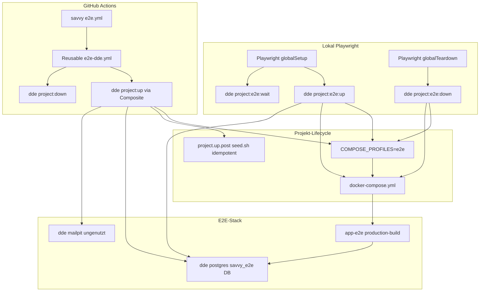
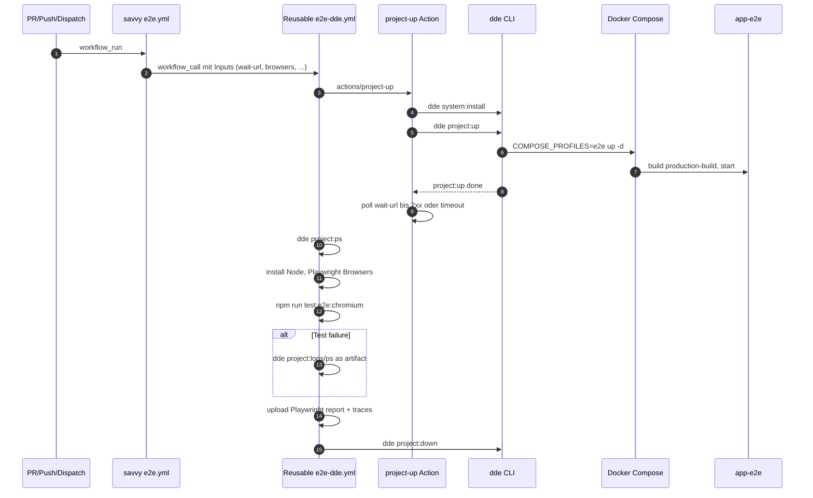
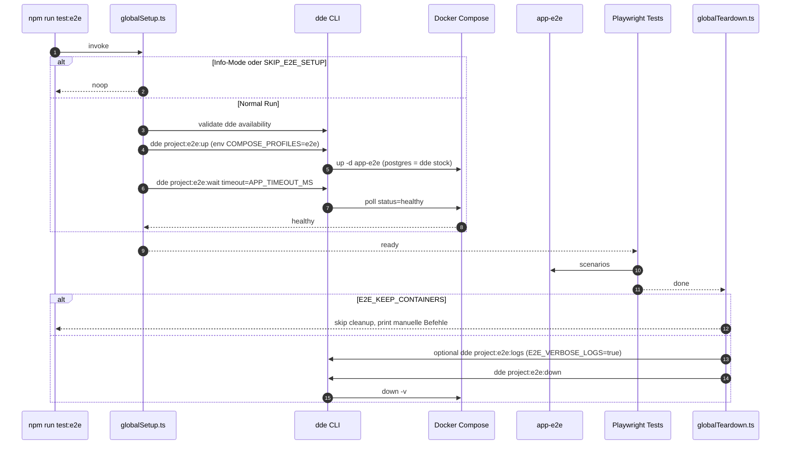

# Design Document

## Overview

**Purpose**: Diese Feature-Implementierung verlagert die Provisionierung der
E2E-Test-Umgebung von einer Runner-direkten `docker compose`-Ausführung auf
eine dde-getriebene Sequenz, die in GitHub Actions und im lokalen
Playwright-Lifecycle identisch wirkt.
**Users**: CI/CD-Verantwortliche und Entwickler, die E2E-Tests entweder über
`npm run test:e2e` lokal oder im PR-/`main`-Workflow ausführen.
**Impact**: Der bestehende Lebenszyklus wechselt vom direkten Aufruf
`docker compose --profile e2e ...` zu `dde project:up`/`dde project:e2e:*`-Plugins,
ohne Änderung an Test-Specs, Production-Images oder Release-Pipeline.

### Goals

- CI ruft die Reusable Workflow `sbaerlocher/.github/.github/workflows/e2e-dde.yml`
  und übergibt vollständige Inputs für Browser, Test-Command, `wait-url`
  und Artefakt-Verhalten.
- Lokales Playwright-`globalSetup`/`globalTeardown` nutzt dde-Plugin-Subcommands
  als einzige Provisionierungs-Schnittstelle.
- Lokale und CI-Provisionierung bauen dieselbe Image-Stage und denselben
  Service-Satz; Konfiguration ist über `COMPOSE_PROFILES=e2e` aktiviert.
- Production-Stages des Dockerfiles bleiben verhaltens- und outputgleich.

### Non-Goals

- Forken oder erweitern der externen Reusable Workflow `e2e-dde.yml`.
- Ablösen des `dev`-Compose-Profils oder Umstellen der lokalen
  Hot-Reload-Entwicklung.
- Reorganisation der Production-Release-Pipeline (`.goreleaser.yaml`,
  `release.yml`).
- Änderungen an Playwright-Test-Specs, Selectors oder Fixtures unter
  `client/tests/e2e/`.

## Boundary Commitments

### This Spec Owns

- `.github/workflows/e2e.yml` — savvy-seitige Inputs und Trigger-Strategie
  für die Reusable Workflow.
- `client/tests/global.setup.ts` und `client/tests/global.teardown.ts` —
  lokale dde-getriebene Provisionierung mit Health-Wait und Skip-Logik.
- `.dde/plugins/e2e.up.sh`, `.dde/plugins/e2e.down.sh`,
  `.dde/plugins/e2e.wait.sh`, `.dde/plugins/e2e.logs.sh`,
  `.dde/plugins/e2e.reset-db.sh` — Plugin-Skripte für den E2E-Lifecycle,
  exponiert von dde unter den Befehlen `dde project:e2e:up`/`:down`/
  `:wait`/`:logs`/`:reset-db`. `:reset-db` ersetzt die Volume-basierte
  Isolation des entfernten `postgres-e2e`-Service durch DB-Reset auf der
  dde-Stock-Postgres.
- `.dde/hooks/project.up.post/seed.sh` — Idempotente Anpassung, damit der
  Hook im E2E-Mode nicht abbricht.
- Coexistenz von `dev`- und `e2e`-Compose-Profilen in `docker-compose.yml`
  (verifiziert, dass die existierenden Profil-Listen
  `COMPOSE_PROFILES=e2e`-konform sind; keine inhaltliche Änderung der Datei).

### Out of Boundary

- Inhalt und Step-Reihenfolge der Reusable Workflow (`e2e-dde.yml`) und der
  Composite-Action `actions/project-up`.
- dde-Binary-Distribution und `dde system:install`-Mechanik (extern).
- `Dockerfile`-Stages `production-build` und `production` (Invariante).
- Helm-Chart, Kubernetes-Manifests und Production-Deployments.
- Goreleaser- und Container-Release-Pipeline.
- Inhalte unter `client/tests/e2e/` und npm-Scripts ausser ihrer
  Lifecycle-Auslösung.

### Allowed Dependencies

- Reusable Workflow `sbaerlocher/.github/.github/workflows/e2e-dde.yml@<ref>`
  als externer Provider für `dde system:install`, `dde project:up`,
  `wait-url`-Polling, Artefakt-Upload und `dde project:down`.
- dde-Stock-Services `postgres` und `mailpit` — laufen in E2E mit, werden
  und werden für die E2E-Datenbank `savvy_e2e` aktiv genutzt
  (`app-e2e` ist auf `dde-services-savvy` und verbindet auf `postgres:5432`).
- Docker Compose 2.x mit `COMPOSE_PROFILES`-Env-Var-Auflösung.
- Playwright 1.59.x mit `globalSetup`/`globalTeardown`-Hooks.

### Revalidation Triggers

- Änderung des `wait-url`-Inputs der Reusable Workflow (Dropping, Umbenennen,
  Semantik-Wechsel).
- Wegfall oder Umbenennen des Postgres-Stock-Services in der dde-Distribution
  (impliziert `seed.sh`-Anpassung).
- Restrukturierung der Compose-Profile-Namen (`dev`, `e2e`).
- Änderung der `app-e2e`-Port-Publikation (aktuell `127.0.0.1:8080:8080`,
  Polling-Ziel für `wait-url`).
- Aufnehmen weiterer Browser-Targets (Firefox, WebKit) als Default in CI —
  beeinflusst Inputs und Test-Command.

## Architecture

### Existing Architecture Analysis

- Compose-Profile: `dev` (Air `api` + Vite `client`, `' '`-Default), `e2e`
  (nur `app-e2e`; Postgres kommt aus dde-Stock), `observability` (Loki,
  Tempo, Grafana, etc.).
- dde-Stock-Services per `.dde/config.yml`: `postgres`, `mailpit`.
- dde-Plugins: bestehendes `e2e.sh` wrappt `docker compose --profile e2e up`;
  `observability.sh` analog.
- Hooks: `project.up.post/seed.sh` setzt voraus, dass `api` (dev) läuft.
- Reusable Workflow leistet `dde system:install` + `dde project:up` +
  `wait-url`-Polling + Diagnose + `dde project:down`.

Diese Pattern bleiben erhalten; das Spec ergänzt eine zweite Plugin-Familie
für den E2E-Lebenszyklus und macht den Seed-Hook sauber abbruchfähig.

### Architecture Pattern & Boundary Map



**Architecture Integration**:

- **Selected pattern**: Reusable-Workflow-Konsumation + dde-Plugin-Lifecycle
  + Compose-Profil-Aktivierung über `COMPOSE_PROFILES`-Env-Var.
- **Domain/feature boundaries**: CI-Layer (Workflow + Reusable),
  Lokal-Layer (Playwright + Plugins), Stack-Layer (Compose + Hooks).
- **Existing patterns preserved**: Compose-Profile, dde-Stock-Services,
  Health-Checks pro Service, Production-Stages des Dockerfiles.
- **New components rationale**: Vier dedizierte dde-Plugin-Subcommands für
  einen klar benannten E2E-Lebenszyklus (`up`/`down`/`wait`/`logs`); ohne
  diese müsste der lokale Lifecycle wieder direkt Docker Compose aufrufen
  und damit die Parität zu CI brechen.
- **Steering compliance**: Folgt dem Workspace-Standard, dass Reusable
  Workflows aus `sbaerlocher/.github` zentral konsumiert werden, und der
  Projekt-Konvention "alles über dde, nichts host-direkt" für lokale
  Provisionierung.

### Technology Stack

| Layer | Choice / Version | Role in Feature | Notes |
|-------|------------------|-----------------|-------|
| CI Workflow | GitHub Actions, Reusable `sbaerlocher/.github/.github/workflows/e2e-dde.yml@<datum>` | Orchestriert dde-Setup, Browser-Install, Test-Run, Diagnose, Teardown | Pin auf datierten Tag empfohlen |
| Provisioning | dde (`dde.sh`, latest) + Composite `actions/project-up@2026-04-28` | `system:install` + `project:up` + `wait-url`-Polling | Externe Abhängigkeit |
| Container Runtime | Docker Compose v2 | Compose-Profil-Aktivierung, Healthchecks, Volumes | `COMPOSE_PROFILES=e2e` aktiviert E2E-Services |
| App-Image | Dockerfile Stage `production-build` (Distroless, gebaut mit `VERSION=e2e-test`) | Production-Build wird in E2E gefahren | Stage selbst bleibt invariant |
| Test Runner | Playwright 1.59.1 | E2E-Specs gegen `http://localhost:8080` | `globalSetup`/`globalTeardown` Hook-Punkte |
| Test DB | dde-Stock-Postgres (Version durch dde-Distribution gepinnt) | Eigene Datenbank `savvy_e2e` auf der gemeinsamen Stock-Instanz | Per-Run-Isolation via `dde project:e2e:reset-db` |

## File Structure Plan

### Directory Structure

```
.github/
└── workflows/
    └── e2e.yml                          # Reusable-Konsument; Inputs für Browser, Test-Command, wait-url, Artefakte

.dde/
├── config.yml                           # unverändert (postgres, mailpit Stock-Services)
├── plugins/
│   ├── e2e.up.sh                        # NEU: dde project:e2e:up – COMPOSE_PROFILES=e2e + compose up -d
│   ├── e2e.down.sh                      # NEU: dde project:e2e:down – compose down -v (E2E-Profil)
│   ├── e2e.wait.sh                      # NEU: dde project:e2e:wait – Polling auf app-e2e Healthcheck
│   ├── e2e.logs.sh                      # NEU: dde project:e2e:logs – Tail logs der E2E-Services
│   ├── e2e.sh                           # ENTFERNT: ersetzt durch obige Subcommand-Plugins
│   └── observability.sh                 # unverändert
└── hooks/
    └── project.up.post/
        └── seed.sh                      # MODIFIZIERT: skip mit Exit 0, wenn dev-api fehlt

client/
└── tests/
    ├── global.setup.ts                  # MODIFIZIERT: dde project:e2e:up + e2e:wait, Skip-Logik unverändert
    └── global.teardown.ts               # MODIFIZIERT: dde project:e2e:down, KEEP_CONTAINERS unverändert

docker-compose.yml                       # UNVERÄNDERT: Profil-Listen reichen aus; wait-url pollt extern
Dockerfile                               # UNVERÄNDERT: production-build/production-Stages bleiben invariant
```

### Modified Files

- `.github/workflows/e2e.yml` — `wait-url` und `wait-timeout` ergänzen; übrige
  Inputs (Browser, Test-Command, Artefakte) konsolidieren.
- `client/tests/global.setup.ts` — Provisionierung über `dde project:e2e:up` und
  `dde project:e2e:wait`; `validateDockerAvailable` ersetzt durch `validateDdeAvailable`;
  `COMPOSE_PROFILES=e2e` als Env beim Exec; bestehende Skip-/Timeout-Variablen
  bleiben semantisch erhalten.
- `client/tests/global.teardown.ts` — Cleanup über `dde project:e2e:down`;
  `E2E_VERBOSE_LOGS`-Pfad ruft `dde project:e2e:logs`.
- `.dde/hooks/project.up.post/seed.sh` — Frühausstieg mit Exit 0, falls der
  dev-`api`-Container nicht existiert (E2E-Mode); übrige Logik unverändert.
- `docker-compose.yml` — keine inhaltliche Änderung erforderlich; Reusable
  `wait-url` pollt extern auf `127.0.0.1:8080/health` (vorhandene
  Port-Publikation), bestehender Compose-Healthcheck (`/app/savvy -health
  -port 8080` im Distroless) bleibt zuständig für interne Bereitschaft.
  Profil-Semantik (`COMPOSE_PROFILES=e2e` aktiviert ausschliesslich
  nur `app-e2e`) entsteht aus den existierenden Profil-Listen.

### New Files

- `.dde/plugins/e2e.up.sh` — `@command e2e:up` setzt `COMPOSE_PROFILES=e2e`
  und ruft `docker compose up -d "$@"`.
- `.dde/plugins/e2e.down.sh` — `@command e2e:down` ruft `docker compose
  --profile e2e down -v "$@"`.
- `.dde/plugins/e2e.wait.sh` — `@command e2e:wait` pollt auf
  `docker compose --profile e2e ps --status running --filter health=healthy
  app-e2e` mit Timeout-Eingabe.
- `.dde/plugins/e2e.logs.sh` — `@command e2e:logs` ruft `docker compose
  --profile e2e logs --tail=<N> [services...]`.

### Removed Files

- `.dde/plugins/e2e.sh` — durch die vier Subcommand-Plugins ersetzt;
  Migrationsschritt: alte Datei löschen, sonst Konflikt mit `e2e:*`-Namespace.

## System Flows

### CI E2E Lifecycle



**Key Decisions**:

- `wait-url` ersetzt eigene Health-Polling-Logik im savvy-Workflow.
- `dde project:down` läuft auch bei Failure, damit der Runner sauber zurückbleibt.

### Lokaler Playwright Lifecycle



**Key Decisions**:

- Lokal nutzt `dde project:e2e:*`-Plugins statt direkter Compose-Calls; alle bekannten
  Skip-Variablen (`SKIP_E2E_SETUP`, `--list`, `--help`, `--version`) bleiben
  semantisch unverändert.
- Diagnose-Logs werden weiterhin nur bei `E2E_VERBOSE_LOGS=true` ausgegeben.

## Requirements Traceability

| Requirement | Summary | Components | Interfaces / Files | Flows |
|-------------|---------|------------|--------------------|-------|
| 1.1 | Workflow nur via Reusable | CI Workflow Wrapper | `.github/workflows/e2e.yml` | CI Lifecycle |
| 1.2, 1.3, 1.4 | PR/Push/Dispatch-Trigger | CI Workflow Wrapper | `.github/workflows/e2e.yml` (`on:`) | CI Lifecycle |
| 1.5 | Vollständige Inputs | CI Workflow Wrapper | `.github/workflows/e2e.yml` (`with:`) | CI Lifecycle |
| 2.1, 2.2 | `system:install` + `project:up` Setup-Phase | Reusable Workflow Adapter | savvy `e2e.yml` Inputs | CI Lifecycle |
| 2.3 | Health-Wait | Reusable `wait-url` | `wait-url`, `wait-timeout` Inputs | CI Lifecycle |
| 2.4 | Failure-Fast | Reusable Workflow Adapter | `e2e.yml` (Defaults aus Reusable) | CI Lifecycle |
| 2.5 | Volume-aware Teardown | Reusable Workflow Adapter | Reusable `dde project:down`-Step | CI Lifecycle |
| 3.1, 3.2 | Lokales Setup über dde + Verfügbarkeitscheck | Playwright Setup Adapter, dde Plugins | `client/tests/global.setup.ts`, `e2e.up.sh`, `e2e.wait.sh` | Lokal Lifecycle |
| 3.3 | Lokales Teardown über dde | Playwright Setup Adapter, dde Plugins | `global.teardown.ts`, `e2e.down.sh` | Lokal Lifecycle |
| 3.4 | `E2E_KEEP_CONTAINERS` | Playwright Setup Adapter | `global.teardown.ts` | Lokal Lifecycle |
| 3.5 | Skip-Modus | Playwright Setup Adapter | `global.setup.ts` `shouldSkipSetup` | Lokal Lifecycle |
| 4.1 | Identischer Service-Satz lokal/CI | Compose Stack | `docker-compose.yml` Profil `e2e` | beide |
| 4.2 | Selbe Dockerfile-Stage | Compose Stack | `docker-compose.yml` `app-e2e.build.target` | beide |
| 4.3 | Gepinnte Image-Digests | Compose Stack | `docker-compose.yml` Postgres-Image | beide |
| 4.4 | Identische Env-Vars | Compose Stack | `docker-compose.yml` `app-e2e.environment` | beide |
| 4.5 | Selbes npm-Script | CI Workflow Wrapper, Playwright Setup Adapter | `e2e.yml` Input `test-command`, `package.json` | beide |
| 5.1 | Production-Stages unverändert | Production Image Invariante | `Dockerfile` Stages `production-build`, `production` | n/a |
| 5.2 | Build-Output unverändert | Production Image Invariante | Manuelles Review-Gate | n/a |
| 5.3 | Keine Tag-Überschreibung | CI Workflow Wrapper | `e2e.yml` (kein Push/Tag-Step) | CI Lifecycle |
| 5.4 | Hilfs-Binaries nur in Nicht-Prod-Stages | Production Image Invariante | `Dockerfile` `go-builder` produziert `e2e`-Binary intern | n/a |
| 6.1 | `dde project:up` ohne Profil-Flag | Compose Profile Switch (`COMPOSE_PROFILES`) | `e2e.yml` `env:`, `e2e.up.sh` | beide |
| 6.2 | dde-Konfiguration registriert E2E-Services | dde Plugins, Compose Stack | `.dde/plugins/e2e.up.sh`, Compose Profil `e2e` | beide |
| 6.3 | Build-Stage-Trennung | Production Image Invariante | `Dockerfile` Stages | n/a |
| 6.4 | E2E im Production-Mode | Compose Stack | `app-e2e.environment` (`GO_ENV=production`, `AUTO_MIGRATE=true`) | beide |
| 6.5 | Bring-up Fehler mit Logs | Reusable Workflow Adapter, Playwright Setup Adapter | Reusable `wait-url` + `dde project:logs`; lokal `e2e.wait.sh` + `e2e.logs.sh` | beide |
| 7.1 | Logs bei Setup-Fehler | Reusable Workflow Adapter, Playwright Setup Adapter | Reusable Failure-Step, lokal `executeDdeCommand` Log-Capture | beide |
| 7.2 | Playwright-Artefakte | Reusable Workflow Adapter | Reusable Upload-Steps | CI Lifecycle |
| 7.3 | 30-Tage-Retention | CI Workflow Wrapper | `e2e.yml` Input `artifact-retention-days: 30` | CI Lifecycle |
| 7.4 | `E2E_VERBOSE_LOGS` | Playwright Setup Adapter | `global.teardown.ts` | Lokal Lifecycle |
| 8.1, 8.2 | Test-Specs unangetastet | Playwright Setup Adapter | `global.setup.ts`/`global.teardown.ts` (nur Provisionierung) | n/a |
| 8.3 | npm-Scripts kompatibel | CI Workflow Wrapper, Playwright Setup Adapter | `package.json` (unverändert) | beide |

## Components and Interfaces

| Component | Domain/Layer | Intent | Req Coverage | Key Dependencies | Contracts |
|-----------|--------------|--------|--------------|------------------|-----------|
| CI Workflow Wrapper | CI | Konsumiert Reusable, setzt Inputs + Env | 1.1–1.5, 5.3, 7.3 | Reusable `e2e-dde.yml` (P0) | Workflow-Inputs |
| Reusable Workflow Adapter | CI | Konzeptioneller Vertrag mit der Reusable Workflow | 2.1–2.5, 6.5, 7.1, 7.2 | Reusable Workflow (P0) | Workflow-Inputs / Polling-Vertrag |
| Playwright Setup Adapter | Lokal | Provisioniert Stack via dde, behält Skip-/Verbose-Schalter | 3.1–3.5, 4.5, 7.1, 7.4, 8.1–8.3 | dde-Plugins (P0), Playwright (P0) | TS-Module |
| dde Plugin Suite | Provisioning | `e2e:up/down/wait/logs` | 3.1, 3.3, 6.1, 6.2, 6.5 | Docker Compose (P0) | Bash-Subcommand-Vertrag |
| Compose Stack | Stack | Definiert E2E-Services + dev-Profile-Koexistenz | 4.1–4.4, 6.1–6.4 | dde-Stock-Postgres/Mailpit (P2) | Compose-Datei |
| Seed Hook (idempotent) | Stack | E2E-fähiger Post-Up-Hook | 6.4 | Docker Compose (P1) | Bash-Hook-Vertrag |
| Production Image Invariante | Stack | Verifizierungspunkt im Review | 5.1, 5.2, 5.4, 6.3 | Dockerfile (P0) | Review-Checkliste |

### CI

#### CI Workflow Wrapper

| Field | Detail |
|-------|--------|
| Intent | Konsumiert die zentrale dde-Reusable Workflow und gibt savvy-spezifische Inputs |
| Requirements | 1.1, 1.2, 1.3, 1.4, 1.5, 5.3, 7.3 |

**Responsibilities & Constraints**

- Definiert `on:`-Trigger (PR auf `main`, Push auf `main`, `workflow_dispatch`).
- Übergibt `dde-version`, `project-directory: .`, `playwright-directory: ./client`,
  `test-command: test:e2e:chromium`, `playwright-browsers: chromium`,
  `wait-url: http://localhost:8080/health`, `wait-timeout: 300`,
  `upload-artifacts: true`, `artifact-retention-days: 30`.
- Enthält keinen `docker compose`-Aufruf.
- Setzt `env: COMPOSE_PROFILES: e2e` auf Job-Ebene, damit der von der Reusable
  ausgeführte `dde project:up` den E2E-Profil-Satz aktiviert.

**Dependencies**

- External: Reusable `sbaerlocher/.github/.github/workflows/e2e-dde.yml@<datum>`
  — Provisionierung, Tests, Diagnose, Teardown (P0).

**Contracts**: Service [ ] / API [ ] / Event [ ] / Batch [ ] / **State** [x]

##### State Management

- **State model**: Workflow-State über GitHub Actions; Konzentration ist
  über `concurrency: group=workflow+ref, cancel-in-progress=true` (Default
  der Reusable).
- **Persistence**: Artefakte über GitHub Actions Storage (30 Tage).

**Implementation Notes**

- Integration: Reusable-Tag pinnen (`@2026-04-28`) statt `@latest`.
- Validation: `act` o. ä. lokal nicht zwingend; Smoke via PR.
- Risks: `wait-url` muss Port `8080` auf dem Runner erreichen — abhängig von
  `app-e2e.ports`.

#### Reusable Workflow Adapter

| Field | Detail |
|-------|--------|
| Intent | Bezeichnet, welche Verträge die Reusable für savvy garantiert |
| Requirements | 2.1, 2.2, 2.3, 2.4, 2.5, 6.5, 7.1, 7.2 |

**Responsibilities & Constraints**

- Garantierte Steps der Reusable: `dde system:install`, `dde project:up`,
  optionales `wait-url`-Polling, `dde project:ps`, Playwright-Setup +
  Test-Run, `dde project:logs/ps` als Artefakt im Failure-Fall, Upload
  Playwright-Report + Test-Results, `dde project:down`.
- Vertrag aus savvy-Sicht: Failure-Fast bei `dde install/up`, garantierter
  Cleanup auch bei Failure.

**Dependencies**

- External: dde Composite-Action `actions/project-up@2026-04-28` (P0).

**Contracts**: Service [ ] / **API** [x] / Event [ ] / Batch [ ] / State [ ]

##### API Contract

| Verb | Input | Garantie |
|------|-------|----------|
| Reusable Inputs | `wait-url`, `wait-timeout`, `playwright-directory`, `test-command`, `playwright-browsers`, `upload-artifacts`, `artifact-retention-days` | siehe Reusable-Doku |
| Reusable Outputs | `dde-version` | wird im PR-Comment-Job konsumiert |

**Implementation Notes**

- Risks: Wechsel der Reusable an `@latest` kann Breaking Changes einschleppen
  (Mitigation: Pin auf datierten Tag).

### Lokal

#### Playwright Setup Adapter

| Field | Detail |
|-------|--------|
| Intent | Lokale Provisionierung über dde-Plugins, identische Skip-/Verbose-Semantik wie heute |
| Requirements | 3.1, 3.2, 3.3, 3.4, 3.5, 4.5, 7.1, 7.4, 8.1, 8.2, 8.3 |

**Responsibilities & Constraints**

- `globalSetup` ruft (in dieser Reihenfolge): `validateDdeAvailable()`,
  `executeDdeCommand('dde project:e2e:up')` mit `env COMPOSE_PROFILES=e2e`,
  `executeDdeCommand('dde project:e2e:wait', timeout=APP_TIMEOUT_MS)`.
- Bei Setup-Fehler: `executeDdeCommand('dde project:e2e:logs --tail 50')`,
  anschliessend Cleanup via `executeDdeCommand('dde project:e2e:down')` und Throw.
- `globalTeardown` ruft `dde project:e2e:logs` (nur bei `E2E_VERBOSE_LOGS=true`) und
  `dde project:e2e:down`.
- Skip-Pfade: Info-Modi (`--list`, `--help`, `--version`) und
  `SKIP_E2E_SETUP=true` springen vor jedem Exec ab.
- Konfiguration über bestehende Env-Variablen (`E2E_POSTGRES_TIMEOUT_MS`,
  `E2E_APP_TIMEOUT_MS`, `E2E_POLL_INTERVAL_MS`, `E2E_KEEP_CONTAINERS`,
  `E2E_VERBOSE_LOGS`, `E2E_REMOVE_VOLUMES`).

**Dependencies**

- Inbound: Playwright `globalSetup`/`globalTeardown` (P0).
- Outbound: dde Plugin Suite via `child_process.exec` (P0).

**Contracts**: **Service** [x] / API [ ] / Event [ ] / Batch [ ] / State [ ]

##### Service Interface

```typescript
type ExecResult = { stdout: string; stderr: string };

interface DdeProvisioningAdapter {
  validateDdeAvailable(): Promise<void>;
  executeDdeCommand(
    command: string,
    description: string,
    timeoutMs?: number,
    extraEnv?: NodeJS.ProcessEnv
  ): Promise<ExecResult>;
  shouldSkipSetup(config: FullConfig): boolean;
  shouldSkipTeardown(config: FullConfig): boolean;
}
```

- **Preconditions**: Docker-Daemon erreichbar; `dde` ausführbar; Projekt
  enthält gültige `.dde/config.yml` und Compose-Profil `e2e`.
- **Postconditions** (`globalSetup`): Compose-Service `app-e2e` ist
  `healthy` und auf `127.0.0.1:8080` erreichbar.
- **Invariants**: Skip-Variablen wirken vor jedem Compose-/dde-Call; bei
  jeder Exception wird mindestens einmal versucht, den Stack abzubauen
  (`E2E_KEEP_CONTAINERS=true` ausgenommen).

**Implementation Notes**

- Integration: `executeDdeCommand` setzt `process.env` lokal über
  `{ ...process.env, ...extraEnv }` und reicht das an `exec`-Optionen weiter
  (`{ env, timeout }`).
- Validation: Smoke `dde --version`-Aufruf in `validateDdeAvailable`,
  vergleichbar zur heutigen `validateDockerAvailable`-Funktion.
- Risks: Plattform-spezifische Pfade (Windows nicht im Scope, dde ist
  Linux/macOS).

### Provisioning

#### dde Plugin Suite

| Field | Detail |
|-------|--------|
| Intent | Stellt vier benannte Subcommands für den E2E-Lifecycle bereit |
| Requirements | 3.1, 3.3, 6.1, 6.2, 6.5 |

**Responsibilities & Constraints**

- Jeder Subcommand ist ein eigenes Bash-Skript mit `@command e2e:<verb>`.
- `e2e:up` exportiert `COMPOSE_PROFILES=e2e` (defensiv, zusätzlich zu vom
  Aufrufer gesetzten Env-Vars) und ruft `docker compose up -d "$@"`.
- `e2e:down` ruft `docker compose --profile e2e down -v "$@"`.
- `e2e:wait` pollt `docker compose --profile e2e ps --status running app-e2e`
  und prüft `Health: healthy`; akzeptiert `--timeout SECONDS` (Default 90 s)
  und `--service NAME` (Default `app-e2e`).
- `e2e:logs` ruft `docker compose --profile e2e logs --tail "${1:-50}" "$@"`.
- Plugins sind zustandslos und idempotent.

**Dependencies**

- External: Docker Compose v2 (P0), dde-Plugin-Loader (P0).

**Contracts**: **Service** [x] / API [ ] / Event [ ] / Batch [ ] / State [ ]

##### Service Interface

```bash
# dde project:e2e:up [docker compose up flags]
# dde project:e2e:down [docker compose down flags]
# dde project:e2e:wait [--timeout <seconds>] [--service <name>]
# dde project:e2e:logs [tail-count] [services...]
```

- **Preconditions**: `docker compose` verfügbar, `.dde/config.yml`
  registriert das Plugin-Verzeichnis.
- **Postconditions**:
  - `e2e:up` → angegebene Services sind detached gestartet.
  - `e2e:wait` → Exit 0 sobald `app-e2e.Health == healthy`, Exit 1 bei
    Timeout (mit Logs-Dump auf stderr).
  - `e2e:down` → Container und Volumes gelöscht.
- **Invariants**: Keine Compose-Profile ausser `e2e` werden aktiviert.

**Implementation Notes**

- Integration: Bestehendes `e2e.sh` wird ersetzt; Plugin-Loader liest
  `@command`-Annotationen.
- Validation: Smoke per `dde project:e2e:up && dde project:e2e:wait && dde project:e2e:down`.
- Risks: Wenn Compose `--status`-Filter nicht verfügbar (sehr alte Versionen),
  Fallback auf `docker inspect <container> --format {{.State.Health.Status}}`.

### Stack

#### Compose Stack

| Field | Detail |
|-------|--------|
| Intent | Hält die `e2e`-Profil-Services und deren Healthcheck/Port-Konfiguration |
| Requirements | 4.1, 4.2, 4.3, 4.4, 6.1, 6.2, 6.3, 6.4 |

**Responsibilities & Constraints**

- `app-e2e`: `build.target = production-build`, `entrypoint = /app/e2e`,
  bestehender Compose-Healthcheck `/app/savvy -health -port 8080` bleibt
  unverändert (Distroless ohne `curl`/`wget`); externe Bereitschaft wird
  über `wait-url` auf `127.0.0.1:8080/health` geprüft. Port
  `127.0.0.1:8080:8080`, `GO_ENV=production`, `AUTO_MIGRATE=true`,
  deterministische Env-Vars für Feature-Flags.
- Postgres läuft als dde-Stock-Service auf der `dde-services-savvy`-
  Bridge; `app-e2e` joint dieses Netzwerk und nutzt die Datenbank
  `savvy_e2e` auf derselben Instanz wie der Dev-Stack (`savvy`).
  Per-Run-Isolation via `dde project:e2e:reset-db`.
- Profile `dev` (`api`, `client`) und `observability` bleiben strukturell
  unverändert.
- Netzwerke: `app-e2e.networks: services` (extern, dde-services-savvy);
  das frühere `e2e`-Bridge-Netz wurde mit `postgres-e2e` entfernt.

**Dependencies**

- External: dde-Stock-Services Postgres/Mailpit (laufen mit, P2).

**Contracts**: Service [ ] / API [ ] / Event [ ] / Batch [ ] / **State** [x]

##### State Management

- **State model**: Postgres-Volume `postgres_e2e_data` ist pro Run kurzlebig
  (Teardown mit `-v`).
- **Concurrency**: Single-Stack pro Run; lokale parallele E2E-Runs nicht
  unterstützt (Port-Konflikt auf 8080).

**Implementation Notes**

- Integration: Compose-Datei bleibt strukturell unverändert. Profil-Aktivierung
  über `COMPOSE_PROFILES=e2e` wird ausschliesslich vom Aufrufer (Workflow-`env`,
  `globalSetup` `extraEnv`, `e2e:up`-Plugin) gesetzt.
- Validation: `docker compose --profile e2e config --quiet` muss grün sein;
  zusätzlich Smoke `docker compose config --profiles` listet `dev`, `e2e`,
  `observability`.
- Risks: Falls dde später Compose-Profile-Logik selbst übernimmt, ist die
  Env-Var-Strategie zu reevaluieren (siehe Revalidation Triggers).

#### Seed Hook (idempotent)

| Field | Detail |
|-------|--------|
| Intent | Bestehender Post-Up-Hook bricht im E2E-Mode nicht mehr ab |
| Requirements | 6.4 |

**Responsibilities & Constraints**

- Wenn `docker compose ps -q api` leer ist (E2E-Mode oder kein dev-Stack
  aktiv), Frühausstieg mit Exit 0 und Log-Hinweis.
- Wenn dev-`api`-Container existiert, läuft die bisherige Logik unverändert.
- Hook bleibt strikt zustandslos und ohne Side-Effects bei E2E-Mode.

**Dependencies**

- External: Docker Compose, dde-managed Postgres-Container (P1).

**Contracts**: Service [ ] / API [ ] / Event [ ] / **Batch** [x] / State [ ]

##### Batch / Job Contract

- **Trigger**: dde-Hook `project.up.post` nach erfolgreichem `project:up`.
- **Input / validation**: keiner; Hook detektiert Modus über Container-State.
- **Output / destination**: Schreibt Migrations- und Seed-Logs nach stdout.
- **Idempotency & recovery**: Bei mehrfachen Aufrufen kein Side-Effect, weil
  Seed-Logik bei vorhandener Schema/Daten-Idempotenz bereits abdeckt; im
  E2E-Mode komplett übersprungen.

**Implementation Notes**

- Integration: Skript-Anfang prüft `docker compose ps -q api`, optional
  zusätzlich `docker compose --profile e2e ps -q app-e2e`, um den E2E-Mode
  positiv zu erkennen.
- Risks: Wenn beide Modi gleichzeitig aktiv wären (Edge-Case), gewinnt der
  dev-`api`-Pfad — gewollt.

#### Production Image Invariante

| Field | Detail |
|-------|--------|
| Intent | Sicherstellen, dass die Produktiv-Stages unverändert bleiben |
| Requirements | 5.1, 5.2, 5.4, 6.3 |

**Responsibilities & Constraints**

- `Dockerfile`-Stages `production-build` und `production` werden nicht
  inhaltlich geändert.
- Hilfs-Binaries (`/app/seed`, `/app/e2e`) liegen weiterhin im
  `go-builder`-Output und werden von `production-build` für E2E mitkopiert
  — bestehender Zustand, nicht E2E-spezifisch neu hinzugefügt.
- Healthcheck-Wechsel auf HTTP-`wget` betrifft nicht die Stage selbst,
  sondern die Compose-Definition; falls ein in-Image-Healthcheck nötig
  würde, dürfte das nur über das bestehende `e2e`-Hilfs-Binary erfolgen
  (kein Tooling-Zukauf in Distroless).

**Dependencies**

- External: Goreleaser-Pipeline (P1) erwartet `production`-Stage stabil.

**Contracts**: Service [ ] / API [ ] / Event [ ] / Batch [ ] / **State** [x]

##### State Management

- **State model**: Image-Layout, Entrypoint, Image-Größe sind die
  Invarianten. Verifikation manuell im PR-Review.

**Implementation Notes**

- Integration: PR-Reviewer prüft `git diff` auf `Dockerfile`-Stages
  `production-build` und `production`.
- Validation: Optional `docker buildx build --target production` lokal als
  Smoke (kein automatischer Gate).
- Risks: Drift bei künftigen Anpassungen — nicht durch CI verhindert.

## Error Handling

### Error Strategy

- **CI-Setup**: Failure-Fast über die Reusable. Bei Fehlern in
  `dde system:install`/`project:up` markiert die Composite-Action den Job
  rot, Tests werden nicht gestartet (R2.4). Diagnose-Logs (`project:logs`,
  `project:ps`) werden als Artefakt gespeichert (R7.1).
- **Lokales Setup**: `globalSetup` fängt Exceptions, ruft `dde project:e2e:logs` und
  versucht `dde project:e2e:down`, dann re-throw. Bestehende Troubleshooting-Hinweise
  in der Konsole bleiben erhalten, sind auf dde-Befehle umzuformulieren.
- **Lokales Teardown**: Fehler werden geloggt (`console.error`), aber nicht
  re-thrown — Tests sollen nicht nachträglich rotgemarkiert werden, wenn
  nur das Cleanup hängt.
- **Hook-Fehler**: `seed.sh` läuft im E2E-Mode mit Exit 0 (kein Abbruch);
  im Dev-Mode behält es die bisherige Retry-/Backoff-Logik.

### Error Categories and Responses

- **System Errors (Setup)** → Frühausstieg, Logs sichtbar, Stack abgebaut.
- **Health-Wait Timeout** → `e2e:wait` Exit 1 mit Service-Logs auf stderr;
  CI bricht über Reusable-Failure ab; lokal wird Exception in
  `globalSetup` weitergereicht.
- **Test-Run Failure (Playwright)** → CI lädt HTML-Report und Traces hoch
  (R7.2); lokal verbleibt Report unter `client/playwright-report/`.

### Monitoring

- CI: GitHub Actions Job-Status, Annotations aus dem Reusable-Comment-Job.
- Lokal: Konsolen-Output der Plugins; `E2E_VERBOSE_LOGS=true` aktiviert
  `dde project:e2e:logs` im Teardown.

## Testing Strategy

### Unit Tests

1. `globalSetup` Skip-Logik: `--list`, `--help`, `--version`,
   `SKIP_E2E_SETUP=true` führen jeweils zum Frühausstieg ohne Plugin-Call
   (R3.5).
2. `globalTeardown` `E2E_KEEP_CONTAINERS`-Pfad ruft kein `dde project:e2e:down`,
   loggt manuelle Cleanup-Anleitung (R3.4).
3. `executeDdeCommand` reicht `extraEnv` (`COMPOSE_PROFILES=e2e`) korrekt an
   `exec` weiter (R6.1, R3.1).
4. dde-Plugin-Skripte: Smoke per `bash -n` (Syntax) plus Argument-Parsing
   für `e2e:wait --timeout` (R3.2, R6.5).

### Integration Tests

1. Lokaler `npm run test:e2e:run -- --list` erzeugt keinen
   Compose-/dde-Aufruf (R3.5, R8.3).
2. Lokaler `npm run test:e2e:chromium -- tests/e2e/auth.spec.ts` läuft
   end-to-end gegen `dde project:e2e:up`-Stack (R3.1, R4.5).
3. `seed.sh` mit fehlendem `api`-Container endet mit Exit 0 ohne
   Side-Effect; mit dev-`api` läuft die bestehende Seed-Sequenz (R6.4).
4. Compose-Schema: `docker compose --profile e2e config --quiet` ist grün
   (R4.1, R6.1).

### E2E / CI Tests

1. PR-Workflow gegen `main`: `dde project:up` bringt den E2E-Stack hoch,
   `wait-url` antwortet 2xx, Tests laufen, Artefakte vorhanden, Stack
   abgebaut (R1.2, R2.1–2.5, R7.2, R7.3).
2. Push auf `main`: identischer Pfad wie PR (R1.3).
3. `workflow_dispatch`: lässt sich manuell auslösen (R1.4).
4. Failure-Pfad: Erzwungener Health-Wait-Fehler (z. B. App startet nicht)
   führt zu Job-Failure mit `dde-logs.txt` als Artefakt (R6.5, R7.1).

## Migration Strategy

```mermaid
flowchart LR
    Start[Branch chore-dde-local-dev] --> Plugins[1 Plugins splitten<br/>e2e.up/down/wait/logs]
    Plugins --> Hooks[2 seed.sh idempotent]
    Hooks --> Setup[3 globalSetup/Teardown auf Plugins]
    Setup --> Compose[4 app-e2e Healthcheck HTTP]
    Compose --> Workflow[5 e2e.yml wait-url + retention]
    Workflow --> Smoke[6 Lokaler test:e2e:chromium]
    Smoke --> CI[7 PR Smoke gegen main]
    CI --> Pin[8 Reusable Tag pinnen]
```



- **Rollback-Trigger**: Lokaler `npm run test:e2e:run -- tests/e2e/auth.spec.ts`
  schlägt nach Schritt 6 fehl → letzten Schritt revertieren.
- **Rollback-Trigger**: PR-Smoke nach Schritt 7 ist rot wegen Reusable-Drift
  → vorübergehend auf alten `e2e-docker.yml@2026-04-23` zurückkehren, danach
  Pin auf datierten dde-Tag in Schritt 8.
