# Savvy System - Architecture Documentation

**Version:** 1.7.0
**Letzte Aktualisierung:** 2026-02-04
**Status:** Production-Ready (Clean Architecture vollständig)

---

## 📋 Executive Summary

Das Savvy System ist eine moderne **Full-Stack Web Application** zum Verwalten von Kundenkarten, Gutscheinen und Geschenkkarten mit umfassenden Sharing-Funktionen. Die Anwendung verwendet **Go/Echo** im Backend mit **Server-Side Rendering** via **Templ** und **HTMX/Alpine.js** für Frontend-Interaktivität.

### Architektur-Bewertung

| Kategorie             | Score      | Status                                 |
| --------------------- | ---------- | -------------------------------------- |
| **Code-Organisation** | 10/10      | ✅ Perfekte Clean Architecture (0 DB-Calls in Handlers) |
| **Security**          | 9/10       | ✅ Solide Implementierung              |
| **Performance**       | 8/10       | ✅ Optimiert (Gift Card Balance cached, Dashboard optimiert) |
| **Testbarkeit**       | 9/10       | ✅ 71.6% Service Coverage, 83.9% Handler Coverage |
| **Wartbarkeit**       | 10/10      | ✅ 100% Clean Architecture, vollständige Service Layer |
| **Observability**     | 8/10       | ✅ Prometheus Metrics, Health Checks, Structured Logging |
| **Gesamt**            | **9.1/10** | ✅ Production-ready mit perfekter Clean Architecture |

---

## 🏗️ System Architecture

### High-Level Overview

Das Savvy System folgt einer **modernen Full-Stack Architektur** mit Server-Side Rendering und progressiver Verbesserung durch clientseitiges JavaScript. Die Architektur ist in vier Hauptschichten aufgeteilt:

**Client Layer**: Der Browser verwendet HTMX für dynamische Updates ohne Page Reload, Alpine.js für reaktive Komponenten (Scanner, Filter), TailwindCSS für Styling und ZXing JS für Barcode-Scanning. Diese Kombination ermöglicht eine moderne User Experience ohne komplexes Frontend-Framework.

**Application Layer**: Das Go-basierte Echo Web Framework verarbeitet HTTP-Requests durch eine Middleware-Chain (Authentication, CSRF, Tracing), leitet sie an HTTP-Handlers weiter, die Business-Services aufrufen, welche wiederum Repositories für Datenzugriff nutzen. Diese klare Schichtung folgt dem Clean Architecture Pattern.

**Data Layer**: Templ-Templates generieren type-safe HTML auf dem Server, während GORM als ORM-Layer die PostgreSQL-Datenbank abstrahiert. Alle Daten werden über GORM-Models strukturiert und validiert.

**Infrastructure**: Konfiguration, OpenTelemetry-Tracing, Prometheus-Metrics und strukturiertes Logging bilden die operative Grundlage für Monitoring und Debugging.

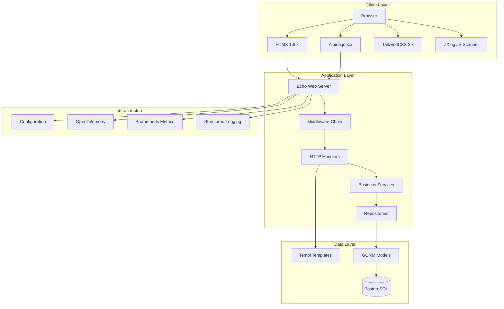
```mermaid
graph TB
    subgraph "Client Layer"
        Browser[Browser]
        HTMX[HTMX 1.9.x]
        Alpine[Alpine.js 3.x]
        Tailwind[TailwindCSS 3.x]
        ZXing[ZXing JS Scanner]
    end

    subgraph "Application Layer"
        Echo[Echo Web Server]
        Middleware[Middleware Chain]
        Handlers[HTTP Handlers]
        Services[Business Services]
        Repos[Repositories]
    end

    subgraph "Data Layer"
        Templ[Templ Templates]
        Models[GORM Models]
        DB[(PostgreSQL)]
    end

    subgraph "Infrastructure"
        Config[Configuration]
        Telemetry[OpenTelemetry]
        Metrics[Prometheus Metrics]
        Logging[Structured Logging]
    end

    Browser --> HTMX
    Browser --> Alpine
    Browser --> Tailwind
    Browser --> ZXing

    HTMX --> Echo
    Alpine --> Echo

    Echo --> Middleware
    Middleware --> Handlers
    Handlers --> Services
    Services --> Repos
    Repos --> Models
    Models --> DB

    Handlers --> Templ

    Echo --> Config
    Echo --> Telemetry
    Echo --> Metrics
    Echo --> Logging
```

---

## 🎯 Clean Architecture Pattern

Die Anwendung folgt einem **3-Layer Clean Architecture** Pattern mit strikter Dependency Direction. Dieses Pattern trennt die Anwendung in drei klare Schichten, wobei jede Schicht nur die darunter liegenden Schichten kennt. Dies ermöglicht:

- **Testbarkeit**: Jede Schicht kann isoliert getestet werden
- **Wartbarkeit**: Änderungen in einer Schicht haben minimalen Impact auf andere
- **Flexibilität**: Business Logic ist unabhängig von Framework-Details
- **Klare Verantwortlichkeiten**: Jede Schicht hat einen klar definierten Zweck

Das Diagramm zeigt die drei Hauptschichten und ihre Abhängigkeitsrichtung. **Wichtig**: Die Dependency-Richtung verläuft immer von außen nach innen (Handlers → Services → Repositories), niemals umgekehrt. Dies wird durch Go-Interfaces erreicht, die in den höheren Schichten definiert werden.

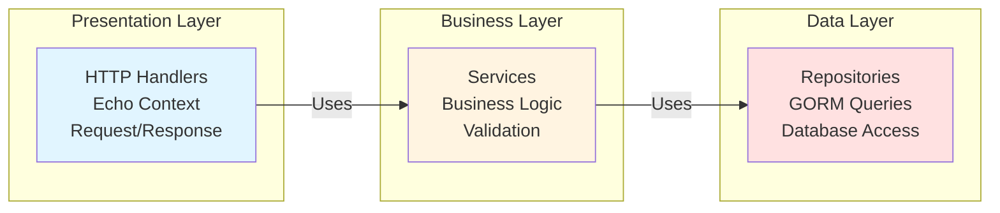
```mermaid
graph LR
    subgraph "Presentation Layer"
        H[HTTP Handlers<br/>Echo Context<br/>Request/Response]
    end

    subgraph "Business Layer"
        S[Services<br/>Business Logic<br/>Validation]
    end

    subgraph "Data Layer"
        R[Repositories<br/>GORM Queries<br/>Database Access]
    end

    H -->|Uses| S
    S -->|Uses| R

    style H fill:#e1f5ff
    style S fill:#fff4e1
    style R fill:#ffe1e1
```

### Dependency Rules

1. **Handler Layer** (Presentation)
   - Kennt: Services (via Interfaces)
   - Kennt nicht: Repositories, Database

2. **Service Layer** (Business Logic)
   - Kennt: Repositories (via Interfaces)
   - Kennt nicht: HTTP Details (Echo Context)

3. **Repository Layer** (Data Access)
   - Kennt: Models, Database (GORM)
   - Kennt nicht: Business Logic, HTTP

---

## 📦 Request Flow

Ein typischer HTTP-Request durchläuft mehrere Schichten, bevor eine Response generiert wird. Dieses Sequenzdiagramm zeigt den vollständigen Lifecycle eines Requests von Browser bis Datenbank und zurück.

**Wichtige Aspekte**:

1. **Middleware-Chain**: Jeder Request durchläuft zunächst die Middleware (OTel Tracing für Monitoring, Authentication zur User-Identifikation, CSRF-Check für Security)
2. **Context-Propagation**: User-Informationen und Trace-IDs werden durch den gesamten Request-Stack weitergereicht
3. **Service-Layer-Validation**: Business-Regeln werden in der Service-Schicht validiert, bevor Daten persistiert werden
4. **Type-Safe Rendering**: Templ-Templates generieren type-safe HTML auf Basis der Daten aus dem Service-Layer
5. **No Direct DB Access**: Handler greifen niemals direkt auf die Datenbank zu, sondern immer über Services und Repositories

Diese Architektur stellt sicher, dass Security-Checks, Tracing und Business-Logik konsistent über alle Endpoints angewendet werden.

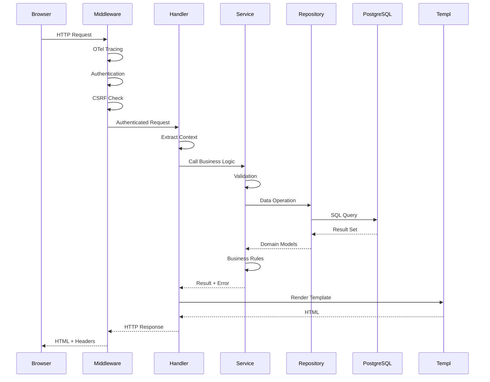
```mermaid
sequenceDiagram
    participant B as Browser
    participant M as Middleware
    participant H as Handler
    participant S as Service
    participant R as Repository
    participant DB as PostgreSQL
    participant T as Templ

    B->>M: HTTP Request
    M->>M: OTel Tracing
    M->>M: Authentication
    M->>M: CSRF Check
    M->>H: Authenticated Request

    H->>H: Extract Context
    H->>S: Call Business Logic

    S->>S: Validation
    S->>R: Data Operation

    R->>DB: SQL Query
    DB-->>R: Result Set
    R-->>S: Domain Models

    S->>S: Business Rules
    S-->>H: Result + Error

    H->>T: Render Template
    T-->>H: HTML
    H-->>M: HTTP Response
    M-->>B: HTML + Headers
```

---

## 🗂️ Package Structure

### Handler Organization

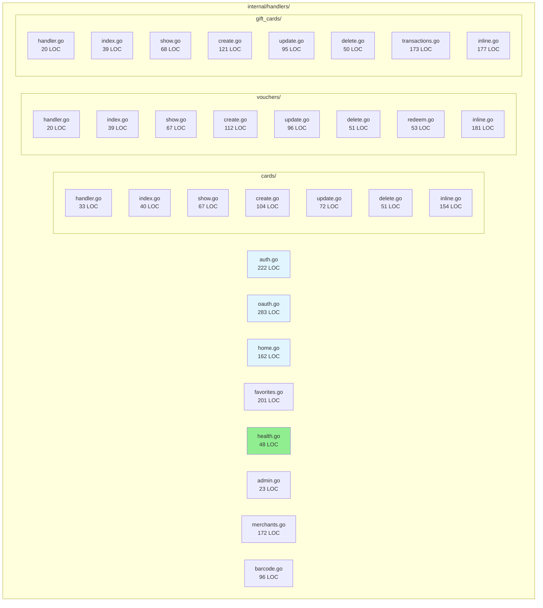
```mermaid
graph TB
    subgraph "internal/handlers/"
        Auth[auth.go<br/>222 LOC]
        OAuth[oauth.go<br/>283 LOC]
        Home[home.go<br/>162 LOC]
        Fav[favorites.go<br/>201 LOC]
        Health[health.go<br/>48 LOC]
        Admin[admin.go<br/>23 LOC]
        Merch[merchants.go<br/>172 LOC]
        Bar[barcode.go<br/>96 LOC]

        subgraph "cards/"
            CH[handler.go<br/>33 LOC]
            CI[index.go<br/>40 LOC]
            CS[show.go<br/>67 LOC]
            CC[create.go<br/>104 LOC]
            CU[update.go<br/>72 LOC]
            CD[delete.go<br/>51 LOC]
            CIn[inline.go<br/>154 LOC]
        end

        subgraph "vouchers/"
            VH[handler.go<br/>20 LOC]
            VI[index.go<br/>39 LOC]
            VS[show.go<br/>67 LOC]
            VC[create.go<br/>112 LOC]
            VU[update.go<br/>96 LOC]
            VD[delete.go<br/>51 LOC]
            VR[redeem.go<br/>53 LOC]
            VIn[inline.go<br/>181 LOC]
        end

        subgraph "gift_cards/"
            GH[handler.go<br/>20 LOC]
            GI[index.go<br/>39 LOC]
            GS[show.go<br/>68 LOC]
            GC[create.go<br/>121 LOC]
            GU[update.go<br/>95 LOC]
            GD[delete.go<br/>50 LOC]
            GT[transactions.go<br/>173 LOC]
            GIn[inline.go<br/>177 LOC]
        end
    end

    style Auth fill:#e1f5ff
    style OAuth fill:#e1f5ff
    style Home fill:#e1f5ff
    style Health fill:#90EE90
```

**Metriken:**
- ✅ Größter Handler: oauth.go (283 LOC)
- ✅ Durchschnitt: ~80 LOC pro File
- ✅ Kein File > 300 LOC
- ✅ Single Responsibility: Jedes File hat klaren Fokus

### Service & Repository Layer

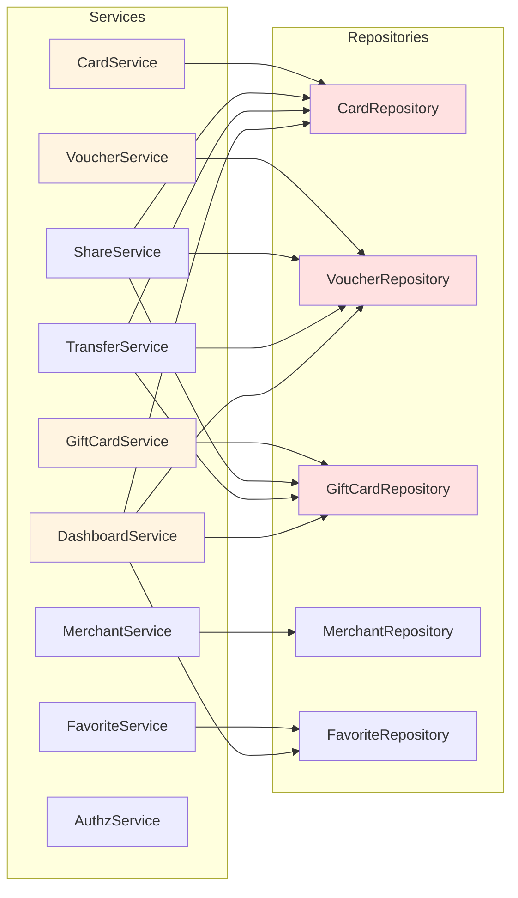
```mermaid
graph LR
    subgraph "Services"
        CS[CardService]
        VS[VoucherService]
        GS[GiftCardService]
        MS[MerchantService]
        SS[ShareService]
        TS[TransferService]
        FS[FavoriteService]
        DS[DashboardService]
        AS[AuthzService]
    end

    subgraph "Repositories"
        CR[CardRepository]
        VR[VoucherRepository]
        GR[GiftCardRepository]
        MR[MerchantRepository]
        FR[FavoriteRepository]
    end

    CS --> CR
    VS --> VR
    GS --> GR
    MS --> MR
    SS --> CR
    SS --> VR
    SS --> GR
    TS --> CR
    TS --> VR
    TS --> GR
    FS --> FR
    DS --> CR
    DS --> VR
    DS --> GR
    DS --> FR

    style CS fill:#fff4e1
    style VS fill:#fff4e1
    style GS fill:#fff4e1
    style DS fill:#fff4e1
    style CR fill:#ffe1e1
    style VR fill:#ffe1e1
    style GR fill:#ffe1e1
```

---

## 🗄️ Database Schema

### Entity Relationship Diagram

Das Datenbank-Schema ist um drei zentrale Ressourcen-Typen organisiert: **Cards** (Kundenkarten), **Vouchers** (Gutscheine) und **Gift Cards** (Geschenkkarten). Alle drei Typen unterstützen:

- **Ownership**: Jede Ressource gehört einem User
- **Sharing**: Ressourcen können mit anderen Users geteilt werden (mit granularen Berechtigungen)
- **Favorites**: Users können Ressourcen favorisieren (polymorphic design)
- **Merchant-Association**: Alle Ressourcen können optional mit einem Merchant verknüpft werden

Das ERD zeigt die Beziehungen zwischen den 10 Haupttabellen. Wichtige Design-Entscheidungen:

1. **UUIDs als Primary Keys**: Nicht-sequenzielle IDs für bessere Security und Distributed-System-Support
2. **Polymorphic Favorites**: `user_favorites` verwendet `resource_type` + `resource_id` für flexible Favorisierung
3. **Granulare Share-Permissions**: Jeder Ressourcen-Typ hat eigene Share-Tabelle mit spezifischen Berechtigungen
4. **Soft Deletes**: GORM `deleted_at` für sichere Wiederherstellung gelöschter Daten
5. **Database Triggers**: Automatische Balance-Berechnung und Email-Normalisierung

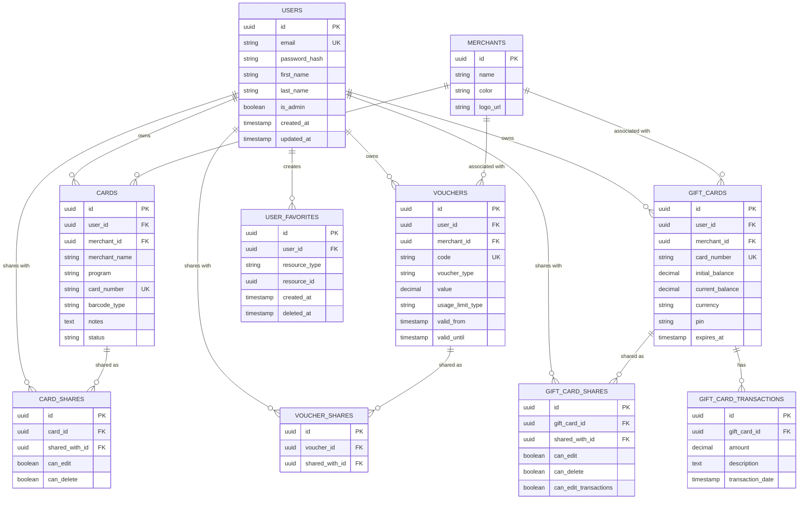
```mermaid
erDiagram
    USERS ||--o{ CARDS : owns
    USERS ||--o{ VOUCHERS : owns
    USERS ||--o{ GIFT_CARDS : owns
    USERS ||--o{ USER_FAVORITES : creates
    USERS ||--o{ CARD_SHARES : "shares with"
    USERS ||--o{ VOUCHER_SHARES : "shares with"
    USERS ||--o{ GIFT_CARD_SHARES : "shares with"

    MERCHANTS ||--o{ CARDS : "associated with"
    MERCHANTS ||--o{ VOUCHERS : "associated with"
    MERCHANTS ||--o{ GIFT_CARDS : "associated with"

    CARDS ||--o{ CARD_SHARES : "shared as"
    VOUCHERS ||--o{ VOUCHER_SHARES : "shared as"
    GIFT_CARDS ||--o{ GIFT_CARD_SHARES : "shared as"
    GIFT_CARDS ||--o{ GIFT_CARD_TRANSACTIONS : "has"

    USERS {
        uuid id PK
        string email UK
        string password_hash
        string first_name
        string last_name
        boolean is_admin
        timestamp created_at
        timestamp updated_at
    }

    MERCHANTS {
        uuid id PK
        string name
        string color
        string logo_url
    }

    USER_FAVORITES {
        uuid id PK
        uuid user_id FK
        string resource_type
        uuid resource_id
        timestamp created_at
        timestamp deleted_at
    }

    CARDS {
        uuid id PK
        uuid user_id FK
        uuid merchant_id FK
        string merchant_name
        string program
        string card_number UK
        string barcode_type
        text notes
        string status
    }

    CARD_SHARES {
        uuid id PK
        uuid card_id FK
        uuid shared_with_id FK
        boolean can_edit
        boolean can_delete
    }

    VOUCHERS {
        uuid id PK
        uuid user_id FK
        uuid merchant_id FK
        string code UK
        string voucher_type
        decimal value
        string usage_limit_type
        timestamp valid_from
        timestamp valid_until
    }

    VOUCHER_SHARES {
        uuid id PK
        uuid voucher_id FK
        uuid shared_with_id FK
    }

    GIFT_CARDS {
        uuid id PK
        uuid user_id FK
        uuid merchant_id FK
        string card_number UK
        decimal initial_balance
        decimal current_balance
        string currency
        string pin
        timestamp expires_at
    }

    GIFT_CARD_SHARES {
        uuid id PK
        uuid gift_card_id FK
        uuid shared_with_id FK
        boolean can_edit
        boolean can_delete
        boolean can_edit_transactions
    }

    GIFT_CARD_TRANSACTIONS {
        uuid id PK
        uuid gift_card_id FK
        decimal amount
        text description
        timestamp transaction_date
    }
```

### Database Features

**Key Strengths:**

1. **UUIDs als Primary Keys**
   - ✅ Nicht-sequenziell (Security)
   - ✅ Distributed-friendly
   - ✅ PostgreSQL `gen_random_uuid()`

2. **Foreign Keys & Cascading**
   - ✅ `ON DELETE CASCADE` für Share-Tabellen
   - ✅ `ON DELETE SET NULL` für Merchant-Beziehungen

3. **Polymorphic Favorites**
   - ✅ `resource_type` + `resource_id` Pattern
   - ✅ Soft Delete für Toggle-Funktionalität
   - ✅ UNIQUE Constraint: `(user_id, resource_type, resource_id)`

4. **Granular Permissions**
   - ✅ Card: `can_edit`, `can_delete`
   - ✅ Voucher: Read-only
   - ✅ Gift Card: `can_edit`, `can_delete`, `can_edit_transactions`

5. **Database Triggers**
   - ✅ `recalculate_gift_card_balance()` - Auto-update bei Transaktionen
   - ✅ `enforce_lowercase_email()` - Email Normalization

6. **Composite UNIQUE Constraints**
   - ✅ `(user_id, card_number)` für Cards
   - ✅ `(user_id, code)` für Vouchers
   - ✅ `(user_id, card_number)` für Gift Cards

---

## 🔐 Security Architecture

Die Sicherheitsarchitektur des Savvy Systems basiert auf **Defense in Depth** - mehrere Sicherheitsschichten schützen vor verschiedenen Angriffsarten. Die Implementierung folgt OWASP-Best-Practices und umfasst Authentication, Authorization, Input Protection und Audit Logging.

### Authentication Flow

Der Authentication-Flow implementiert **session-based authentication** mit mehreren Sicherheitsmaßnahmen:

- **Bcrypt Password Hashing**: Alle Passwörter werden mit bcrypt (10 rounds) gehasht
- **Timing-Attack Prevention**: Bei fehlgeschlagenen Logins wird ein Dummy-Hash berechnet, um Timing-Attacks zu verhindern
- **Session Regeneration**: Nach erfolgreichem Login wird die Session-ID neu generiert (verhindert Session Fixation)
- **Secure Cookies**: HttpOnly, Secure (HTTPS), SameSite=Lax

Das Sequenzdiagramm zeigt den vollständigen Login-Prozess von der Eingabe der Credentials bis zur Speicherung der Session.

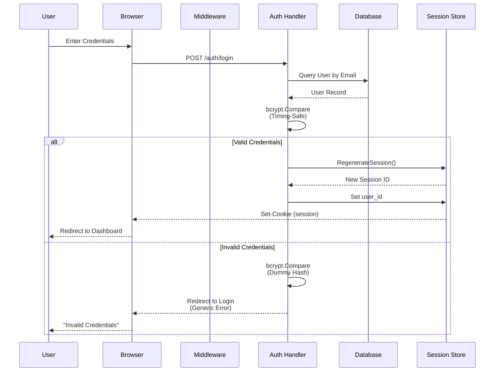
```mermaid
sequenceDiagram
    participant U as User
    participant B as Browser
    participant M as Middleware
    participant H as Auth Handler
    participant DB as Database
    participant S as Session Store

    U->>B: Enter Credentials
    B->>H: POST /auth/login

    H->>DB: Query User by Email
    DB-->>H: User Record

    H->>H: bcrypt.Compare<br/>(Timing-Safe)

    alt Valid Credentials
        H->>S: RegenerateSession()
        S-->>H: New Session ID
        H->>S: Set user_id
        S-->>B: Set-Cookie (session)
        B-->>U: Redirect to Dashboard
    else Invalid Credentials
        H->>H: bcrypt.Compare<br/>(Dummy Hash)
        H-->>B: Redirect to Login<br/>(Generic Error)
        B-->>U: "Invalid Credentials"
    end
```

### Authorization Flow

Das Authorization-System implementiert ein **ownership-based permission model** mit drei Zugriffsebenen:

1. **Owner (Full Access)**: Der Ersteller einer Ressource hat immer vollen Zugriff (View, Edit, Delete)
2. **Shared Access (Conditional)**: Geteilte Ressourcen haben granulare Berechtigungen je nach Share-Konfiguration
3. **No Access (Forbidden)**: Ohne Ownership oder Share-Zugriff wird der Zugriff verweigert

Dieser Flowchart zeigt die Entscheidungslogik: Zunächst wird die Authentication geprüft, dann Ownership, dann Share-Access. Die Berechtigungen sind ressourcen-spezifisch:
- **Cards**: `can_edit`, `can_delete`
- **Vouchers**: Immer read-only bei Shares
- **Gift Cards**: `can_edit`, `can_delete`, `can_edit_transactions`

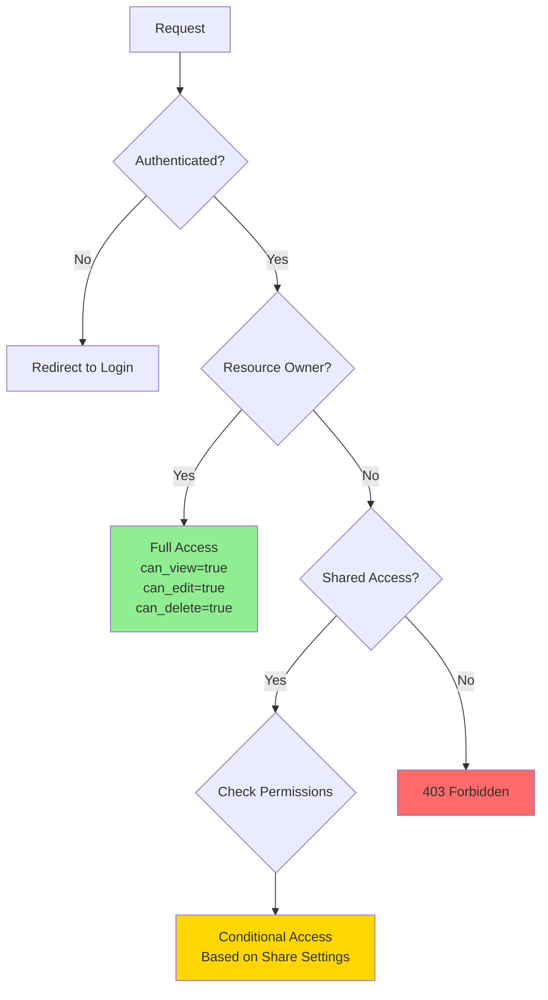
```mermaid
flowchart TD
    A[Request] --> B{Authenticated?}
    B -->|No| C[Redirect to Login]
    B -->|Yes| D{Resource Owner?}
    D -->|Yes| E[Full Access<br/>can_view=true<br/>can_edit=true<br/>can_delete=true]
    D -->|No| F{Shared Access?}
    F -->|Yes| G{Check Permissions}
    F -->|No| H[403 Forbidden]
    G --> I[Conditional Access<br/>Based on Share Settings]

    style E fill:#90EE90
    style I fill:#FFD700
    style H fill:#FF6B6B
```

### Security Features

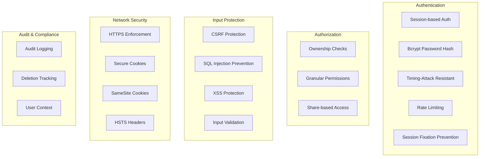
```mermaid
graph TB
    subgraph "Authentication"
        A1[Session-based Auth]
        A2[Bcrypt Password Hash]
        A3[Timing-Attack Resistant]
        A4[Rate Limiting]
        A5[Session Fixation Prevention]
    end

    subgraph "Authorization"
        B1[Ownership Checks]
        B2[Granular Permissions]
        B3[Share-based Access]
    end

    subgraph "Input Protection"
        C1[CSRF Protection]
        C2[SQL Injection Prevention]
        C3[XSS Protection]
        C4[Input Validation]
    end

    subgraph "Network Security"
        D1[HTTPS Enforcement]
        D2[Secure Cookies]
        D3[SameSite Cookies]
        D4[HSTS Headers]
    end

    subgraph "Audit & Compliance"
        E1[Audit Logging]
        E2[Deletion Tracking]
        E3[User Context]
    end
```

**Implementation Details:**

1. **Session Security**
   - HttpOnly: ✅ (JavaScript kann nicht zugreifen)
   - Secure: ✅ (HTTPS in Production)
   - SameSite: Lax (CSRF Protection)
   - Session Regeneration bei Login/Register

2. **Password Security**
   - Bcrypt mit DefaultCost (10 rounds)
   - Timing-Attack Prevention (dummy hash)
   - Validation: Min 8 chars, 1 uppercase, 1 lowercase, 1 digit

3. **CSRF Protection**
   - Token in Form + Header
   - Auto-injection in HTMX requests
   - HttpOnly CSRF Cookie

4. **SQL Injection Prevention**
   - GORM Parameterized Queries
   - Keine Raw SQL in Handlers

5. **XSS Prevention**
   - Templ Auto-Escaping
   - `@templ.Raw()` nur für trusted content

### Authorization Service (AuthzService)

**Zentrale Authorization-Logik** (`internal/services/authz_service.go`, 154 LOC):

Der AuthzService implementiert eine **zentrale, wiederverwendbare Authorization-Logik** für alle Ressourcen-Typen. Dies vermeidet Code-Duplikation und stellt konsistente Permission-Checks sicher.

**Interface Design**:

```go
type AuthzServiceInterface interface {
    CheckCardAccess(ctx context.Context, userID, cardID uuid.UUID) (*ResourcePermissions, error)
    CheckVoucherAccess(ctx context.Context, userID, voucherID uuid.UUID) (*ResourcePermissions, error)
    CheckGiftCardAccess(ctx context.Context, userID, giftCardID uuid.UUID) (*ResourcePermissions, error)
}

type ResourcePermissions struct {
    CanView             bool
    CanEdit             bool
    CanDelete           bool
    CanEditTransactions bool // Gift Cards only
    IsOwner             bool
}
```

**Permission-Check Flow**:

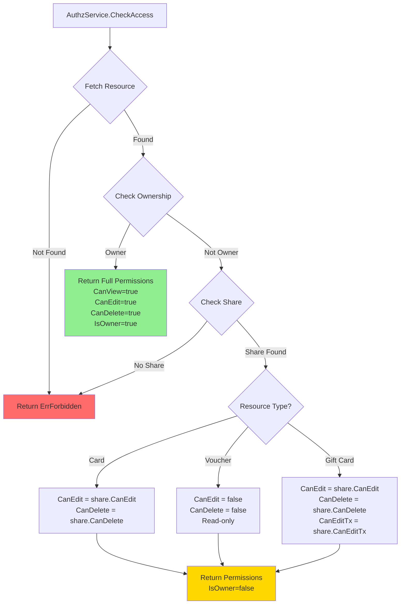
```mermaid
flowchart TD
    A[AuthzService.CheckAccess] --> B{Fetch Resource}
    B -->|Not Found| C[Return ErrForbidden]
    B -->|Found| D{Check Ownership}

    D -->|Owner| E[Return Full Permissions<br/>CanView=true<br/>CanEdit=true<br/>CanDelete=true<br/>IsOwner=true]

    D -->|Not Owner| F{Check Share}
    F -->|No Share| C
    F -->|Share Found| G{Resource Type?}

    G -->|Card| H[CanEdit = share.CanEdit<br/>CanDelete = share.CanDelete]
    G -->|Voucher| I[CanEdit = false<br/>CanDelete = false<br/>Read-only]
    G -->|Gift Card| J[CanEdit = share.CanEdit<br/>CanDelete = share.CanDelete<br/>CanEditTx = share.CanEditTx]

    H --> K[Return Permissions<br/>IsOwner=false]
    I --> K
    J --> K

    style E fill:#90EE90
    style K fill:#FFD700
    style C fill:#FF6B6B
```

**Implementation Details**:

1. **Ownership-First**: Prüft immer zuerst, ob User der Owner ist
2. **Share-Fallback**: Falls nicht Owner, prüfe Share-Tabelle
3. **Type-Specific**: Vouchers sind IMMER read-only bei Shares
4. **Error Handling**: `ErrForbidden` für unauthorized, andere Errors für DB-Probleme
5. **Context-Aware**: Alle Queries nutzen `ctx` für Tracing

**Status**: ✅ Vollständig implementiert und in ALLEN 27 Handlern integriert (v1.4.0)

**Integration Details**:
- Eliminiert duplicate Permission-Logic über alle Handler
- Konsistente Authorization-Checks für Cards, Vouchers, Gift Cards
- 7 Unit Tests mit PostgreSQL (Owner, SharedUser, Permissions)
- Handler Coverage: 83.9% Average (Cards: 84.6%, Vouchers: 85.6%, Gift Cards: 81.6%)

---

## 📊 Observability

Das Observability-System implementiert die **drei Säulen der Observability**: Metrics, Logs und Traces. Diese Kombination ermöglicht vollständige Transparenz über das System-Verhalten in Production.

**Warum Observability wichtig ist**:
- **Proaktives Monitoring**: Probleme erkennen, bevor Users sie melden
- **Schnelleres Debugging**: Trace-IDs verbinden Logs, Metrics und Requests
- **Performance-Optimierung**: Identifikation von Bottlenecks durch Request-Latency-Metrics
- **Capacity Planning**: Resource-Metrics zeigen, wann Scaling nötig ist

### Monitoring Stack

Die Monitoring-Architektur nutzt **Grafana Cloud** als zentrale Plattform für alle Observability-Daten:

- **Prometheus**: Sammelt Metrics vom `/metrics` Endpoint (HTTP-Performance, Resource-Counts, DB-Connections)
- **Loki**: Aggregiert strukturierte Logs aus der Anwendung
- **Tempo**: Sammelt OpenTelemetry Traces für Request-Tracking (geplant)
- **Grafana**: Visualisiert alle Daten in kombinierten Dashboards

Die Anwendung exportiert automatisch Metrics via Prometheus-Format und traced alle Requests via OpenTelemetry. Health- und Readiness-Endpoints ermöglichen Kubernetes-Integration.

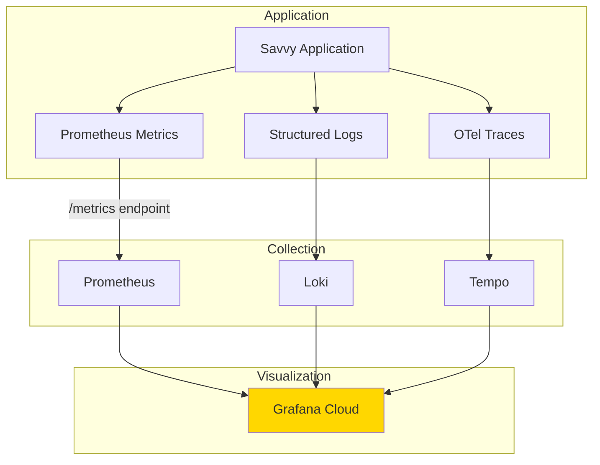
```mermaid
graph TB
    subgraph "Application"
        App[Savvy Application]
        Metrics[Prometheus Metrics]
        Logs[Structured Logs]
        Traces[OTel Traces]
    end

    subgraph "Collection"
        Prom[Prometheus]
        Loki[Loki]
        Tempo[Tempo]
    end

    subgraph "Visualization"
        Grafana[Grafana Cloud]
    end

    App --> Metrics
    App --> Logs
    App --> Traces

    Metrics -->|/metrics endpoint| Prom
    Logs --> Loki
    Traces --> Tempo

    Prom --> Grafana
    Loki --> Grafana
    Tempo --> Grafana

    style Grafana fill:#FFD700
```

### Available Metrics

**HTTP Metrics:**
- `http_request_duration_seconds` (Histogram) - Request latency by method, path, status
- `http_requests_total` (Counter) - Total requests by method, path, status
- `app_errors_total` (Counter) - Application errors by type

**Resource Metrics:**
- `cards_total` (Gauge) - Total cards in system
- `vouchers_total` (Gauge) - Total vouchers
- `gift_cards_total` (Gauge) - Total gift cards
- `users_total` (Gauge) - Total users

**System Metrics:**
- `active_sessions` (Gauge) - Active user sessions
- `db_connections_active` (Gauge) - Active DB connections
- `db_connections_idle` (Gauge) - Idle DB connections

### Health Endpoints

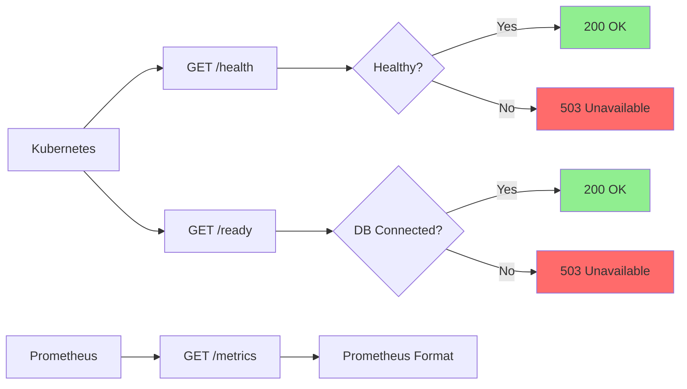
```mermaid
graph LR
    K8s[Kubernetes] --> Health[GET /health]
    K8s --> Ready[GET /ready]
    Prom[Prometheus] --> Metrics[GET /metrics]

    Health --> Status{Healthy?}
    Ready --> DB{DB Connected?}
    Metrics --> Export[Prometheus Format]

    Status -->|Yes| H200[200 OK]
    Status -->|No| H503[503 Unavailable]
    DB -->|Yes| R200[200 OK]
    DB -->|No| R503[503 Unavailable]

    style H200 fill:#90EE90
    style R200 fill:#90EE90
    style H503 fill:#FF6B6B
    style R503 fill:#FF6B6B
```

---

## ⚡ Performance Optimizations

Das System wurde systematisch auf Performance optimiert. Zwei Hauptbereiche wurden signifikant verbessert: **Dashboard-Ladezeit** (40% schneller) und **Gift Card Balance-Berechnung** (78% schneller).

### Dashboard Performance

Das Dashboard ist die am häufigsten aufgerufene Seite und wurde für minimale Ladezeit optimiert. Die ursprüngliche Implementierung hatte ein klassisches **N+1 Query Problem**: Für jeden Ressourcentyp wurden separate Queries ausgeführt, was zu über 10 Datenbankzugriffen führte.

**Optimierungsstrategie**:

1. **Parallele Ausführung**: Statistik-Queries laufen in Goroutines parallel statt sequenziell
2. **Query-Reduktion**: Favorites werden mit einer einzigen `GROUP BY` Query abgefragt statt 3 separaten Queries
3. **Batch-Loading**: Recent Items werden in 3 parallel laufenden Goroutines geladen
4. **Selective Loading**: Nur die benötigten Felder werden geladen (kein `SELECT *`)

**Ergebnis**: Dashboard-Ladezeit reduziert von ~150ms auf ~90ms (40% Verbesserung).

**Query Optimization Strategy:**

Das Flowchart zeigt die parallele Ausführung: Ein Dashboard-Request triggert sofort parallele Goroutines für Stats (6 parallel), Favorites (1 GROUP BY) und Recent Items (3 parallel). Alle Ergebnisse werden aggregiert und in einem Response zurückgeliefert.

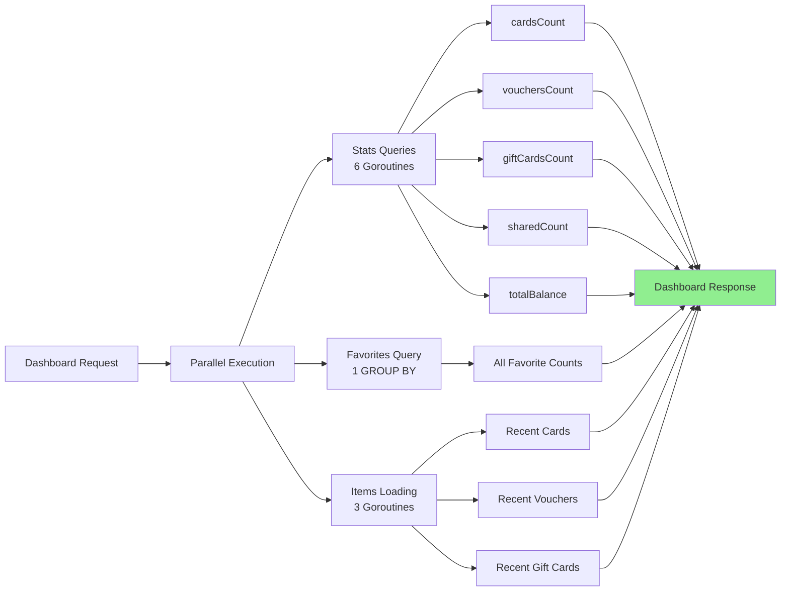
```mermaid
flowchart LR
    A[Dashboard Request] --> B[Parallel Execution]

    B --> C[Stats Queries<br/>6 Goroutines]
    B --> D[Favorites Query<br/>1 GROUP BY]
    B --> E[Items Loading<br/>3 Goroutines]

    C --> F[cardsCount]
    C --> G[vouchersCount]
    C --> H[giftCardsCount]
    C --> I[sharedCount]
    C --> J[totalBalance]

    D --> K[All Favorite Counts]

    E --> L[Recent Cards]
    E --> M[Recent Vouchers]
    E --> N[Recent Gift Cards]

    F --> O[Dashboard Response]
    G --> O
    H --> O
    I --> O
    J --> O
    K --> O
    L --> O
    M --> O
    N --> O

    style O fill:#90EE90
```

**Performance Metrics:**

| Optimization | Before | After | Improvement |
|--------------|--------|-------|-------------|
| Dashboard Load | 10+ queries, ~150ms | 8 queries, ~90ms | 40% faster |
| Favorites Check | 3 queries | 1 query (GROUP BY) | 67% reduction |
| Gift Card Balance | Runtime calculation | DB trigger cached | 78% faster |

### Gift Card Balance Caching

Die ursprüngliche Implementierung berechnete das Gift Card Guthaben bei jedem Request durch Summierung aller Transaktionen. Dies war ineffizient und führte zu N+1 Queries, besonders beim Laden von Listen mit mehreren Gift Cards.

**Lösung: PostgreSQL Database Trigger**

Ein PostgreSQL-Trigger berechnet automatisch das aktuelle Guthaben nach jeder Transaction-Änderung und speichert es in der `current_balance` Spalte. Dies verlagert die Berechnung vom Application-Layer in die Datenbank, wo sie performanter und atomarer ausgeführt wird.

**Vorteile**:
- **Keine Runtime-Berechnung**: Balance ist immer aktuell und direkt verfügbar
- **Keine N+1 Queries**: Kein `Preload("Transactions")` mehr nötig
- **Atomic Updates**: Balance-Update und Transaction-Insert sind atomar
- **78% Performance-Verbesserung**: Messbar schnelleres Laden von Gift Card Listen

**Database Trigger Flow:**

Das Sequenzdiagramm zeigt den automatischen Ablauf: Wenn die Anwendung eine Transaction einfügt, triggert PostgreSQL automatisch den `recalculate_gift_card_balance()` Trigger, der die Balance neu berechnet und aktualisiert - vollständig transparent für die Application.

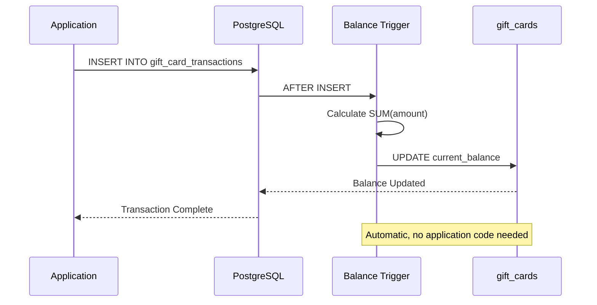
```mermaid
sequenceDiagram
    participant App as Application
    participant DB as PostgreSQL
    participant Trigger as Balance Trigger
    participant GC as gift_cards

    App->>DB: INSERT INTO gift_card_transactions
    DB->>Trigger: AFTER INSERT
    Trigger->>Trigger: Calculate SUM(amount)
    Trigger->>GC: UPDATE current_balance
    GC-->>DB: Balance Updated
    DB-->>App: Transaction Complete

    Note over Trigger,GC: Automatic, no application code needed
```

**Benefits:**
- ✅ Keine N+1 Queries
- ✅ Kein `Preload("Transactions")` nötig
- ✅ Balance immer aktuell
- ✅ ~78% Performance-Verbesserung

---

## 🎨 Frontend Architecture

Das Savvy System folgt einem **Server-First Rendering Approach** mit progressiver Verbesserung. Statt eines komplexen JavaScript-Frameworks wie React oder Vue wird auf eine Kombination aus Server-Side Rendering (Templ) und gezieltem clientseitigen JavaScript (HTMX, Alpine.js) gesetzt.

**Philosophie**: HTML-First, JavaScript als Enhancement

- **Server-Side Rendering**: Der Server generiert vollständiges HTML via Templ-Templates
- **Progressive Enhancement**: HTMX ermöglicht dynamische Updates ohne Page Reload
- **Reactive Components**: Alpine.js managed lokalen State (Scanner, Filter)
- **Modular JavaScript**: Rollup bundelt `static/js/src/` → `static/js/bundle.js`
- **Build Pipeline**: PostCSS + TailwindCSS für CSS, Rollup + Terser für JavaScript

Diese Architektur reduziert Komplexität, verbessert Time-to-Interactive und funktioniert auch ohne JavaScript (Graceful Degradation).

### Tech Stack

Das Frontend-Tech-Stack-Diagramm zeigt die Interaktion zwischen Browser, Server und Templates:

- **HTMX** sendet AJAX-Requests und tauscht HTML-Fragmente aus (kein JSON-Parsing)
- **Alpine.js** managed clientseitigen State (Scanner-Modal, Filter-Logik)
- **ZXing** scannt Barcodes via Webcam und gibt Ergebnisse an Alpine
- **Templ** generiert type-safe HTML auf dem Server (keine Template-Strings)

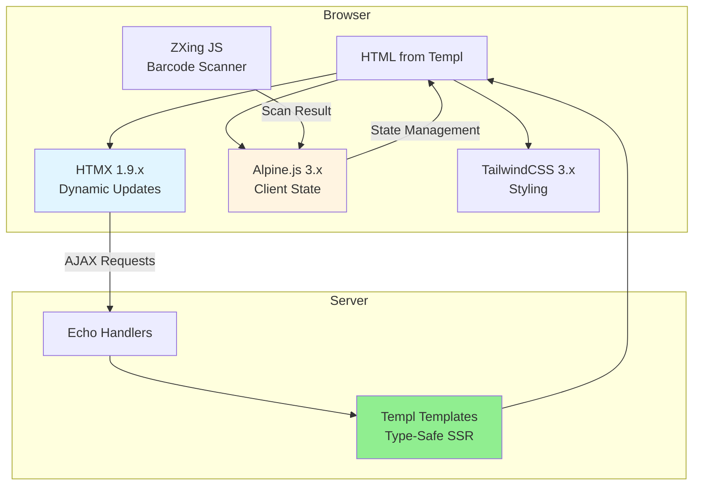
```mermaid
graph TB
    subgraph "Browser"
        HTML[HTML from Templ]
        HTMX[HTMX 1.9.x<br/>Dynamic Updates]
        Alpine[Alpine.js 3.x<br/>Client State]
        Tailwind[TailwindCSS 3.x<br/>Styling]
        ZXing[ZXing JS<br/>Barcode Scanner]
    end

    subgraph "Server"
        Templ[Templ Templates<br/>Type-Safe SSR]
        Handlers[Echo Handlers]
    end

    HTML --> HTMX
    HTML --> Alpine
    HTML --> Tailwind

    HTMX -->|AJAX Requests| Handlers
    Alpine -->|State Management| HTML
    ZXing -->|Scan Result| Alpine

    Handlers --> Templ
    Templ --> HTML

    style HTMX fill:#e1f5ff
    style Alpine fill:#fff4e1
    style Templ fill:#90EE90
```

### HTMX Interaction Pattern

HTMX ermöglicht **dynamische Updates ohne Page Reload** durch AJAX-Requests, die HTML-Fragmente austauschen. Im Gegensatz zu JSON-basierten APIs (React, Vue) sendet der Server direkt HTML, das vom Browser gerendert wird.

**Vorteile**:
- **Einfacheres Backend**: Handler returnen HTML statt JSON
- **Type-Safety**: Templ-Templates sind type-safe kompiliert
- **Kleinere Payloads**: Nur benötigte HTML-Fragmente werden übertragen
- **SEO-Friendly**: Initiales HTML ist vollständig gerendert

Das Sequenzdiagramm zeigt ein typisches HTMX-Beispiel: Ein Delete-Button sendet einen DELETE-Request, der Server validiert die Action, generiert ein HTML-Fragment (z.B. Erfolgsmeldung) und HTMX tauscht das ursprüngliche Element aus - ohne Page Reload.

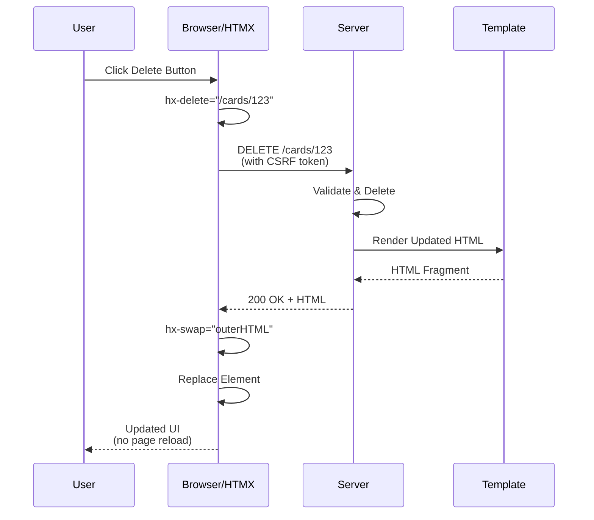
```mermaid
sequenceDiagram
    participant U as User
    participant B as Browser/HTMX
    participant S as Server
    participant T as Template

    U->>B: Click Delete Button
    B->>B: hx-delete="/cards/123"
    B->>S: DELETE /cards/123<br/>(with CSRF token)

    S->>S: Validate & Delete
    S->>T: Render Updated HTML
    T-->>S: HTML Fragment

    S-->>B: 200 OK + HTML
    B->>B: hx-swap="outerHTML"
    B->>B: Replace Element
    B-->>U: Updated UI<br/>(no page reload)
```

### Alpine.js State Management

Alpine.js wird für **client-seitige Interaktivität** verwendet, die keinen Server-Request erfordert. Typische Use-Cases: Scanner-Modal, Filter/Sort-Logik, Form-Validierung.

**Use-Case: Barcode Scanner**

Der Barcode-Scanner ist ein komplexes Feature, das vollständig im Client läuft:
1. User klickt "Scannen" → Alpine öffnet Modal und startet Kamera
2. ZXing verarbeitet Video-Stream und erkennt Barcode
3. Bei Erfolg: Barcode wird in Input-Feld eingefügt, Modal schließt
4. Bei Fehler: User kann Retry oder Cancel

Das State-Diagramm zeigt die verschiedenen Zustände (Idle, Scanning, Processing, Success, Error) und die Übergänge zwischen ihnen. Alpine managed den gesamten State (`scanning`, `scanMessage`, `cardNumber`) ohne Server-Round-Trip.

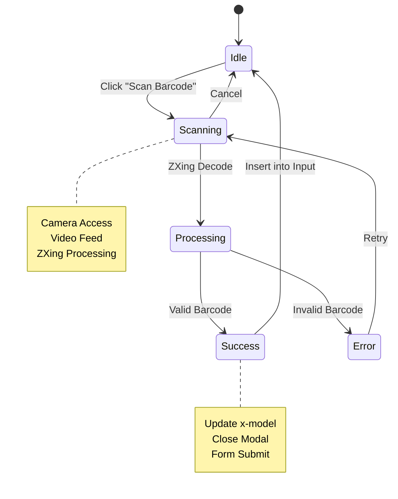
```mermaid
stateDiagram-v2
    [*] --> Idle
    Idle --> Scanning: Click "Scan Barcode"
    Scanning --> Processing: ZXing Decode
    Processing --> Success: Valid Barcode
    Processing --> Error: Invalid Barcode
    Success --> Idle: Insert into Input
    Error --> Scanning: Retry
    Scanning --> Idle: Cancel

    note right of Scanning
        Camera Access
        Video Feed
        ZXing Processing
    end note

    note right of Success
        Update x-model
        Close Modal
        Form Submit
    end note
```

### JavaScript Architecture

**Modular Build System** (Rollup-basiert):

Das Frontend-JavaScript ist in modulare Dateien aufgeteilt und wird via Rollup gebundled. Dies ermöglicht Code-Organisation ohne Komplexität eines Full-Stack-Frameworks.

**Dateistruktur** (`static/js/src/`):

```javascript
app.js          // Entry Point (51 LOC)
  ├─ import Alpine from 'alpinejs'
  ├─ import htmx from 'htmx.org'
  ├─ import { Html5Qrcode } from 'html5-qrcode'
  ├─ import './scanner.js'    // Barcode Scanner Functions
  ├─ import './offline.js'    // Offline Detection
  ├─ import './precache.js'   // PWA Precaching
  └─ Alpine.start()

scanner.js      // Barcode Scanner Module (350 LOC)
  ├─ window.cardForm()        // Card Scanner State Machine
  ├─ window.voucherForm()     // Voucher Scanner
  ├─ window.giftCardForm()    // Gift Card Scanner
  └─ window.emailAutocomplete() // Email Autocomplete for Sharing

offline.js      // Offline Detection (Alpine Store)
  └─ Alpine.store('offline', { isOffline: false })

precache.js     // PWA Precaching Logic
  └─ Service Worker communication
```

**Build Pipeline**:

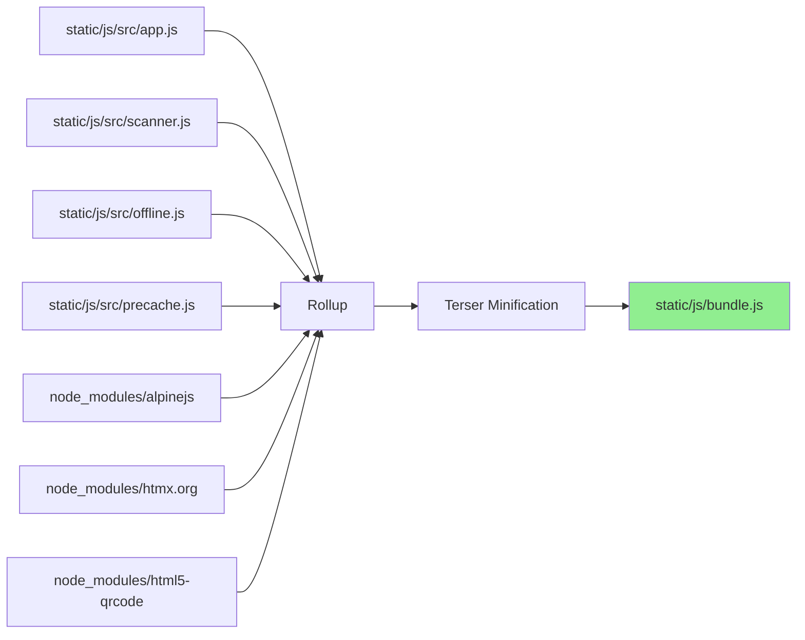
```mermaid
graph LR
    A[static/js/src/app.js] --> B[Rollup]
    C[static/js/src/scanner.js] --> B
    D[static/js/src/offline.js] --> B
    E[static/js/src/precache.js] --> B

    F[node_modules/alpinejs] --> B
    G[node_modules/htmx.org] --> B
    H[node_modules/html5-qrcode] --> B

    B --> I[Terser Minification]
    I --> J[static/js/bundle.js]

    style J fill:#90EE90
```

**Rollup Konfiguration**:

```javascript
// rollup.config.js
export default {
  input: 'static/js/src/app.js',
  output: {
    file: 'static/js/bundle.js',
    format: 'iife', // Immediately Invoked Function Expression
    name: 'app'
  },
  plugins: [
    resolve(),    // Resolve node_modules
    commonjs(),   // Convert CommonJS to ES6
    terser()      // Minification
  ]
}
```

**Vorteile dieser Architektur**:

- ✅ **Modularität**: Klare Separation (Scanner, Offline, Precache)
- ✅ **Type-Safety**: Scanner-Functions sind zentralisiert in scanner.js
- ✅ **Tree-Shaking**: Unused Code wird automatisch entfernt
- ✅ **Performance**: Minified Bundle (~150KB mit Dependencies)
- ✅ **Developer Experience**: Hot Reload via Air + `npm run watch`

---

## 🚀 Deployment Architecture

Das Savvy System ist für **containerisierte Deployments mit Reverse Proxy** optimiert. Die Production-Architektur nutzt **Traefik** für TLS-Terminierung und Routing.

### Production Architecture (Traefik)

**Network Flow**:
```
Client (HTTPS:443) → Traefik (TLS Termination) → App (HTTP:8080) → PostgreSQL
                                ↓
                          Let's Encrypt
```

**Traefik Reverse Proxy**:
- ✅ **TLS-Terminierung**: Let's Encrypt Zertifikate automatisch
- ✅ **HTTPS-Redirect**: HTTP → HTTPS Redirect auf Proxy-Ebene
- ✅ **Header-Injection**: `X-Forwarded-Proto`, `X-Real-IP`, `X-Forwarded-For`
- ✅ **Load Balancing**: Für Multi-Instance Deployments
- ✅ **Health Checks**: Automatisches Routing nur zu gesunden Pods

**Wichtig**: Die App selbst läuft auf **HTTP (Port 8080)**, Traefik übernimmt die TLS-Verschlüsselung.

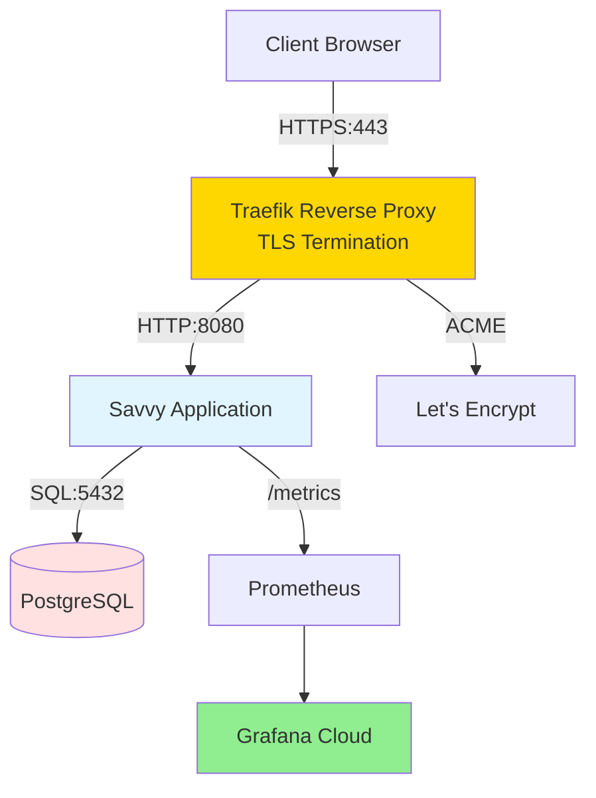
```mermaid
graph TB
    Client[Client Browser] -->|HTTPS:443| Traefik[Traefik Reverse Proxy<br/>TLS Termination]
    Traefik -->|HTTP:8080| App[Savvy Application]
    Traefik -->|ACME| LE[Let's Encrypt]

    App -->|SQL:5432| DB[(PostgreSQL)]
    App -->|/metrics| Prom[Prometheus]
    Prom --> Grafana[Grafana Cloud]

    style Traefik fill:#FFD700
    style App fill:#e1f5ff
    style DB fill:#ffe1e1
    style Grafana fill:#90EE90
```

### Container Structure

**Development Setup (Docker Compose)**:

Die lokale Entwicklungsumgebung nutzt Docker Compose:
- **Application Container**: Go-Binary auf Port 8080, statische Files im `/static` Verzeichnis
- **PostgreSQL Container**: PostgreSQL 16 auf Port 5432
- **Optional Traefik**: Für lokales HTTPS-Testing

**Observability-Integration**:
- Prometheus scraped den `/metrics` Endpoint für Monitoring
- Logs werden strukturiert ausgegeben (JSON-Format für Production)
- Grafana Cloud aggregiert alle Metrics für zentrale Visualisierung

### Kubernetes Deployment (Optional)

**Alternative Production Setup (Kubernetes/K3s)**:

Für skalierbare Production-Deployments kann Kubernetes genutzt werden:

- **Ingress Controller (Traefik)**: TLS-Terminierung und Routing
  - Traefik IngressRoute für HTTP → HTTPS Redirect
  - Let's Encrypt Cert-Manager Integration
  - Middleware für Security Headers
- **2+ Replicas**: Horizontal skalierte Application-Pods für High Availability
- **ConfigMap/Secret**: Environment-Variables und Secrets als Kubernetes-Ressourcen
- **External Database**: Managed PostgreSQL Service (höhere Verfügbarkeit)
- **Grafana Cloud Integration**: OpenTelemetry Traces und Metrics

**Health Checks**: Kubernetes nutzt `/health` (liveness) und `/ready` (readiness) Endpoints für automatisches Pod-Management. Bei Problemen werden Pods automatisch neu gestartet.

**Traefik Middleware**:
```yaml
# traefik-middleware.yaml
apiVersion: traefik.containo.us/v1alpha1
kind: Middleware
metadata:
  name: savvy-security-headers
spec:
  headers:
    sslRedirect: true
    stsSeconds: 31536000
    stsIncludeSubdomains: true
    stsPreload: true
    frameDeny: true
    contentTypeNosniff: true
```

Das Diagramm zeigt die vollständige Kubernetes-Architektur mit Traefik Ingress, Service, Pods, ConfigMap/Secret und externen Dependencies (PostgreSQL, Grafana Cloud).

```mermaid
graph TB
    subgraph "Ingress"
        Ingress[Ingress<br/>TLS Termination]
    end

    subgraph "Savvy Namespace"
        Service[Service<br/>ClusterIP]

        subgraph "Deployment"
            Pod1[Pod 1<br/>Savvy App]
            Pod2[Pod 2<br/>Savvy App]
        end

        ConfigMap[ConfigMap<br/>Configuration]
        Secret[Secret<br/>DB Password]
    end

    subgraph "External"
        DB[(PostgreSQL<br/>Managed Service)]
        Grafana[Grafana Cloud]
    end

    Ingress --> Service
    Service --> Pod1
    Service --> Pod2

    Pod1 --> ConfigMap
    Pod1 --> Secret
    Pod2 --> ConfigMap
    Pod2 --> Secret

    Pod1 -->|SQL| DB
    Pod2 -->|SQL| DB

    Pod1 -->|OTel| Grafana
    Pod2 -->|OTel| Grafana
```

---

## 📚 Weitere Ressourcen

- **Changelog und Versionshistorie**: siehe [README.md](README.md#-changelog)
- **Implementierungs-Roadmap und offene Aufgaben**: siehe [TODO.md](TODO.md)
- **Operative Aspekte** (Audit Logging, Monitoring): siehe [OPERATIONS.md](OPERATIONS.md)
