# Savvy - Architecture Documentation

**Last Updated:** 2026-03-02
**Status:** Production-Ready (Layered Architecture + SvelteKit SPA)

---

## 📋 Executive Summary

The Savvy is a modern **Full-Stack Web Application** for managing customer cards, vouchers, and gift cards with comprehensive sharing functionality. The application uses **Go/Echo** in the backend with a **JSON API** and **SvelteKit** as a modern **TypeScript SPA** frontend.

### Architecture Characteristics

| Category                 | Status                                                                                    |
| ------------------------ | ----------------------------------------------------------------------------------------- |
| **Code Organization**    | ✅ Layered Architecture (no DB calls in Handlers)                                         |
| **Security**             | ✅ Comprehensive implementation (session-based auth, CSRF, bcrypt, parameterized queries) |
| **Performance**          | ✅ Optimized (SvelteKit SPA, API caching, database triggers)                              |
| **Testability**          | ✅ Go: 80.0% Service, 80.4% Handler / Frontend: 23 E2E test files (Playwright)            |
| **Maintainability**      | ✅ Layered Architecture with TypeScript Frontend                                          |
| **Developer Experience** | ✅ SvelteKit + TypeScript + Vite HMR                                                      |
| **Observability**        | ✅ Prometheus metrics, health checks, structured logging                                  |

---

## 🏗️ System Architecture

### High-Level Overview

The Savvy follows a **modern API-First Full-Stack Architecture** with a SvelteKit SPA and JSON API backend. The architecture is divided into four main layers:

**Client Layer**: A **SvelteKit Single Page Application** (TypeScript) communicates with the backend via
a JSON API. SvelteKit uses Vite for build/dev server, TailwindCSS for styling, barcode-detector for
barcode scanning (browser), and bwip-js for barcode generation (server). Svelte Stores manage global
state (auth, offline, notifications, i18n). PWA functionality is provided via custom Service Worker
with Workbox Recipes (injectManifest strategy) for offline-first caching.

**Application Layer**: The Go-based Echo Web Framework processes API requests (`/api/v1/`) through a middleware chain (Authentication, CSRF, CORS, Tracing). JSON API Handlers transform requests into DTOs, call business services, and return JSON responses. This clear layering follows the Layered Architecture pattern.

**Data Layer**: GORM as ORM layer abstracts the PostgreSQL database. All data is structured, validated, and made accessible via repositories through GORM models. Embedded migrations (Gormigrate) are automatically applied at startup.

**Infrastructure**: Configuration, OpenTelemetry tracing, Prometheus metrics, and structured logging form the operational foundation for monitoring and debugging. The SvelteKit build is embedded into the Go binary via `//go:embed`.

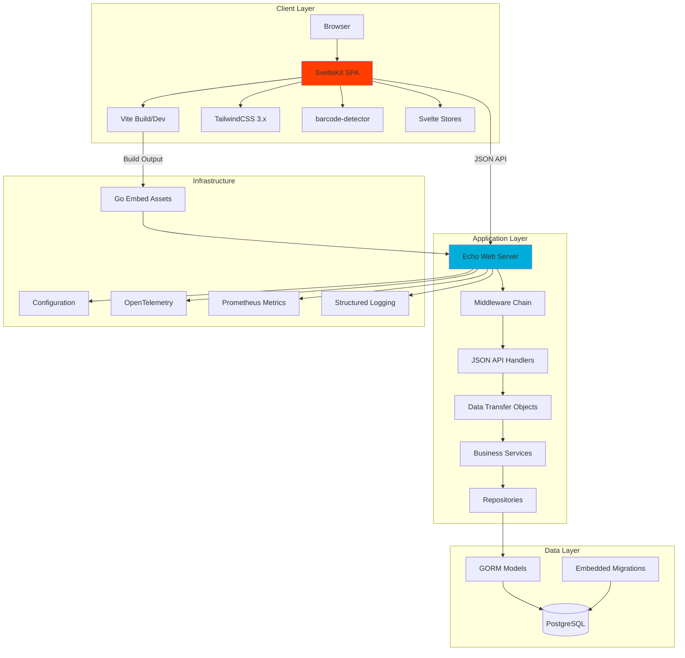
```mermaid
graph TB
    subgraph "Client Layer"
        Browser[Browser]
        SvelteKit[SvelteKit SPA]
        Vite[Vite Build/Dev]
        Tailwind[TailwindCSS 3.x]
        Scanner[barcode-detector]
        Stores[Svelte Stores]
    end

    subgraph "Application Layer"
        Echo[Echo Web Server]
        Middleware[Middleware Chain]
        APIHandlers[JSON API Handlers]
        DTOs[Data Transfer Objects]
        Services[Business Services]
        Repos[Repositories]
    end

    subgraph "Data Layer"
        Models[GORM Models]
        DB[(PostgreSQL)]
        Migrations[Embedded Migrations]
    end

    subgraph "Infrastructure"
        Config[Configuration]
        Telemetry[OpenTelemetry]
        Metrics[Prometheus Metrics]
        Logging[Structured Logging]
        Embed[Go Embed Assets]
    end

    Browser --> SvelteKit
    SvelteKit --> Vite
    SvelteKit --> Tailwind
    SvelteKit --> Scanner
    SvelteKit --> Stores

    SvelteKit -->|JSON API| Echo

    Echo --> Middleware
    Middleware --> APIHandlers
    APIHandlers --> DTOs
    DTOs --> Services
    Services --> Repos
    Repos --> Models
    Models --> DB

    Migrations --> DB

    Echo --> Config
    Echo --> Telemetry
    Echo --> Metrics
    Echo --> Logging

    Vite -->|Build Output| Embed
    Embed --> Echo

    style SvelteKit fill:#FF3E00
    style Echo fill:#00ADD8
```

---

## 🎯 Layered Architecture Pattern

The application follows a **3-Layer Layered Architecture** pattern with strict dependency direction. This pattern separates the application into three clear layers, where each layer only knows about the layers below it. This enables:

- **Testability**: Each layer can be tested in isolation
- **Maintainability**: Changes in one layer have minimal impact on others
- **Flexibility**: Business logic is independent of framework details
- **Clear Responsibilities**: Each layer has a clearly defined purpose

The diagram shows the three main layers and their dependency direction. **Important**: The dependency direction always flows from outside to inside (Handlers → Services → Repositories), never in reverse. This is achieved through Go interfaces defined in the higher layers.

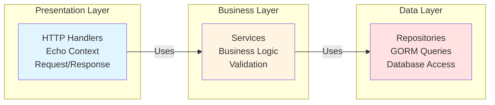
```mermaid
graph LR
    subgraph "Presentation Layer"
        H[HTTP Handlers<br/>Echo Context<br/>Request/Response]
    end

    subgraph "Business Layer"
        S[Services<br/>Business Logic<br/>Validation]
    end

    subgraph "Data Layer"
        R[Repositories<br/>GORM Queries<br/>Database Access]
    end

    H -->|Uses| S
    S -->|Uses| R

    style H fill:#e1f5ff
    style S fill:#fff4e1
    style R fill:#ffe1e1
```

### Dependency Rules

1. **Handler Layer** (Presentation)
   - Knows: Services (via Interfaces)
   - Does not know: Repositories, Database

2. **Service Layer** (Business Logic)
   - Knows: Repositories (via Interfaces)
   - Does not know: HTTP Details (Echo Context)

3. **Repository Layer** (Data Access)
   - Knows: Models, Database (GORM)
   - Does not know: Business Logic, HTTP

---

## 📦 Request Flow

A typical HTTP request goes through multiple layers before a response is generated. This sequence diagram shows the complete lifecycle of a request from browser to database and back.

**Important Aspects**:

1. **Middleware Chain**: Every request first goes through middleware (OTel Tracing for monitoring, Authentication for user identification, CSRF check for security)
2. **Context Propagation**: User information and trace IDs are passed through the entire request stack
3. **Service Layer Validation**: Business rules are validated in the service layer before data is persisted
4. **Type-Safe Rendering**: Templ templates generate type-safe HTML based on data from the service layer
5. **No Direct DB Access**: Handlers never access the database directly, always through services and repositories

This architecture ensures that security checks, tracing, and business logic are consistently applied across all endpoints.

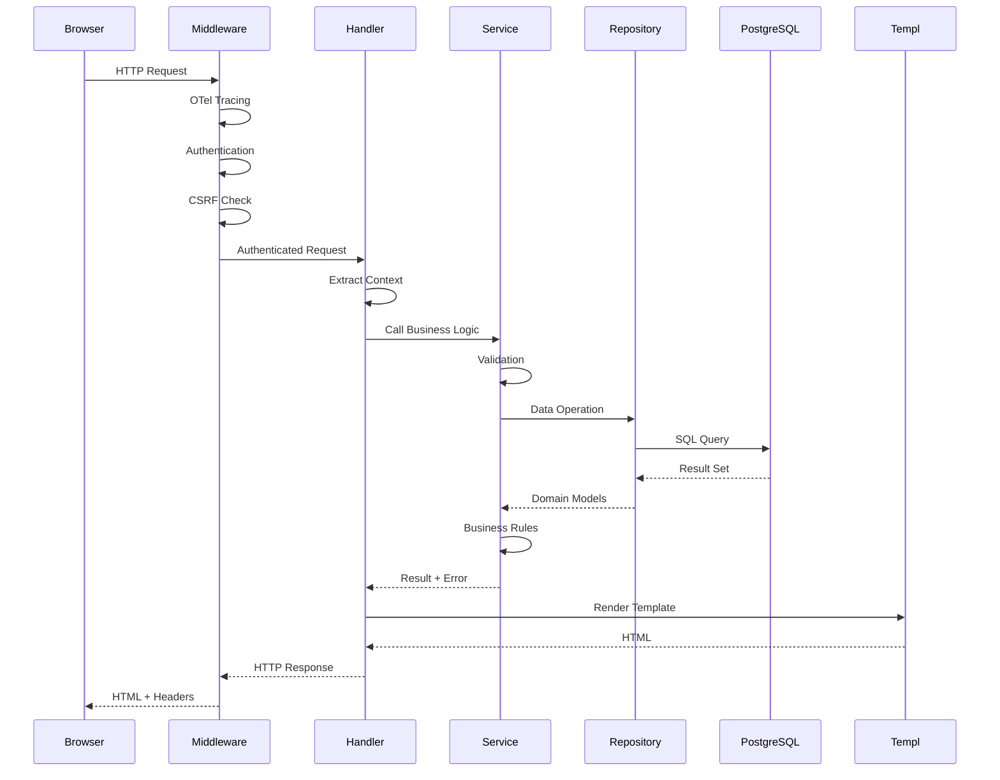
```mermaid
sequenceDiagram
    participant B as Browser
    participant M as Middleware
    participant H as Handler
    participant S as Service
    participant R as Repository
    participant DB as PostgreSQL
    participant T as Templ

    B->>M: HTTP Request
    M->>M: OTel Tracing
    M->>M: Authentication
    M->>M: CSRF Check
    M->>H: Authenticated Request

    H->>H: Extract Context
    H->>S: Call Business Logic

    S->>S: Validation
    S->>R: Data Operation

    R->>DB: SQL Query
    DB-->>R: Result Set
    R-->>S: Domain Models

    S->>S: Business Rules
    S-->>H: Result + Error

    H->>T: Render Template
    T-->>H: HTML
    H-->>M: HTTP Response
    M-->>B: HTML + Headers
```

---

## 🗂️ Package Structure

### Setup Package

The `internal/setup/` package centralizes server initialization and follows Layered Architecture principles:

**Structure**:

```
internal/setup/
├── dependencies.go   # DI Container, Database, Telemetry (306 LOC)
├── routes.go        # Route Registration (326 LOC)
└── server.go        # Echo Configuration (199 LOC)
```

**Dependency Injection Container** (`dependencies.go`):

- Centralizes all service and repository initialization
- Contains 14 service interfaces (Admin, Card, Voucher, GiftCard, Notification, Transfer, Share, Favorite, Merchant,
  Dashboard, Authz, User, Session, Export)
- Initializes repositories first, then services with their dependencies
- Returns container with all configured services
- Enables testability through interface-based dependency injection

**Route Registration** (`routes.go`):

- API v1 Routes (`/api/v1/*`)
- Health Checks (`/health`, `/ready`)
- OAuth Routes (`/auth/oauth/*`)
- SPA Fallback (all other routes → SvelteKit)

**Benefits**:

- ✅ Central configuration of all routes
- ✅ Dependency injection for all handlers
- ✅ Testability through container pattern
- ✅ Clear separation of setup and business logic

### Handler Organization (JSON API)

With the SvelteKit migration, handlers were restructured into **JSON API endpoints**:

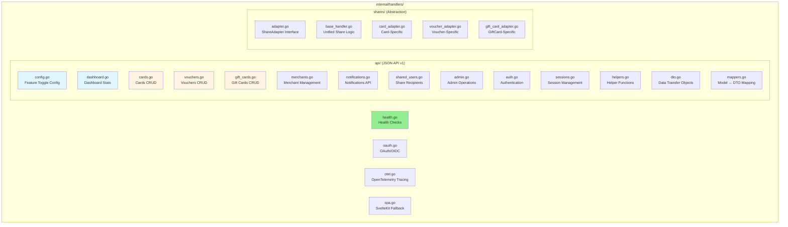
```mermaid
graph TB
    subgraph "internal/handlers/"
        Health[health.go<br/>Health Checks]
        OAuth[oauth.go<br/>OAuth/OIDC]
        OTel[otel.go<br/>OpenTelemetry Tracing]
        SPA[spa.go<br/>SvelteKit Fallback]

        subgraph "api/ (JSON API v1)"
            Config[config.go<br/>Feature Toggle Config]
            Dashboard[dashboard.go<br/>Dashboard Stats]
            Cards[cards.go<br/>Cards CRUD]
            Vouchers[vouchers.go<br/>Vouchers CRUD]
            GiftCards[gift_cards.go<br/>Gift Cards CRUD]
            Merchants[merchants.go<br/>Merchant Management]
            Notifications[notifications.go<br/>Notifications API]
            SharedUsers[shared_users.go<br/>Share Recipients]
            Admin[admin.go<br/>Admin Operations]
            Auth[auth.go<br/>Authentication]
            Sessions[sessions.go<br/>Session Management]
            Helpers[helpers.go<br/>Helper Functions]
            DTO[dto.go<br/>Data Transfer Objects]
            Mappers[mappers.go<br/>Model ↔ DTO Mapping]
        end

        subgraph "shares/ (Abstraction)"
            Adapter[adapter.go<br/>ShareAdapter Interface]
            BaseHandler[base_handler.go<br/>Unified Share Logic]
            CardAdapter[card_adapter.go<br/>Card-Specific]
            VoucherAdapter[voucher_adapter.go<br/>Voucher-Specific]
            GiftCardAdapter[gift_card_adapter.go<br/>GiftCard-Specific]
        end
    end

    style Config fill:#e1f5ff
    style Dashboard fill:#e1f5ff
    style Cards fill:#fff4e1
    style Vouchers fill:#fff4e1
    style GiftCards fill:#fff4e1
    style Health fill:#90EE90
```

**Architecture Highlights**:

- ✅ **API v1 Endpoints**: All resources available via `/api/v1/*`
- ✅ **DTOs**: Clear separation between models and API responses
- ✅ **Share Abstraction**: Adapter pattern eliminates 70% code duplication
- ✅ **SPA Fallback**: All non-API routes forwarded to SvelteKit
- ✅ **Layered Architecture**: Handlers only use services (no DB calls)

**Metrics**:

- ✅ Average: ~150 LOC per API handler
- ✅ DTOs centralized (dto.go, mappers.go)
- ✅ Single Responsibility: Each handler focuses on one resource

### Service & Repository Layer

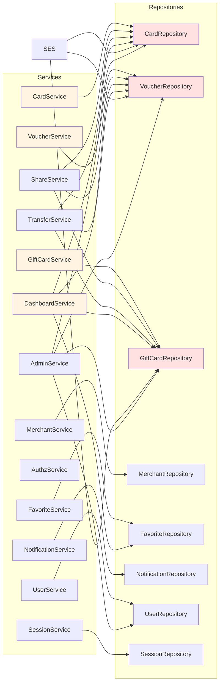
```mermaid
graph LR
    subgraph "Services"
        CS[CardService]
        VS[VoucherService]
        GS[GiftCardService]
        MS[MerchantService]
        SS[ShareService]
        TS[TransferService]
        FS[FavoriteService]
        DS[DashboardService]
        AS[AuthzService]
        NS[NotificationService]
        US[UserService]
        ADS[AdminService]
        SES2[SessionService]
    end

    subgraph "Repositories"
        CR[CardRepository]
        VR[VoucherRepository]
        GR[GiftCardRepository]
        MR[MerchantRepository]
        FR[FavoriteRepository]
        NR[NotificationRepository]
        UR[UserRepository]
        SR[SessionRepository]
    end

    CS --> CR
    VS --> VR
    GS --> GR
    MS --> MR
    SS --> CR
    SS --> VR
    SS --> GR
    TS --> CR
    TS --> VR
    TS --> GR
    FS --> FR
    DS --> CR
    DS --> VR
    DS --> GR
    DS --> FR
    SES --> CR
    SES --> VR
    SES --> GR
    NS --> NR
    US --> UR
    ADS --> CR
    ADS --> VR
    ADS --> GR
    ADS --> UR
    SES2 --> SR

    style CS fill:#fff4e1
    style VS fill:#fff4e1
    style GS fill:#fff4e1
    style DS fill:#fff4e1
    style CR fill:#ffe1e1
    style VR fill:#ffe1e1
    style GR fill:#ffe1e1
```

---

## 🗄️ Database Schema

### Entity Relationship Diagram

The database schema is organized around three central resource types: **Cards** (customer cards), **Vouchers**, and **Gift Cards**. All three types support:

- **Ownership**: Each resource belongs to a user
- **Sharing**: Resources can be shared with other users (with granular permissions)
- **Favorites**: Users can favorite resources (polymorphic design)
- **Merchant Association**: All resources can optionally be linked to a merchant

The ERD shows the relationships between the 19 tables. Important design decisions:

1. **UUIDs as Primary Keys**: Non-sequential IDs for better security and distributed system support
2. **Polymorphic Favorites**: `user_favorites` uses `resource_type` + `resource_id` for flexible favoriting
3. **Granular Share Permissions**: Each resource type has its own share table with specific permissions
4. **Soft Deletes**: GORM `deleted_at` for safe recovery of deleted data
5. **Database Triggers**: Automatic balance calculation and email normalization


```mermaid
erDiagram
    USERS ||--o{ CARDS : owns
    USERS ||--o{ VOUCHERS : owns
    USERS ||--o{ GIFT_CARDS : owns
    USERS ||--o{ USER_FAVORITES : creates
    USERS ||--o{ CARD_SHARES : "shares with"
    USERS ||--o{ VOUCHER_SHARES : "shares with"
    USERS ||--o{ GIFT_CARD_SHARES : "shares with"
    USERS ||--o| USER_TOTPS : "has 2FA"
    USERS ||--o{ EMAIL_TOKENS : "has tokens"
    USERS ||--o{ PUSH_SUBSCRIPTIONS : "subscribes"
    USERS ||--o{ NOTIFICATIONS : receives
    USERS ||--o{ EXPIRY_REMINDER_SENTS : "reminded"
    USERS ||--o{ SESSIONS : "has sessions"

    MERCHANTS ||--o{ CARDS : "associated with"
    MERCHANTS ||--o{ VOUCHERS : "associated with"
    MERCHANTS ||--o{ GIFT_CARDS : "associated with"

    CARDS ||--o{ CARD_SHARES : "shared as"
    VOUCHERS ||--o{ VOUCHER_SHARES : "shared as"
    GIFT_CARDS ||--o{ GIFT_CARD_SHARES : "shared as"
    GIFT_CARDS ||--o{ GIFT_CARD_TRANSACTIONS : "has"

    USERS {
        uuid id PK
        string email UK
        string password_hash
        string first_name
        string last_name
        boolean is_admin
        boolean push_notifications_enabled
        boolean email_notifications_enabled
        boolean push_reminders_enabled
        boolean push_sharing_enabled
        boolean email_reminders_enabled
        boolean email_sharing_enabled
        timestamp password_changed_at
        timestamp created_at
        timestamp updated_at
    }

    MERCHANTS {
        uuid id PK
        string name
        string color
        string logo_url
    }

    USER_FAVORITES {
        uuid id PK
        uuid user_id FK
        string resource_type
        uuid resource_id
        timestamp created_at
        timestamp deleted_at
    }

    CARDS {
        uuid id PK
        uuid user_id FK
        uuid merchant_id FK
        string merchant_name
        string program
        string card_number UK
        string barcode_type
        text notes
        string status
    }

    CARD_SHARES {
        uuid id PK
        uuid card_id FK
        uuid shared_with_id FK
        boolean can_edit
        boolean can_delete
    }

    VOUCHERS {
        uuid id PK
        uuid user_id FK
        uuid merchant_id FK
        string code UK
        string voucher_type
        decimal value
        string usage_limit_type
        timestamp valid_from
        timestamp valid_until
    }

    VOUCHER_SHARES {
        uuid id PK
        uuid voucher_id FK
        uuid shared_with_id FK
    }

    GIFT_CARDS {
        uuid id PK
        uuid user_id FK
        uuid merchant_id FK
        string card_number UK
        decimal initial_balance
        decimal current_balance
        string currency
        string pin
        timestamp expires_at
    }

    GIFT_CARD_SHARES {
        uuid id PK
        uuid gift_card_id FK
        uuid shared_with_id FK
        boolean can_edit
        boolean can_delete
        boolean can_edit_transactions
    }

    GIFT_CARD_TRANSACTIONS {
        uuid id PK
        uuid gift_card_id FK
        decimal amount
        text description
        timestamp transaction_date
    }

    NOTIFICATIONS {
        uuid id PK
        uuid user_id FK
        string type
        string title
        string message
        jsonb metadata
        boolean is_read
        string email_status
        int email_attempts
        text email_last_error
        timestamp created_at
    }

    AUDIT_LOGS {
        uuid id PK
        uuid user_id FK
        string action
        string resource_type
        uuid resource_id
        jsonb resource_data
        string ip_address
        string user_agent
        timestamp created_at
    }

    USER_TOTPS {
        uuid id PK
        uuid user_id FK
        text secret
        text backup_codes
        boolean enabled
        boolean verified
        timestamp enabled_at
    }

    EMAIL_TOKENS {
        uuid id PK
        uuid user_id FK
        string token_hash
        string token_type
        timestamp expires_at
        timestamp created_at
    }

    PUSH_SUBSCRIPTIONS {
        uuid id PK
        uuid user_id FK
        string endpoint
        string p256dh_key
        string auth_key
        string user_agent
    }

    EXPIRY_REMINDER_SENTS {
        uuid id PK
        uuid user_id FK
        string resource_type
        uuid resource_id
        integer days_before
        timestamp sent_at
    }

    SESSIONS {
        uuid id PK
        uuid user_id FK
        string token_hash
        bytea data
        string ip_address
        string user_agent
        timestamp created_at
        timestamp last_active_at
        timestamp expires_at
    }
```

### Database Features

**Key Strengths:**

1. **UUIDs as Primary Keys**
   - ✅ Non-sequential (security)
   - ✅ Distributed-friendly
   - ✅ PostgreSQL `gen_random_uuid()`

2. **Foreign Keys & Cascading**
   - ✅ `ON DELETE CASCADE` for share tables
   - ✅ `ON DELETE SET NULL` for merchant relationships

3. **Polymorphic Favorites**
   - ✅ `resource_type` + `resource_id` pattern
   - ✅ Soft delete for toggle functionality
   - ✅ UNIQUE constraint: `(user_id, resource_type, resource_id)`

4. **Granular Permissions**
   - ✅ Card: `can_edit`, `can_delete`
   - ✅ Voucher: Read-only
   - ✅ Gift Card: `can_edit`, `can_delete`, `can_edit_transactions`

5. **Database Triggers**
   - ✅ `recalculate_gift_card_balance()` - Auto-update on transactions
   - ✅ `enforce_lowercase_email()` - Email normalization

6. **Security Tables**
   - ✅ `user_totps` - TOTP secrets encrypted with AES-256-GCM, backup codes bcrypt-hashed
   - ✅ `email_tokens` - SHA-256 hashed tokens for verification and password reset
   - ✅ `push_subscriptions` - VAPID-based Web Push subscriptions
   - ✅ `expiry_reminder_sents` - Prevents duplicate reminders per (user, resource, days_before)
   - ✅ `sessions` - Server-side sessions with SHA-256 hashed tokens, IP/UA tracking

7. **Composite UNIQUE Constraints**
   - ✅ `(user_id, card_number)` for cards
   - ✅ `(user_id, code)` for vouchers
   - ✅ `(user_id, card_number)` for gift cards

### Notification Email Delivery (Outbox)

Notification emails are **decoupled** from notification creation. Creating a
notification records that an email is due; a background dispatcher delivers it.

```
Reminder / Share / Transfer
        │
        ▼
  notifications row  ──  email_status = pending | skipped
        │
        │  EmailDispatchService, 1-minute ticker
        ▼
  claim (FOR UPDATE SKIP LOCKED) → sending → SMTP → sent
                                      │
                                      └── error → pending (retry) → failed (after 5)
```

**Why it exists.** Email used to be sent inline while the row was created, and a
send error was only logged — the reminder was then permanently marked as sent and
never retried, so a brief SMTP outage silently dropped it for good.

- **The row is the outbox.** No separate table: the template data already lives in
  `metadata`, so `email_status`, `email_attempts` and `email_last_error` are enough.
- **`skipped` is the default**, not `pending` — otherwise the first dispatcher run
  after deploy would mail out the entire notification backlog.
- **Two independent states.** `expiry_reminder_sents` stays the *schedule* guard
  ("the 3-day reminder was due"); `notifications.email_status` is the *delivery*
  state. Keeping them apart is what lets a failed send retry without the unique
  constraint blocking it.
- **Replica-safe without coordination.** `FOR UPDATE SKIP LOCKED` gives each
  instance a disjoint set of rows, so the multi-replica production deployment
  needs no leader election.
- **At-least-once, not exactly-once.** A pod dying between a successful SMTP
  handoff and the status write means the row is recovered after 10 minutes and
  the mail goes out twice. A duplicate reminder is acceptable; a lost one is not.
  Exactly-once would require a transaction spanning SMTP.
- **Push is unaffected** — it stays inline and best-effort.

---

## 🔐 Security Architecture

The security architecture of the Savvy is based on **Defense in Depth** - multiple security layers protect against various attack types. The implementation follows OWASP best practices and includes authentication, authorization, input protection, and audit logging.

### Authentication Flow

The authentication flow implements **server-side session-based authentication** with multiple security measures:

- **PostgreSQL Session Store**: Sessions stored in database (not cookies) with SHA-256 hashed tokens
- **512-bit Random Tokens**: Cryptographically secure session identifiers
- **Bcrypt Password Hashing**: All passwords are hashed with bcrypt (10 rounds)
- **Timing-Attack Prevention**: For failed logins, a dummy hash is calculated to prevent timing attacks
- **Session Regeneration**: After successful login, the session ID is regenerated (prevents session fixation)
- **Stale Session Invalidation**: Sessions created before `password_changed_at` are auto-invalidated
- **Active Session Management**: Users can view and revoke active sessions
- **Secure Cookies**: HttpOnly, Secure (HTTPS), SameSite=Lax

The sequence diagram shows the complete login process from credential entry to session storage.

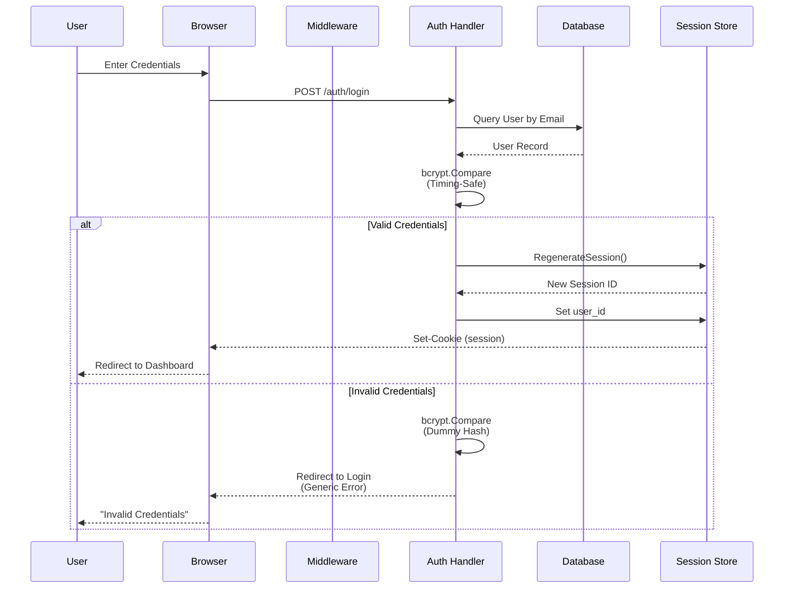
```mermaid
sequenceDiagram
    participant U as User
    participant B as Browser
    participant M as Middleware
    participant H as Auth Handler
    participant DB as Database
    participant S as Session Store

    U->>B: Enter Credentials
    B->>H: POST /auth/login

    H->>DB: Query User by Email
    DB-->>H: User Record

    H->>H: bcrypt.Compare<br/>(Timing-Safe)

    alt Valid Credentials
        H->>S: RegenerateSession()
        S-->>H: New Session ID
        H->>S: Set user_id
        S-->>B: Set-Cookie (session)
        B-->>U: Redirect to Dashboard
    else Invalid Credentials
        H->>H: bcrypt.Compare<br/>(Dummy Hash)
        H-->>B: Redirect to Login<br/>(Generic Error)
        B-->>U: "Invalid Credentials"
    end
```

### Authorization Flow

The authorization system implements an **ownership-based permission model** with three access levels:

1. **Owner (Full Access)**: The creator of a resource always has full access (View, Edit, Delete)
2. **Shared Access (Conditional)**: Shared resources have granular permissions based on share configuration
3. **No Access (Forbidden)**: Without ownership or share access, access is denied

This flowchart shows the decision logic: First, authentication is checked, then ownership, then share access. Permissions are resource-specific:

- **Cards**: `can_edit`, `can_delete`
- **Vouchers**: Always read-only on shares
- **Gift Cards**: `can_edit`, `can_delete`, `can_edit_transactions`

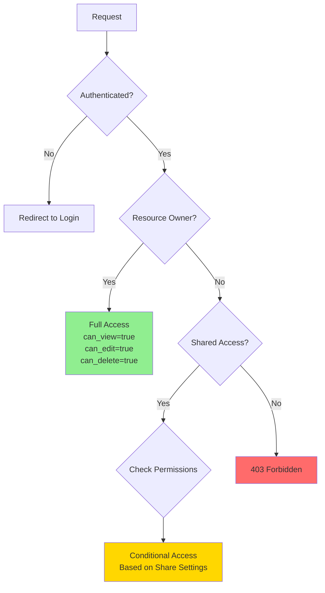
```mermaid
flowchart TD
    A[Request] --> B{Authenticated?}
    B -->|No| C[Redirect to Login]
    B -->|Yes| D{Resource Owner?}
    D -->|Yes| E[Full Access<br/>can_view=true<br/>can_edit=true<br/>can_delete=true]
    D -->|No| F{Shared Access?}
    F -->|Yes| G{Check Permissions}
    F -->|No| H[403 Forbidden]
    G --> I[Conditional Access<br/>Based on Share Settings]

    style E fill:#90EE90
    style I fill:#FFD700
    style H fill:#FF6B6B
```

### Security Features

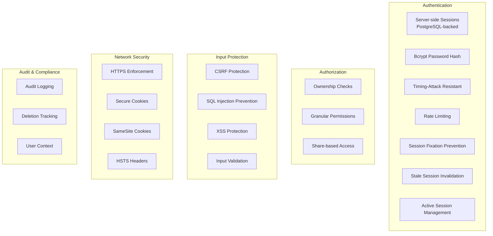
```mermaid
graph TB
    subgraph "Authentication"
        A1[Server-side Sessions<br/>PostgreSQL-backed]
        A2[Bcrypt Password Hash]
        A3[Timing-Attack Resistant]
        A4[Rate Limiting]
        A5[Session Fixation Prevention]
        A6[Stale Session Invalidation]
        A7[Active Session Management]
    end

    subgraph "Authorization"
        B1[Ownership Checks]
        B2[Granular Permissions]
        B3[Share-based Access]
    end

    subgraph "Input Protection"
        C1[CSRF Protection]
        C2[SQL Injection Prevention]
        C3[XSS Protection]
        C4[Input Validation]
    end

    subgraph "Network Security"
        D1[HTTPS Enforcement]
        D2[Secure Cookies]
        D3[SameSite Cookies]
        D4[HSTS Headers]
    end

    subgraph "Audit & Compliance"
        E1[Audit Logging]
        E2[Deletion Tracking]
        E3[User Context]
    end
```

**Implementation Details:**

1. **Session Security**
   - PostgreSQL-backed: ✅ (server-side session store, not cookie-based)
   - SHA-256 hashed tokens: ✅ (raw token in cookie, hash in DB)
   - 512-bit random tokens: ✅ (cryptographically secure)
   - HttpOnly: ✅ (JavaScript cannot access)
   - Secure: ✅ (HTTPS in production)
   - SameSite: Lax (CSRF protection)
   - Session regeneration on login/register
   - Stale session detection: Sessions invalidated after password change
   - Active session management: View/revoke via `/api/v1/profile/sessions`
   - Automatic cleanup: Hourly goroutine removes expired sessions

2. **Password Security**
   - Bcrypt with DefaultCost (10 rounds)
   - Timing-attack prevention (dummy hash)
   - Validation: Min 8 chars, 1 uppercase, 1 lowercase, 1 digit

3. **CSRF Protection**
   - Token in form + header
   - Auto-injection in HTMX requests
   - HttpOnly CSRF cookie

4. **SQL Injection Prevention**
   - GORM parameterized queries
   - No raw SQL in handlers

5. **XSS Prevention**
   - Templ auto-escaping
   - `@templ.Raw()` only for trusted content

### Authorization Service (AuthzService)

**Centralized Authorization Logic** (`internal/services/authz_service.go`, 154 LOC):

The AuthzService implements **centralized, reusable authorization logic** for all resource types. This avoids code duplication and ensures consistent permission checks.

**Interface Design**:

- Three access check methods (CheckCardAccess, CheckVoucherAccess, CheckGiftCardAccess)
- Each method returns ResourcePermissions struct with access flags
- Permission flags: CanView, CanEdit, CanDelete, CanEditTransactions (Gift Cards only), IsOwner
- Context-aware for tracing and cancellation

**Permission Check Flow**:

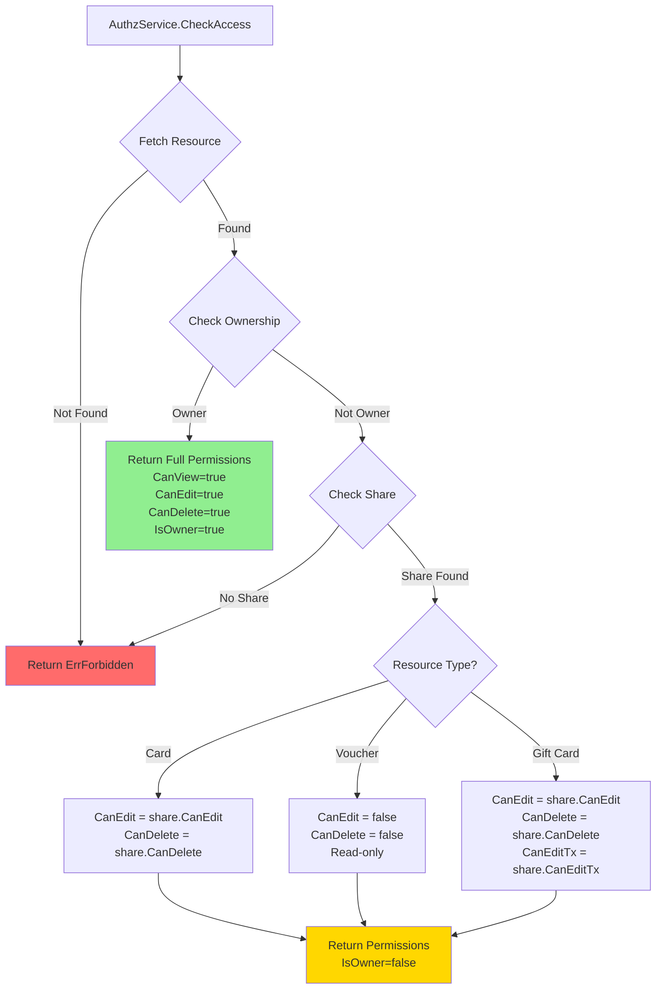
```mermaid
flowchart TD
    A[AuthzService.CheckAccess] --> B{Fetch Resource}
    B -->|Not Found| C[Return ErrForbidden]
    B -->|Found| D{Check Ownership}

    D -->|Owner| E[Return Full Permissions<br/>CanView=true<br/>CanEdit=true<br/>CanDelete=true<br/>IsOwner=true]

    D -->|Not Owner| F{Check Share}
    F -->|No Share| C
    F -->|Share Found| G{Resource Type?}

    G -->|Card| H[CanEdit = share.CanEdit<br/>CanDelete = share.CanDelete]
    G -->|Voucher| I[CanEdit = false<br/>CanDelete = false<br/>Read-only]
    G -->|Gift Card| J[CanEdit = share.CanEdit<br/>CanDelete = share.CanDelete<br/>CanEditTx = share.CanEditTx]

    H --> K[Return Permissions<br/>IsOwner=false]
    I --> K
    J --> K

    style E fill:#90EE90
    style K fill:#FFD700
    style C fill:#FF6B6B
```

**Implementation Details**:

1. **Ownership First**: Always checks first if user is the owner
2. **Share Fallback**: If not owner, check share table
3. **Type-Specific**: Vouchers are ALWAYS read-only on shares
4. **Error Handling**: `ErrForbidden` for unauthorized, other errors for DB problems
5. **Context-Aware**: All queries use `ctx` for tracing

**Status**: ✅ Fully implemented and integrated in ALL 27 handlers

**Integration Details**:

- Eliminates duplicate permission logic across all handlers
- Consistent authorization checks for cards, vouchers, gift cards
- 7 unit tests with PostgreSQL (owner, shared user, permissions)
- Handler coverage: 0.0% (no handler tests exist)

---

## 📊 Observability

The observability system implements the **three pillars of observability**: Metrics, Logs, and Traces. This combination enables complete transparency about system behavior in production.

**Why Observability Matters**:

- **Proactive Monitoring**: Detect problems before users report them
- **Faster Debugging**: Trace IDs connect logs, metrics, and requests
- **Performance Optimization**: Identify bottlenecks through request latency metrics
- **Capacity Planning**: Resource metrics show when scaling is needed

### Monitoring Stack

The monitoring architecture uses **Grafana Cloud** as a central platform for all observability data:

- **Prometheus**: Collects metrics from the `/metrics` endpoint (HTTP performance, resource counts, DB connections)
- **Loki**: Aggregates structured logs from the application
- **Tempo**: Collects OpenTelemetry traces for request tracking (planned)
- **Grafana**: Visualizes all data in combined dashboards

The application automatically exports metrics via Prometheus format and traces all requests via OpenTelemetry. Health and readiness endpoints enable Kubernetes integration.

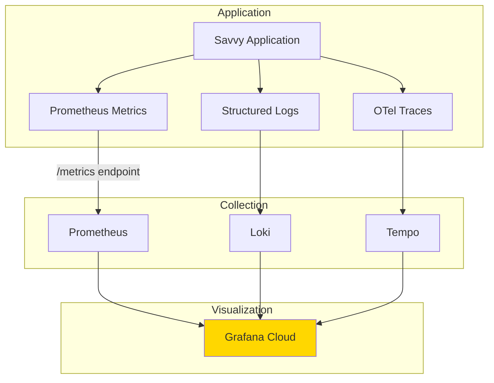
```mermaid
graph TB
    subgraph "Application"
        App[Savvy Application]
        Metrics[Prometheus Metrics]
        Logs[Structured Logs]
        Traces[OTel Traces]
    end

    subgraph "Collection"
        Prom[Prometheus]
        Loki[Loki]
        Tempo[Tempo]
    end

    subgraph "Visualization"
        Grafana[Grafana Cloud]
    end

    App --> Metrics
    App --> Logs
    App --> Traces

    Metrics -->|/metrics endpoint| Prom
    Logs --> Loki
    Traces --> Tempo

    Prom --> Grafana
    Loki --> Grafana
    Tempo --> Grafana

    style Grafana fill:#FFD700
```

### Available Metrics

**HTTP Metrics:**

- `http_request_duration_seconds` (Histogram) - Request latency by method, path, status
- `http_requests_total` (Counter) - Total requests by method, path, status
- `app_errors_total` (Counter) - Application errors by type

**Resource Metrics:**

- `cards_total` (Gauge) - Total cards in system
- `vouchers_total` (Gauge) - Total vouchers
- `gift_cards_total` (Gauge) - Total gift cards
- `users_total` (Gauge) - Total users

**System Metrics:**

- `active_sessions` (Gauge) - Active user sessions
- `db_connections_active` (Gauge) - Active DB connections
- `db_connections_idle` (Gauge) - Idle DB connections

### Health Endpoints

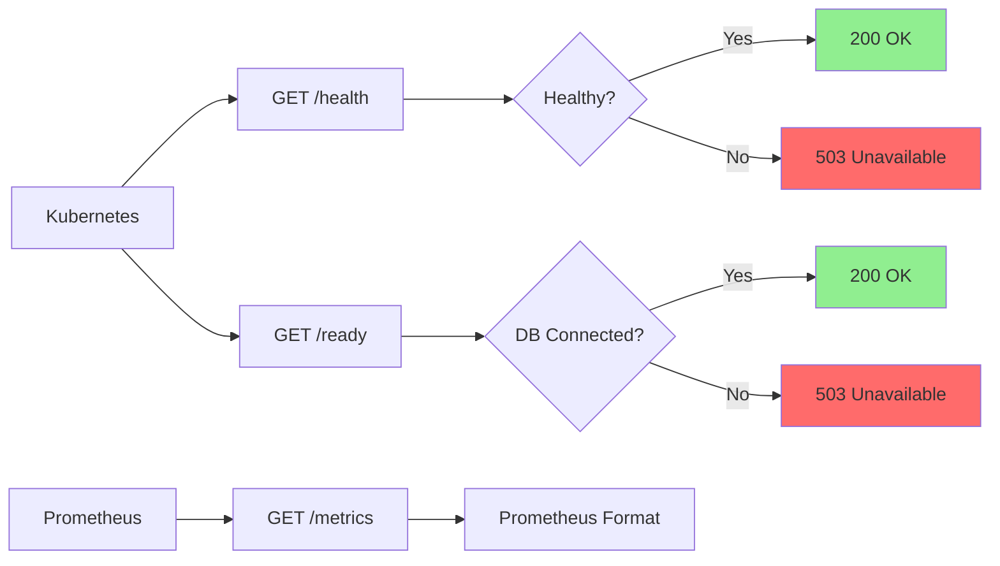
```mermaid
graph LR
    K8s[Kubernetes] --> Health[GET /health]
    K8s --> Ready[GET /ready]
    Prom[Prometheus] --> Metrics[GET /metrics]

    Health --> Status{Healthy?}
    Ready --> DB{DB Connected?}
    Metrics --> Export[Prometheus Format]

    Status -->|Yes| H200[200 OK]
    Status -->|No| H503[503 Unavailable]
    DB -->|Yes| R200[200 OK]
    DB -->|No| R503[503 Unavailable]

    style H200 fill:#90EE90
    style R200 fill:#90EE90
    style H503 fill:#FF6B6B
    style R503 fill:#FF6B6B
```

---

## ⚡ Performance Architecture

The system uses several architectural patterns for performance:

**Parallel Execution**:

- Dashboard queries run in parallel goroutines
- Concurrent data fetching reduces response time
- Non-blocking I/O for database operations

**Database Optimization**:

- Database triggers for automatic balance calculation (gift cards)
- Query aggregation (GROUP BY) instead of N+1 queries
- Selective field loading (avoid SELECT \*)

**Caching Strategy**:

- Service Worker cache for offline-first PWA
- API response caching with NetworkFirst strategy
- Client-side state management (Svelte stores)

---

## 🎨 Frontend Architecture

The Savvy uses a **modern SPA approach** with SvelteKit as the frontend framework. This architecture provides a reactive, performant user experience with full TypeScript support.

**Philosophy**: API-First, Component-Based, Type-Safe

- **SvelteKit SPA**: Modern Svelte framework with file-based routing
- **JSON API**: Backend exposes REST API (`/api/v1/`)
- **TypeScript**: Complete type safety across frontend and API definitions
- **Vite Build**: Fast dev server and optimized production build
- **Component Architecture**: Reusable Svelte components
- **Svelte Stores**: Centralized state management (auth, offline, i18n, notifications)
- **PWA Support**: Custom Service Worker with Workbox Recipes (injectManifest + warmStrategyCache)

This architecture enables fast development, clear separation of frontend/backend, and modern developer experience.

### Tech Stack

The frontend tech stack diagram shows the interaction between SvelteKit SPA, Vite dev server/build, and Go API backend:

- **SvelteKit** uses file-based routing and Svelte components for the UI
- **Vite** provides dev server and bundles for production
- **API Clients** (`client/src/lib/api/`) communicate with Go API via Fetch
- **Svelte Stores** (`client/src/lib/stores/`) manage global state (auth, offline, i18n, notifications)

```mermaid
graph TB
    subgraph "Browser"
        SPA[SvelteKit SPA]
        Components[Svelte Components]
        Stores[Svelte Stores]
        Tailwind[TailwindCSS 3.x<br/>Styling]
        Scanner[barcode-detector<br/>Barcode Scanner]
    end

    subgraph "Development"
        Vite[Vite Dev Server<br/>:5173]
        HMR[Hot Module Reload]
    end

    subgraph "Production"
        ViteBuild[Vite Build]
        Embed[Go Embed<br/>internal/assets/client/]
    end

    subgraph "Server"
        API[Go JSON API<br/>/api/v1/<br/>Port 8080 (dev) / 3000 (prod)]
        Handlers[API Handlers]
    end

    SPA --> Components
    SPA --> Stores
    SPA --> Tailwind
    Components --> Scanner

    SPA -->|JSON API| API
    API --> Handlers

    Vite --> HMR
    HMR --> SPA

    ViteBuild --> Embed
    Embed --> API

    style SPA fill:#FF3E00
    style Vite fill:#646CFF
    style API fill:#00ADD8
```

### SvelteKit API Interaction Pattern

SvelteKit communicates with the backend via a **JSON REST API**. The frontend sends fetch() requests to `/api/v1/` endpoints, which return JSON responses. These are transformed by API client modules into TypeScript types.

**Benefits**:

- **Type Safety**: TypeScript interfaces for API requests and responses
- **Clear Separation**: Frontend and backend completely decoupled
- **Testability**: API clients can be tested with mocks
- **Developer Experience**: Hot module reload in dev mode

The sequence diagram shows a typical API example: A delete button triggers an API call, the server validates the action, the response is processed, and the UI reactively updates - without page reload.

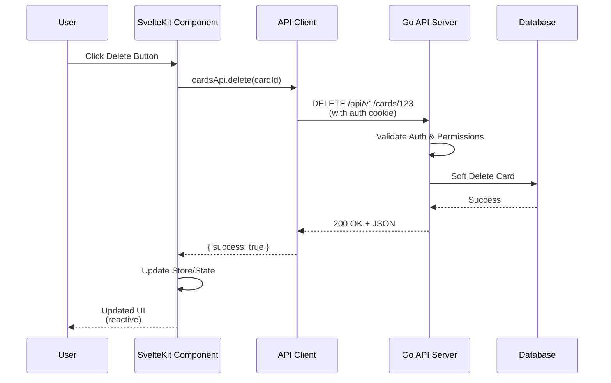
```mermaid
sequenceDiagram
    participant U as User
    participant C as SvelteKit Component
    participant API as API Client
    participant S as Go API Server
    participant DB as Database

    U->>C: Click Delete Button
    C->>API: cardsApi.delete(cardId)
    API->>S: DELETE /api/v1/cards/123<br/>(with auth cookie)

    S->>S: Validate Auth & Permissions
    S->>DB: Soft Delete Card
    DB-->>S: Success

    S-->>API: 200 OK + JSON
    API-->>C: { success: true }
    C->>C: Update Store/State
    C-->>U: Updated UI<br/>(reactive)
```

### Svelte Store State Management

Svelte Stores are used for **global state** that needs to be shared across multiple components.

**Available Stores** (`client/src/lib/stores/`):

- **auth.ts**: Authentication state (user, session, login/logout)
- **offline.ts**: Offline detection + automatic cache validation on online event
- **offline-db.ts**: IndexedDB wrapper for offline data storage
- **i18n.ts**: Internationalization (translations, language switching)
- **notifications.ts**: In-app notifications (shares, transfers)
- **config.ts**: Feature toggle configuration (from server)
- **pwa.ts**: PWA installation state and prompts
- **toast.ts**: Toast notifications (success, error messages)

**Key Features**:

- **Reactivity**: `$store` syntax for auto-subscription in components
- **Derived Stores**: Computed values (e.g., `isOnline`, `isSyncing`)
- **Persistence**: Some stores sync with localStorage (auth, i18n)
- **Background Operations**: Offline store runs cache validation automatically

**Use Case: Barcode Scanner**

The barcode scanner is a Svelte component with local state:

1. User clicks "Scan" → Component opens modal and starts camera (barcode-detector)
2. barcode-detector processes video stream and detects barcode
3. On success: Barcode is emitted via `dispatch('scan', { barcode })` event
4. Parent component receives event and updates form field

The state diagram shows the different states (Idle, Scanning, Processing, Success, Error) and the transitions between them. Svelte's reactive statements (`$:`) ensure automatic UI updates.

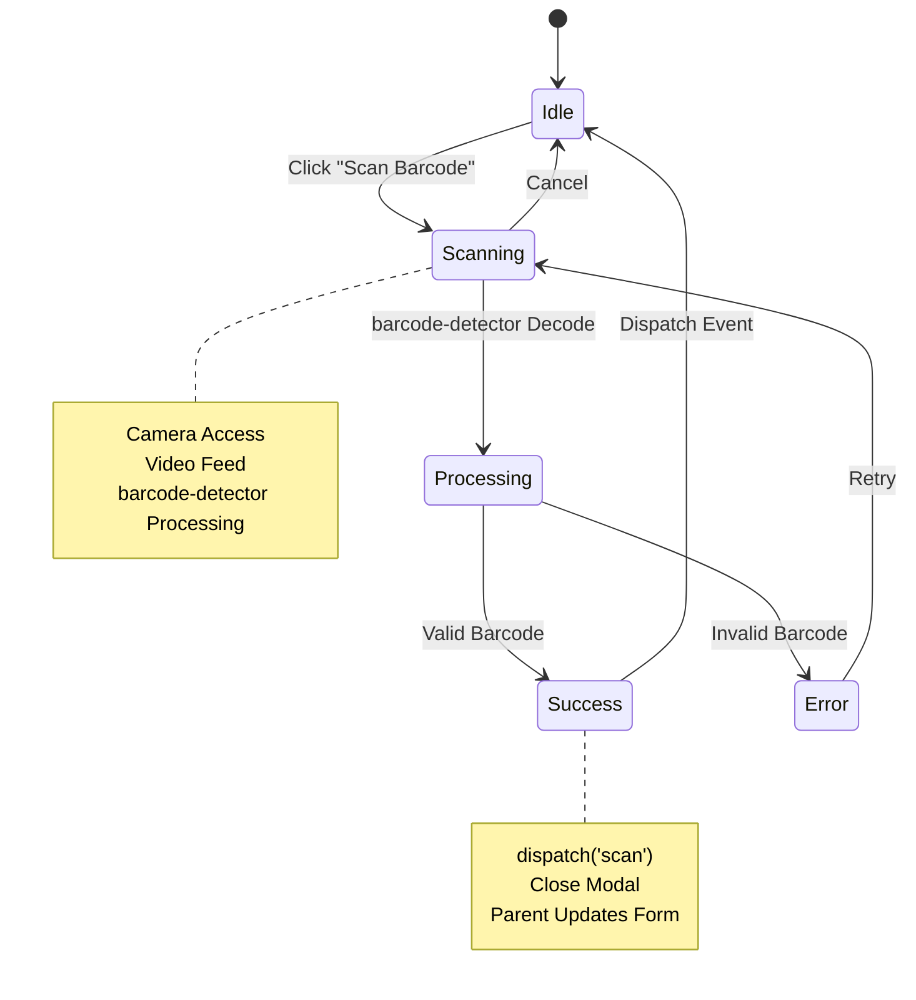
```mermaid
stateDiagram-v2
    [*] --> Idle
    Idle --> Scanning: Click "Scan Barcode"
    Scanning --> Processing: barcode-detector Decode
    Processing --> Success: Valid Barcode
    Processing --> Error: Invalid Barcode
    Success --> Idle: Dispatch Event
    Error --> Scanning: Retry
    Scanning --> Idle: Cancel

    note right of Scanning
        Camera Access
        Video Feed
        barcode-detector Processing
    end note

    note right of Success
        dispatch('scan')
        Close Modal
        Parent Updates Form
    end note
```

### SvelteKit Client Architecture

**Static SPA (SSR Disabled)**:

The SvelteKit frontend is built as a **static Single Page Application** with SSR disabled
(`adapter-static`). The entire app is pre-built during `npm run build` and served as static
files from the Go binary, with client-side routing and API calls to the backend.

**Modular Build System** (Vite-based):

The SvelteKit frontend is organized into Pages, Components, Stores, and API Clients.
Vite bundles everything for production as static assets that are embedded into the Go binary.

**Directory Structure** (`client/`):

```typescript
client/
├── src/
│   ├── routes/                  // SvelteKit Pages (File-Based Routing)
│   │   ├── +layout.svelte      // Root Layout (Nav, Auth)
│   │   ├── +page.svelte        // Dashboard (/)
│   │   ├── cards/
│   │   │   ├── +page.svelte    // Cards List
│   │   │   └── [id]/+page.svelte  // Card Details
│   │   ├── vouchers/           // Vouchers Pages
│   │   ├── gift-cards/         // Gift Cards Pages
│   │   ├── merchants/          // Merchant Overview & Detail
│   │   ├── profile/            // Profile Settings
│   │   ├── security/           // Security (Password, 2FA, Sessions)
│   │   ├── notifications/      // Notifications List & Preferences
│   │   └── admin/              // Admin Panel
│   ├── lib/
│   │   ├── components/         // Reusable Components
│   │   │   ├── CardForm.svelte
│   │   │   ├── BarcodeScanner.svelte
│   │   │   ├── BatchPanel.svelte
│   │   │   ├── NotificationPanel.svelte
│   │   │   ├── OfflineIndicator.svelte
│   │   │   └── settings/       // Settings Subsections
│   │   │       ├── ProfileSection.svelte
│   │   │       ├── SecuritySection.svelte
│   │   │       ├── NotificationsSection.svelte
│   │   │       └── ToggleSwitch.svelte
│   │   ├── stores/             // Svelte Stores
│   │   │   ├── auth.ts        // Auth State
│   │   │   ├── offline.ts     // Offline Detection + Cache Validation
│   │   │   ├── offline-db.ts  // IndexedDB Wrapper
│   │   │   ├── i18n.ts        // i18n Store
│   │   │   ├── notifications.ts // Notification State
│   │   │   ├── config.ts      // Feature Toggle Config
│   │   │   ├── pwa.ts         // PWA State
│   │   │   └── toast.ts       // Toast Notifications
│   │   ├── i18n/              // Internationalization
│   │   │   ├── index.ts       // i18n Configuration
│   │   │   ├── types.ts       // Translation Types
│   │   │   └── locales/       // Translation Files (de, en, fr)
│   │   ├── api/               // API Clients
│   │   │   ├── client.ts      // Base API Client
│   │   │   ├── cards.ts       // Cards API
│   │   │   ├── vouchers.ts    // Vouchers API
│   │   │   ├── gift-cards.ts  // Gift Cards API
│   │   │   ├── admin.ts       // Admin API
│   │   │   ├── auth.ts        // Authentication API
│   │   │   ├── batch.ts       // Batch Operations API
│   │   │   ├── dashboard.ts   // Dashboard Stats API
│   │   │   ├── export.ts      // Data Export API
│   │   │   ├── merchants.ts   // Merchants API
│   │   │   ├── notifications.ts // Notifications API
│   │   │   ├── sessions.ts    // Session Management API
│   │   │   └── shares.ts      // Sharing API
│   │   ├── types/             // TypeScript Types
│   │   │   └── api.ts         // API Request/Response Types
│   │   └── utils/             // Helper Functions
│   └── app.css                // Global TailwindCSS
├── vite.config.ts             // Vite Configuration + PWA
├── svelte.config.js           // SvelteKit Configuration
└── package.json               // Dependencies
```

**Build Pipeline**:

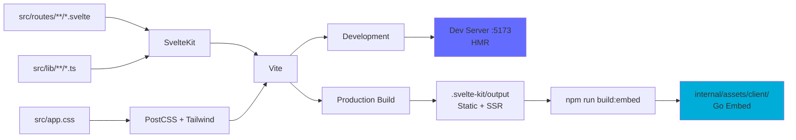
```mermaid
graph LR
    A[src/routes/**/*.svelte] --> B[SvelteKit]
    C[src/lib/**/*.ts] --> B
    D[src/app.css] --> E[PostCSS + Tailwind]

    B --> F[Vite]
    E --> F

    F --> G[Development]
    F --> H[Production Build]

    G --> I[Dev Server :5173<br/>HMR]
    H --> J[.svelte-kit/output<br/>Static + SSR]

    J --> K[npm run build:embed]
    K --> L[internal/assets/client/<br/>Go Embed]

    style I fill:#646CFF
    style L fill:#00ADD8
```

**Vite Configuration** (`vite.config.ts`):

- **SvelteKit Plugin**: Core SvelteKit functionality
- **Vite PWA Plugin** (`@vite-pwa/sveltekit`): PWA manifest generation + custom service worker
  - `injectManifest` strategy for custom Service Worker
  - Manual registration in `+layout.svelte` (full control)
  - Workbox integration with NetworkFirst + warmup cache
  - Auto-update support via `registerType: 'autoUpdate'`

**Benefits of this Architecture**:

- ✅ **Type Safety**: Full TypeScript across frontend and API
- ✅ **File-Based Routing**: URL structure = file structure
- ✅ **Component Reusability**: Svelte components are highly reusable
- ✅ **Fast Dev Experience**: Vite HMR in <100ms
- ✅ **Tree-Shaking**: Unused code is automatically removed
- ✅ **PWA Support**: Custom Service Worker with NetworkFirst + automatic warmup cache

---

## 📱 Offline Architecture & PWA

The Savvy is a **Progressive Web App (PWA)** with comprehensive offline support.
Users can view and interact with cached data when offline, with automatic synchronization
when connectivity is restored.

### Architecture Overview

**Three-Layer Cache Strategy**:

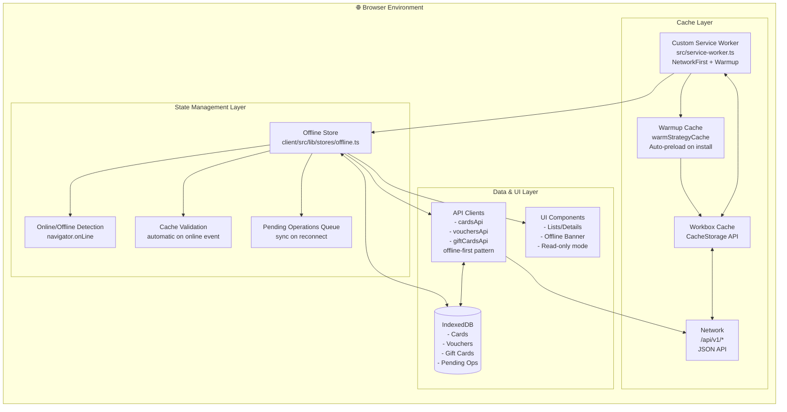
```mermaid
graph TB
    subgraph Browser["🌐 Browser Environment"]
        direction TB

        subgraph Cache["Cache Layer"]
            SW[Custom Service Worker<br/>src/service-worker.ts<br/>NetworkFirst + Warmup]
            WB[Workbox Cache<br/>CacheStorage API]
            WARM[Warmup Cache<br/>warmStrategyCache<br/>Auto-preload on install]
            NET[Network<br/>/api/v1/*<br/>JSON API]
        end

        subgraph Store["State Management Layer"]
            OS[Offline Store<br/>client/src/lib/stores/offline.ts]
            OSD[Online/Offline Detection<br/>navigator.onLine]
            CV[Cache Validation<br/>automatic on online event]
            POQ[Pending Operations Queue<br/>sync on reconnect]
        end

        subgraph Data["Data & UI Layer"]
            IDB[(IndexedDB<br/>- Cards<br/>- Vouchers<br/>- Gift Cards<br/>- Pending Ops)]
            API[API Clients<br/>- cardsApi<br/>- vouchersApi<br/>- giftCardsApi<br/>offline-first pattern]
            UI[UI Components<br/>- Lists/Details<br/>- Offline Banner<br/>- Read-only mode]
        end
    end

    SW --> WARM
    WARM --> WB
    SW <--> WB
    WB <--> NET
    SW --> OS
    OS --> OSD
    OS --> CV
    OS --> POQ
    OS <--> IDB
    OS --> API
    API --> NET
    API <--> IDB
    OS --> UI
```

### Storage Layers

#### 1. Service Worker Cache (CacheStorage API)

Managed by custom Service Worker (`src/service-worker.ts`) with Workbox:

- **Strategy**: **NetworkFirst** with automatic warmup cache
  - Tries network first with 5-second timeout
  - Falls back to cache if network fails or times out
  - Auto-caches successful responses
  - **Result**: No 500 errors offline, data always available
- **Warmup Cache** (Automatic on Install):
  - Uses `warmStrategyCache` from Workbox Recipes
  - Preloads critical API routes in background on SW install
  - No user interaction needed - runs automatically
  - URLs: `/api/v1/cards`, `/api/v1/vouchers`, `/api/v1/gift-cards`, `/api/v1/dashboard`
- **Cache Duration**:
  - API responses: 1 day (`maxAgeSeconds: 86400`)
  - Dashboard/Merchants: 1 hour (more dynamic data)
  - Static assets: 1 year (rarely change)
- **Cache Namespaces** (v4):
  - `cards-cache-v4`, `vouchers-cache-v4`, `gift-cards-cache-v4`
  - `dashboard-cache-v4`, `merchants-cache-v4`
  - `api-cache-v4` (generic fallback)
  - `pages-cache` (HTML navigation)
  - `workbox-precache-v2-*` (static assets)

#### 2. IndexedDB (Structured Data)

Managed by `offline-db.ts` wrapper:

- **Object Stores**:
  - `cards`: CardDTO objects (keyPath: "id")
  - `vouchers`: VoucherDTO objects (keyPath: "id")
  - `gift_cards`: GiftCardDTO objects (keyPath: "id")
  - `pending_operations`: Queue for offline mutations (keyPath: "id", index: "timestamp")
- **No Expiration**: Data persists until explicit validation or clearance
- **Bulk Operations**: Transaction-based for performance (`saveManyCards()` ~10x faster)

### Cache Validation (Automatic)

When the user comes back online, the system automatically validates cached data against the server to ensure consistency.

**Validation Flow**:

1. **Event Detection**: Browser fires `online` event when connectivity restored
2. **Sync Pending Operations**: Upload queued mutations (create/update/delete)
3. **Parallel Validation**: Validate all resource types simultaneously (Cards, Vouchers, Gift Cards)
4. **Per-Resource Validation**:
   - Fetch current list from server
   - Compare cached IDs with server IDs
   - Remove items not present on server (deleted or permission revoked)
   - Update cache with fresh data (includes permission updates)
5. **Background Execution**: Non-blocking, runs silently without UI interruption

**Validation Scenarios**:

| Scenario            | Cached Data       | Server Response    | Action                   |
| ------------------- | ----------------- | ------------------ | ------------------------ |
| Card deleted        | Card A in cache   | Card A not in list | ❌ Remove from IndexedDB |
| Permission revoked  | Card B in cache   | Card B not in list | ❌ Remove from IndexedDB |
| Card updated        | Card C (old data) | Card C (new data)  | ✅ Update in IndexedDB   |
| New card added      | No Card D         | Card D in list     | ✅ Add to IndexedDB      |
| Shared card removed | Shared Card E     | E not in list      | ❌ Remove from IndexedDB |

**Why This Matters**:

- **Security**: Revoked permissions are enforced offline
- **Data Integrity**: Deleted items don't persist in cache
- **User Experience**: Fresh data reflects latest state
- **Background**: Non-blocking, runs silently

### Offline Capabilities

**What Works Offline**:

- ✅ View cards/vouchers/gift cards (cached data)
- ✅ Display shared items
- ✅ Browse favorites
- ✅ View barcode details
- ✅ Dashboard statistics (cached)
- ✅ Filter & sorting (client-side)
- ✅ Barcode scanner (Camera API, browser-native)

**What Does NOT Work Offline**:

- ❌ Create new items
- ❌ Edit/delete items
- ❌ Manage sharing
- ❌ Add/remove favorites
- ❌ Transactions (Gift Cards)
- ❌ Admin operations

**UI Adaptations**:

- Offline banner via `<OfflineIndicator />` component
- All mutations disabled when offline (Svelte reactive statements)
- Visual feedback: disabled buttons, lock icons
- Read-only mode: cached data only

### Offline-First API Pattern

API clients implement an **offline-first pattern** for read operations (`client/src/lib/api/`):

**Strategy**:

1. **Check Browser Environment**: IndexedDB only available in browser (not SSR)
2. **Offline Mode**: Return cached data from IndexedDB if available
3. **Online Mode with Cache**:
   - Return cached data immediately (instant response, 0ms latency)
   - Trigger background fetch to update cache
   - Silent failure if background fetch fails
4. **Online Mode without Cache**: Fetch from network, then cache result
5. **Graceful Degradation**: Falls back to network if no cache available

**Benefits**:

- Instant response for cached data
- Background refresh keeps data fresh
- Seamless offline experience
- No loading spinners for repeat visits

### PWA Manifest & Service Worker

**PWA Manifest** (configured in `vite.config.ts`):

- **App Name**: Savvy - Loyalty Cards Manager
- **Display Mode**: Standalone (fullscreen app experience)
- **Theme Color**: Blue (`#3b82f6`)
- **Icons**: 192x192 and 512x512 PNG icons
- **Start URL**: Root (`/`)

**Service Worker** (Custom with Workbox):

- **Source**: `client/src/service-worker.ts` (custom implementation)
- **Strategy**: `injectManifest` via `@vite-pwa/sveltekit` plugin
- **Registration**: Manual in `+layout.svelte` (`registerType: 'autoUpdate'`)
- **Caching**: NetworkFirst with automatic warmup cache (Workbox Recipes)
- **Warmup**: Critical API routes preloaded on install (cards, vouchers, gift-cards, dashboard)
- **Precaching**: Static assets (app shell, icons, SvelteKit chunks) cached during install
- **Runtime Caching**: API responses cached on first request
- **Update Mechanism**: Silent background updates, prompt for reload

### Implementation Files

| File                                                | Purpose                                       | LOC |
| --------------------------------------------------- | --------------------------------------------- | --- |
| `client/vite.config.ts`                             | PWA plugin config, Workbox cache strategies   | 347 |
| `client/src/lib/stores/offline.ts`                  | Offline store, cache validation logic         | 312 |
| `client/src/lib/stores/offline-db.ts`               | IndexedDB wrapper (cards/vouchers/gift-cards) | 342 |
| `client/src/lib/api/cards.ts`                       | Cards API client with offline-first pattern   | 213 |
| `client/src/lib/components/OfflineIndicator.svelte` | Offline banner component                      | ~50 |

### Performance Characteristics

| Metric              | Offline (Cache) | Online (Cache Hit) | Online (Cache Miss) |
| ------------------- | --------------- | ------------------ | ------------------- |
| **List Load**       | <50ms           | ~100ms             | ~300ms              |
| **Detail Load**     | <20ms           | ~80ms              | ~250ms              |
| **User Perception** | Instant         | Fast               | Acceptable          |

**Cache Validation Impact**:

- Runs in background on online event
- Non-blocking (UI remains responsive)
- Typical duration: 500-1500ms for 100 items
- Parallel validation for all resources

---

## 📚 SvelteKit Reference Guide

This section provides detailed conceptual documentation for the SvelteKit frontend architecture. For code examples, refer to the actual implementation files in `client/src/lib/`.

### Svelte Stores Reference

Svelte Stores are the **central state management system** for global application state. Each store is a singleton that manages a specific domain of the application.

#### Authentication Store (auth.ts)

**Purpose**: Manages user authentication state, login/logout operations, and session persistence.

**State Schema**:

- User object (email, name, admin status)
- Authentication flag (boolean)
- Loading state (async operations)
- Error messages (validation failures)

**Core Operations**:

- **checkAuth**: Validates session by calling backend `/auth/me` endpoint
- **login**: Authenticates user with email/password credentials
- **register**: Creates new user account
- **logout**: Clears session and all cached data (ServiceWorker, IndexedDB)
- **startImpersonation**: Admin-only feature to impersonate another user
- **stopImpersonation**: Returns admin to original session

**Security Features**:

- Only stores authentication flag in localStorage (SVL-003 security requirement)
- User data always fetched from server (prevents XSS data theft)
- Clears all caches on logout (ServiceWorker + IndexedDB)
- Regenerates session on impersonation (prevents session fixation)

**Persistence**: Syncs authentication flag with localStorage for page reload survival

#### Offline Store (offline.ts)

**Purpose**: Manages offline/online detection, pending operations queue, and automatic cache validation.

**State Schema**:

- Online status (navigator.onLine)
- Sync status (boolean flag for ongoing sync)
- Pending operation count (queued mutations)
- Last sync timestamp (for UI feedback)

**Core Operations**:

- **addPendingOperation**: Queues mutations (create/update/delete) when offline
- **syncPendingOperations**: Replays queued operations when online
- **validateCache**: Compares IndexedDB with server state, removes stale data
- **forceSync**: Manually triggers sync (for UI button)
- **clearPendingOperations**: Resets queue (admin operation)

**Automatic Behaviors**:

- Listens to `online` event → triggers sync + cache validation
- Listens to `offline` event → updates state (UI shows offline banner)
- Parallel validation for all resource types (cards, vouchers, gift cards)
- Background execution (non-blocking)

**Derived Stores**:

- `isOnline`: Boolean online status
- `isSyncing`: Boolean sync status
- `pendingCount`: Number of queued operations
- `showOfflineBanner`: Boolean for UI visibility

#### Offline Database Store (offline-db.ts)

**Purpose**: IndexedDB wrapper for structured offline data storage.

**Database Schema**:

- Database name: `savvy-offline`
- Version: 1
- Object stores: cards, vouchers, gift_cards, pending_operations

**Core Operations**:

- **saveCards/Vouchers/GiftCards**: Stores DTOs in IndexedDB
- **saveManyCards**: Bulk insert (transaction-based, ~10x faster)
- **getCard/Voucher/GiftCard**: Retrieves single item by ID
- **getAllCards/Vouchers/GiftCards**: Fetches all items for list views
- **deleteCard/Voucher/GiftCard**: Removes item from cache
- **addPendingOperation**: Queues mutation for sync
- **getPendingOperations**: Fetches all queued operations (sorted by timestamp)
- **clearAll**: Deletes entire database (logout operation)

**Performance Characteristics**:

- Bulk operations use transactions (atomic, faster)
- Indexed by UUID (fast lookups)
- No expiration (manual validation only)

#### Internationalization Store (i18n.ts)

**Purpose**: Manages language selection and translation lookup.

**Supported Languages**:

- German (de) - Default
- English (en)
- French (fr)

**State Schema**:

- Current language code (de/en/fr)
- Translations object (nested structure)

**Core Operations**:

- **setLanguage**: Changes active language
- **t (derived store)**: Translation function with parameter interpolation

**Translation Lookup**:

- Dot notation for nested keys (e.g., "common.save")
- Parameter replacement with curly braces (e.g., "{count} items")
- Fallback to key if translation missing (visible to developers)
- Warning logged for missing translations

**Persistence**: Language selection synced with localStorage

#### Notification Store (notifications.ts)

**Purpose**: Manages in-app notifications for shares and ownership transfers.

**State Schema**:

- Notifications array (list of NotificationDTO)
- Unread count (badge number)
- Loading state (fetching indicator)
- Panel open state (UI visibility)

**Core Operations**:

- **load**: Fetches notifications from API (parallel: list + unread count)
- **refreshUnreadCount**: Updates badge count only (lightweight operation)
- **markAsRead**: Sets single notification as read
- **markAllAsRead**: Bulk operation for all notifications
- **delete**: Removes single notification
- **togglePanel**: Opens/closes notification panel
- **startPolling**: Background refresh every 5 minutes
- **stopPolling**: Cancels polling (cleanup)
- **reset**: Clears all state (logout)

**Automatic Behaviors**:

- Polling starts on app load (5-minute interval)
- Stops on logout
- Toast notifications on errors

**Derived Stores**:

- `unreadNotifications`: Filtered list of unread items

#### Config Store (config.ts)

**Purpose**: Feature toggle configuration from backend.

**State Schema**:

- OAuth settings (enabled flag, login URL)
- Feature flags (cards, vouchers, gift cards)
- Local login enabled (boolean)
- Registration enabled (boolean)
- Log level (DEBUG, INFO, WARN, ERROR)

**Core Operations**:

- **load**: Fetches config from `/api/v1/config` endpoint

**Automatic Behaviors**:

- Sets logger level based on backend config
- Loaded on app initialization (before routes)

**Default Fallback**:

- All features enabled
- Local login enabled
- Registration enabled
- Log level: INFO

#### PWA Store (pwa.ts)

**Purpose**: Manages PWA installation state and service worker updates.

**State Schema**:

- Offline flag (navigator.onLine)
- Needs refresh flag (new service worker version available)
- Service worker registration object
- Auto-update enabled flag

**Core Operations**:

- **setRegistration**: Stores service worker registration
- **setNeedsRefresh**: Triggers update banner
- **updateServiceWorker**: Activates waiting service worker
- **setAutoUpdate**: Enables/disables automatic updates

**Automatic Behaviors**:

- Listens to `online/offline` events
- Shows update banner when new version detected
- Reloads page after service worker activation

#### Toast Store (toast.ts)

**Purpose**: Temporary notification messages (success, error, info, warning).

**State Schema**:

- Array of toast objects (id, type, message, duration)

**Core Operations**:

- **show**: Displays toast with auto-dismiss
- **remove**: Manually dismisses toast
- **success/error/info/warning**: Convenience methods

**Toast Lifecycle**:

- Auto-generated UUID for each toast
- Default duration: 5 seconds
- Auto-removal after timeout
- Manual removal via close button

### Core Components Reference

#### BarcodeScanner.svelte

**Purpose**: Browser-based barcode scanning using device camera.

**Technologies**:

- barcode-detector polyfill (spec-compliant BarcodeDetector API for all browsers, ZXing-C++ WASM)

**Component State**:

- Scanning status (idle, initializing, scanning, found, error)
- Video element reference (camera feed)
- Canvas element reference (WASM processing)
- Torch support detection (flashlight availability)
- Scan attempts counter (feedback optimization)
- Debug panel state (development troubleshooting)

**Core Features**:

- **Camera Access**: Requests rear camera via MediaDevices API
- **Format Detection**: Supports CODE128, QR, EAN13, EAN8, UPC, ITF, etc.
- **Torch Control**: Toggle flashlight on supported devices
- **Format Validation**: EAN/UPC digit count validation
- **Format Mapping**: Normalizes format names (removes ZBAR\_ prefix)
- **Progressive Feedback**: Tips after 20/50/100 scan attempts
- **Debug Panel**: Real-time scan logs (development mode)

**Event System**:

- `onscan`: Emits barcode string and format
- `onerror`: Emits error message for permission/camera issues

**User Experience**:

- Portal-based modal (rendered at document.body)
- Focus management (accessibility)
- Loading states with internationalized messages
- Success animation on detection
- Error handling with user-friendly messages

**Performance Characteristics**:

- Native API: ~100ms scan interval
- WASM Fallback: ~300ms scan interval (image processing overhead)
- Progressive canvas scaling (max 640px width for performance)
- Memory cleanup on close (stops tracks, releases camera)

#### OfflineIndicator.svelte

**Purpose**: Visual feedback for network connectivity status.

**Component State**:

- Banner visibility flag
- Banner message text
- Banner type (info, warning, success)

**Reactive Behaviors**:

- Shows warning banner when offline (persists until online)
- Shows success message briefly when reconnected (3 seconds)
- Auto-hides after timeout (prevents banner fatigue)

**UI Features**:

- Slide transition (smooth appearance)
- Color-coded banners (yellow warning, green success)
- Internationalized messages
- Sticky positioning (always visible)

**Integration**:

- Subscribes to `isOnline` store
- Uses `$effect` for reactive banner updates
- Listens to window `online` event for reconnection feedback

### Routing & Navigation

SvelteKit uses **file-based routing** where the URL structure directly maps to the file structure in `client/src/routes/`.

**Routing Pattern**:

| URL Path      | File Path                        | Description                      |
| ------------- | -------------------------------- | -------------------------------- |
| `/`           | `routes/+page.svelte`            | Dashboard (landing page)         |
| `/cards`      | `routes/cards/+page.svelte`      | Cards list view                  |
| `/cards/{id}` | `routes/cards/[id]/+page.svelte` | Card detail view (dynamic route) |
| `/vouchers`   | `routes/vouchers/+page.svelte`   | Vouchers list                    |
| `/gift-cards` | `routes/gift-cards/+page.svelte` | Gift cards list                  |
| `/admin`      | `routes/admin/+page.svelte`      | Admin panel                      |
| `/settings`   | `routes/settings/+page.svelte`   | User settings                    |

**Layout System**:

- `+layout.svelte`: Root layout wrapping all pages
  - Contains navigation header
  - Authentication check (redirects unauthenticated users)
  - Notification panel integration
  - Offline indicator component
  - Toast notifications container

**Route Parameters**:

- Dynamic segments use square brackets: `[id]`
- Accessible via `$page.params.id` in components
- Type-safe through SvelteKit's generated types

**Navigation Methods**:

- **Declarative**: `<a href="/cards">` links (SvelteKit intercepts, client-side routing)
- **Programmatic**: `goto('/cards')` function (imported from `$app/navigation`)
- **Browser History**: Back/forward buttons work seamlessly

**Route Guards** (Authentication):

- Root layout checks authentication store
- Redirects to `/login` if not authenticated
- Whitelisted routes: `/login`, `/register`, `/auth/oauth/*`
- Admin routes check `user.is_admin` flag

**SPA Behavior**:

- All routes handled client-side (no server round-trips)
- Initial page load fetches entire app bundle
- Subsequent navigation instant (no full page reload)
- Browser back/forward buttons preserved
- Deep linking supported (direct URL access)

### Type System & API Integration

The type system ensures **end-to-end type safety** from API responses to UI components.

#### TypeScript Type Definitions

**Location**: `client/src/lib/types/api.ts`

**DTO Categories**:

1. **Resource DTOs** (Cards, Vouchers, Gift Cards)
   - All fields typed (string, number, boolean, Date)
   - Nullable fields explicitly marked
   - Matches Go backend struct tags

2. **Request DTOs** (Create/Update payloads)
   - Subset of resource fields
   - Required vs optional fields differentiated
   - Validation aligned with backend rules

3. **Response DTOs** (API responses)
   - Wrapper objects (e.g., `{ cards: CardDTO[] }`)
   - Includes metadata (pagination, counts)
   - Error responses standardized

4. **Relationship DTOs** (Shares, Transfers)
   - Foreign key relationships typed
   - Permission flags (boolean)
   - User references (email, name)

**Type Safety Benefits**:

- Compile-time validation of API calls
- Autocomplete in IDEs for all fields
- Prevents runtime type errors
- Refactoring safety (breaking changes caught at compile time)

#### API Client Architecture

**Location**: `client/src/lib/api/`

**Client Modules**:

- `client.ts`: Base API client with fetch wrapper
- `auth.ts`: Authentication operations
- `cards.ts`: Cards CRUD operations
- `vouchers.ts`: Vouchers CRUD
- `gift-cards.ts`: Gift cards CRUD + transactions
- `merchants.ts`: Merchant management
- `shares.ts`: Sharing operations
- `dashboard.ts`: Dashboard statistics
- `notifications.ts`: Notification operations
- `admin.ts`: Admin operations (users, audit logs)

**API Client Pattern**:

Each client module exports:

- **Named functions** for each operation (e.g., `list()`, `create()`, `update()`)
- **Type-safe parameters** (DTOs as function arguments)
- **Type-safe returns** (Promises with typed responses)
- **Error handling** (ApiError class with status codes)

**Request Flow**:

1. Component calls API function (e.g., `cardsApi.list()`)
2. API client constructs fetch request with headers
3. Authentication cookie automatically sent (httpOnly)
4. Response parsed as JSON
5. Typed DTO returned to component
6. Component updates local state or store

**Error Handling**:

- Network errors thrown as ApiError
- HTTP errors (4xx, 5xx) parsed and thrown
- Components catch errors, display toast notifications
- Offline mode gracefully handles failures

**Offline Integration**:

- API clients check IndexedDB cache first (offline-first)
- Return cached data if available + trigger background refresh
- Fall back to network if cache miss
- Store successful responses in IndexedDB for future offline use

### State Management Patterns

This section describes the **data flow architecture** for state management in the SvelteKit frontend.

#### Component ↔ Store ↔ API Data Flow

**Unidirectional Data Flow**:

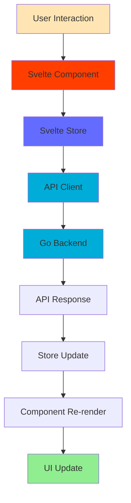
```mermaid
graph TB
    User[User Interaction] --> Component[Svelte Component]
    Component --> Store[Svelte Store]
    Store --> API[API Client]
    API --> Server[Go Backend]

    Server --> API2[API Response]
    API2 --> Store2[Store Update]
    Store2 --> Component2[Component Re-render]
    Component2 --> UI[UI Update]

    style User fill:#FFE5B4
    style Component fill:#FF3E00
    style Store fill:#646CFF
    style API fill:#00ADD8
    style Server fill:#00ADD8
    style UI fill:#90EE90
```

**Flow Explanation**:

1. **User Interaction**: Button click, form submit, navigation
2. **Component Event**: Handler function triggered
3. **Store Method Call**: Component calls store action (e.g., `authStore.login()`)
4. **API Request**: Store calls API client (e.g., `authApi.login()`)
5. **Backend Processing**: Go API validates, processes, responds
6. **API Response**: JSON parsed into DTO
7. **Store Update**: Store updates internal state with new data
8. **Reactive Update**: Svelte detects store change
9. **Component Re-render**: UI automatically updates (reactive)

#### Reactive Subscriptions Pattern

**Automatic Subscriptions**:

Components subscribe to stores using `$store` prefix syntax. Svelte automatically manages subscription lifecycle (subscribe on mount, unsubscribe on destroy).

**Subscription Types**:

1. **Direct Store Subscription**: Access entire store state
2. **Derived Store Subscription**: Computed values from base stores
3. **Reactive Statements**: `$:` prefix for side effects

**Benefits**:

- No manual subscription management
- Automatic cleanup (memory leak prevention)
- Granular reactivity (only affected components update)

#### Local vs Global State Decision Matrix

**Use Svelte Store (Global) When**:

- Data shared across multiple pages/components
- Data survives page navigation
- Data requires persistence (localStorage, IndexedDB)
- Data triggers side effects (API calls, notifications)

**Use Component State (Local) When**:

- Data specific to single component
- Data temporary (modal open state, form draft)
- Data reset on component unmount
- No cross-component communication needed

**Examples**:

| State               | Storage   | Reason                                 |
| ------------------- | --------- | -------------------------------------- |
| User authentication | Store     | Shared across all pages, persisted     |
| Offline status      | Store     | Affects all components, automatic sync |
| Modal open/close    | Component | Temporary, single component            |
| Form draft          | Component | Temporary, reset on cancel             |
| Notifications       | Store     | Cross-component, polling, persistence  |
| Scan progress       | Component | Temporary, modal-specific              |

#### Optimistic UI Updates

**Pattern**: Update UI immediately, rollback on API failure.

**Use Cases**:

- Marking notification as read (instant visual feedback)
- Adding to favorites (immediate star icon change)
- Deleting items (instant removal from list)

**Implementation Strategy**:

1. **Optimistic Update**: Immediately update store state
2. **API Call**: Send request to backend
3. **Success**: Keep optimistic state
4. **Failure**: Rollback state + show error toast

**Benefits**:

- Perceived performance (no loading spinners)
- Responsive UI (instant feedback)
- Better user experience (feels fast)

**Tradeoffs**:

- Requires rollback logic (more complexity)
- Can show stale data briefly on conflict
- Error handling more critical

---

## 🚀 Deployment Architecture

The Savvy is optimized for **containerized deployments with reverse proxy**. The production architecture uses **Traefik** for TLS termination and routing.

### Production Architecture (Traefik)

**Network Flow**:

```
Client (HTTPS:443) → Traefik (TLS Termination) → App (HTTP:3000) → PostgreSQL
                                ↓
                          Let's Encrypt
```

**Port Configuration**:

- **Development (Docker Compose)**: Port 8080
- **Production (Kubernetes/Helm)**: Port 3000

**Traefik Reverse Proxy**:

- ✅ **TLS Termination**: Let's Encrypt certificates automatically
- ✅ **HTTPS Redirect**: HTTP → HTTPS redirect at proxy level
- ✅ **Header Injection**: `X-Forwarded-Proto`, `X-Real-IP`, `X-Forwarded-For`
- ✅ **Load Balancing**: For multi-instance deployments
- ✅ **Health Checks**: Automatic routing only to healthy pods

**Important**: The app itself runs on **HTTP** (port 8080 in dev, port 3000 in production), Traefik handles TLS encryption.

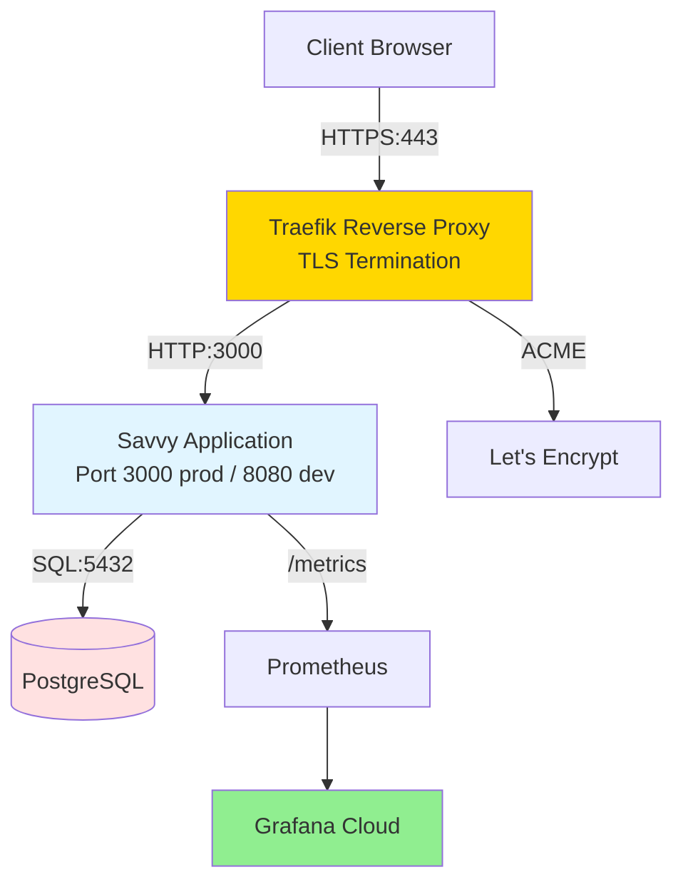
```mermaid
graph TB
    Client[Client Browser] -->|HTTPS:443| Traefik[Traefik Reverse Proxy<br/>TLS Termination]
    Traefik -->|HTTP:3000| App[Savvy Application<br/>Port 3000 prod / 8080 dev]
    Traefik -->|ACME| LE[Let's Encrypt]

    App -->|SQL:5432| DB[(PostgreSQL)]
    App -->|/metrics| Prom[Prometheus]
    Prom --> Grafana[Grafana Cloud]

    style Traefik fill:#FFD700
    style App fill:#e1f5ff
    style DB fill:#ffe1e1
    style Grafana fill:#90EE90
```

### Container Structure

**Development Setup (Docker Compose)**:

The local development environment uses Docker Compose with different port configuration than production:

- **Application Container**: Go binary on **port 8080** (development), static files in `/static` directory
- **PostgreSQL Container**: PostgreSQL 16 on port 5432
- **Optional Traefik**: For local HTTPS testing

**Production Setup (Kubernetes/Helm)**:

- **Application Container**: Go binary on **port 3000** (production)
- **External PostgreSQL**: Managed database service
- **Traefik Ingress**: TLS termination and routing

**Observability Integration**:

- Prometheus scrapes the `/metrics` endpoint for monitoring
- Logs are output structured (JSON format for production)
- Grafana Cloud aggregates all metrics for central visualization

### Kubernetes Deployment (Optional)

**Alternative Production Setup (Kubernetes/K3s)**:

For scalable production deployments, Kubernetes can be used:

- **Ingress Controller (Traefik)**: TLS termination and routing
  - Traefik IngressRoute for HTTP → HTTPS redirect
  - Let's Encrypt Cert-Manager integration
  - Middleware for security headers
- **2+ Replicas**: Horizontally scaled application pods for high availability
- **ConfigMap/Secret**: Environment variables and secrets as Kubernetes resources
- **External Database**: Managed PostgreSQL service (higher availability)
- **Grafana Cloud Integration**: OpenTelemetry traces and metrics

**Health Checks**: Kubernetes uses `/health` (liveness) and `/ready` (readiness) endpoints for automatic pod management. Pods are automatically restarted on problems.

**Traefik Middleware**:

- SSL redirect enabled
- HSTS headers (31536000 seconds, includeSubdomains, preload)
- Frame deny protection
- Content-Type nosniff

The diagram shows the complete Kubernetes architecture with Traefik Ingress, Service, Pods, ConfigMap/Secret, and external dependencies (PostgreSQL, Grafana Cloud).

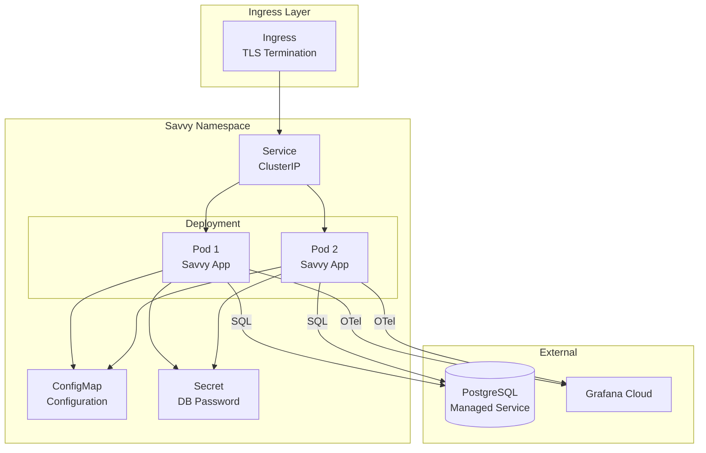
```mermaid
graph TB
    subgraph "Ingress Layer"
        Ingress[Ingress<br/>TLS Termination]
    end

    subgraph "Savvy Namespace"
        Service[Service<br/>ClusterIP]

        subgraph "Deployment"
            Pod1[Pod 1<br/>Savvy App]
            Pod2[Pod 2<br/>Savvy App]
        end

        ConfigMap[ConfigMap<br/>Configuration]
        Secret[Secret<br/>DB Password]
    end

    subgraph "External"
        DB[(PostgreSQL<br/>Managed Service)]
        Grafana[Grafana Cloud]
    end

    Ingress --> Service
    Service --> Pod1
    Service --> Pod2

    Pod1 --> ConfigMap
    Pod1 --> Secret
    Pod2 --> ConfigMap
    Pod2 --> Secret

    Pod1 -->|SQL| DB
    Pod2 -->|SQL| DB

    Pod1 -->|OTel| Grafana
    Pod2 -->|OTel| Grafana
```

---

## 🧪 Testing & Quality Assurance

### Backend Testing (Go)

**Test Coverage**:

- **Services**: 57.8% Coverage
- **Handlers**: 54.1% Coverage
- **Models**: 100.0% Coverage
- **Repository**: 97.2% Coverage
- **Config**: 47.3% Coverage
- **Middleware**: 13.9% Coverage
- **Race Detection**: All tests pass with `-race` flag

**Testing Stack**:

- Go standard `testing` package
- PostgreSQL for integration tests (AuthzService)
- Testify for assertions
- Mock interfaces for isolation

**Run Tests**:

```bash
# All tests
go test ./...

# With coverage
go test -cover ./...

# Race detection
go test -race ./...

# Specific package
go test ./internal/services -v
```

### Frontend Testing (Vitest + Playwright)

**Vitest Unit Tests**:

- **Coverage**: 32.8% unit test coverage (19 tests, stores and utils)
- **Stores**: `offlineStore` (8/8), `authStore` (6/11)

**Playwright E2E Tests**:

- **Coverage**: 23 E2E test files (Playwright) covering authentication, CRUD operations, sharing, favorites,
  notifications, and admin panel
- **Scenarios**: Auth, CRUD, Sharing, Favorites, Notifications
- **Browsers**: Chromium, Firefox, WebKit, Mobile
- **Setup**: See [CONTRIBUTING.md](CONTRIBUTING.md) for E2E testing guide

**Run Tests**:

```bash
cd client

# Unit tests
npm test
npm run test:ui
npm run test:coverage

# E2E tests
npm run test:e2e
npm run test:e2e:ui
```

---

## 📚 Further Resources

### For Users

- **[README.md](README.md)** - Quick Start, Features, Installation
- **[SUPPORT.md](SUPPORT.md)** - Support resources, FAQ, Troubleshooting
- **[SECURITY.md](SECURITY.md)** - Security policy, vulnerability reporting

### For Developers

- **[CONTRIBUTING.md](CONTRIBUTING.md)** - Contribution guidelines, code style, PR process
- **[AGENTS.md](AGENTS.md)** - AI agent documentation, offline architecture, cache validation
- **[OPERATIONS.md](OPERATIONS.md)** - Deployment (Traefik/K8s), monitoring, audit logging
- **[OBSERVABILITY.md](OBSERVABILITY.md)** - Observability stack, Prometheus, Grafana, Loki
- **[DEVELOPMENT.md](DEVELOPMENT.md)** - Docker development, Air hot reload, best practices

### Project Management

- **[CHANGELOG.md](CHANGELOG.md)** - Release history and breaking changes
- **[GOVERNANCE.md](GOVERNANCE.md)** - Project governance model, decision-making
- **[LICENSE](LICENSE)** - MIT License
