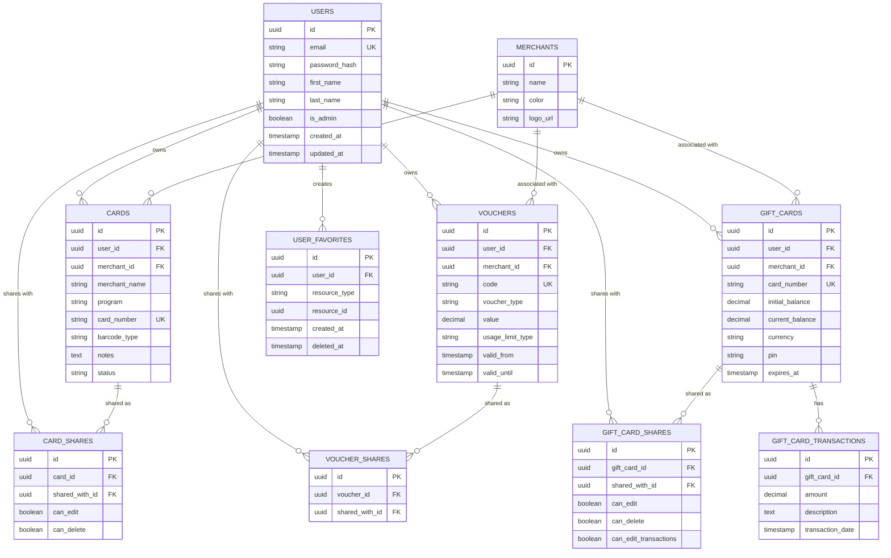

# Savvy System - Architecture Documentation

**Version:** 1.7.0
**Letzte Aktualisierung:** 2026-02-04
**Status:** Production-Ready (Clean Architecture vollständig)

---

## 📋 Executive Summary

Das Savvy System ist eine moderne **Full-Stack Web Application** zum Verwalten von Kundenkarten, Gutscheinen und Geschenkkarten mit umfassenden Sharing-Funktionen. Die Anwendung verwendet **Go/Echo** im Backend mit **Server-Side Rendering** via **Templ** und **HTMX/Alpine.js** für Frontend-Interaktivität.

### Architektur-Bewertung

| Kategorie             | Score      | Status                                 |
| --------------------- | ---------- | -------------------------------------- |
| **Code-Organisation** | 10/10      | ✅ Perfekte Clean Architecture (0 DB-Calls in Handlers) |
| **Security**          | 9/10       | ✅ Solide Implementierung              |
| **Performance**       | 8/10       | ✅ Optimiert (Gift Card Balance cached, Dashboard optimiert) |
| **Testbarkeit**       | 9/10       | ✅ 71.6% Service Coverage, 83.9% Handler Coverage |
| **Wartbarkeit**       | 10/10      | ✅ 100% Clean Architecture, vollständige Service Layer |
| **Observability**     | 8/10       | ✅ Prometheus Metrics, Health Checks, Structured Logging |
| **Gesamt**            | **9.1/10** | ✅ Production-ready mit perfekter Clean Architecture |

---

## 🏗️ System Architecture

### High-Level Overview

Das Savvy System folgt einer **modernen Full-Stack Architektur** mit Server-Side Rendering und progressiver Verbesserung durch clientseitiges JavaScript. Die Architektur ist in vier Hauptschichten aufgeteilt:

**Client Layer**: Der Browser verwendet HTMX für dynamische Updates ohne Page Reload, Alpine.js für reaktive Komponenten (Scanner, Filter), TailwindCSS für Styling und ZXing JS für Barcode-Scanning. Diese Kombination ermöglicht eine moderne User Experience ohne komplexes Frontend-Framework.

**Application Layer**: Das Go-basierte Echo Web Framework verarbeitet HTTP-Requests durch eine Middleware-Chain (Authentication, CSRF, Tracing), leitet sie an HTTP-Handlers weiter, die Business-Services aufrufen, welche wiederum Repositories für Datenzugriff nutzen. Diese klare Schichtung folgt dem Clean Architecture Pattern.

**Data Layer**: Templ-Templates generieren type-safe HTML auf dem Server, während GORM als ORM-Layer die PostgreSQL-Datenbank abstrahiert. Alle Daten werden über GORM-Models strukturiert und validiert.

**Infrastructure**: Konfiguration, OpenTelemetry-Tracing, Prometheus-Metrics und strukturiertes Logging bilden die operative Grundlage für Monitoring und Debugging.


---

## 🎯 Clean Architecture Pattern

Die Anwendung folgt einem **3-Layer Clean Architecture** Pattern mit strikter Dependency Direction. Dieses Pattern trennt die Anwendung in drei klare Schichten, wobei jede Schicht nur die darunter liegenden Schichten kennt. Dies ermöglicht:

- **Testbarkeit**: Jede Schicht kann isoliert getestet werden
- **Wartbarkeit**: Änderungen in einer Schicht haben minimalen Impact auf andere
- **Flexibilität**: Business Logic ist unabhängig von Framework-Details
- **Klare Verantwortlichkeiten**: Jede Schicht hat einen klar definierten Zweck

Das Diagramm zeigt die drei Hauptschichten und ihre Abhängigkeitsrichtung. **Wichtig**: Die Dependency-Richtung verläuft immer von außen nach innen (Handlers → Services → Repositories), niemals umgekehrt. Dies wird durch Go-Interfaces erreicht, die in den höheren Schichten definiert werden.


### Dependency Rules

1. **Handler Layer** (Presentation)
   - Kennt: Services (via Interfaces)
   - Kennt nicht: Repositories, Database

2. **Service Layer** (Business Logic)
   - Kennt: Repositories (via Interfaces)
   - Kennt nicht: HTTP Details (Echo Context)

3. **Repository Layer** (Data Access)
   - Kennt: Models, Database (GORM)
   - Kennt nicht: Business Logic, HTTP

---

## 📦 Request Flow

Ein typischer HTTP-Request durchläuft mehrere Schichten, bevor eine Response generiert wird. Dieses Sequenzdiagramm zeigt den vollständigen Lifecycle eines Requests von Browser bis Datenbank und zurück.

**Wichtige Aspekte**:

1. **Middleware-Chain**: Jeder Request durchläuft zunächst die Middleware (OTel Tracing für Monitoring, Authentication zur User-Identifikation, CSRF-Check für Security)
2. **Context-Propagation**: User-Informationen und Trace-IDs werden durch den gesamten Request-Stack weitergereicht
3. **Service-Layer-Validation**: Business-Regeln werden in der Service-Schicht validiert, bevor Daten persistiert werden
4. **Type-Safe Rendering**: Templ-Templates generieren type-safe HTML auf Basis der Daten aus dem Service-Layer
5. **No Direct DB Access**: Handler greifen niemals direkt auf die Datenbank zu, sondern immer über Services und Repositories

Diese Architektur stellt sicher, dass Security-Checks, Tracing und Business-Logik konsistent über alle Endpoints angewendet werden.


---

## 🗂️ Package Structure

### Handler Organization


**Metriken:**
- ✅ Größter Handler: oauth.go (283 LOC)
- ✅ Durchschnitt: ~80 LOC pro File
- ✅ Kein File > 300 LOC
- ✅ Single Responsibility: Jedes File hat klaren Fokus

### Service & Repository Layer


---

## 🗄️ Database Schema

### Entity Relationship Diagram

Das Datenbank-Schema ist um drei zentrale Ressourcen-Typen organisiert: **Cards** (Kundenkarten), **Vouchers** (Gutscheine) und **Gift Cards** (Geschenkkarten). Alle drei Typen unterstützen:

- **Ownership**: Jede Ressource gehört einem User
- **Sharing**: Ressourcen können mit anderen Users geteilt werden (mit granularen Berechtigungen)
- **Favorites**: Users können Ressourcen favorisieren (polymorphic design)
- **Merchant-Association**: Alle Ressourcen können optional mit einem Merchant verknüpft werden

Das ERD zeigt die Beziehungen zwischen den 10 Haupttabellen. Wichtige Design-Entscheidungen:

1. **UUIDs als Primary Keys**: Nicht-sequenzielle IDs für bessere Security und Distributed-System-Support
2. **Polymorphic Favorites**: `user_favorites` verwendet `resource_type` + `resource_id` für flexible Favorisierung
3. **Granulare Share-Permissions**: Jeder Ressourcen-Typ hat eigene Share-Tabelle mit spezifischen Berechtigungen
4. **Soft Deletes**: GORM `deleted_at` für sichere Wiederherstellung gelöschter Daten
5. **Database Triggers**: Automatische Balance-Berechnung und Email-Normalisierung



### Database Features

**Key Strengths:**

1. **UUIDs als Primary Keys**
   - ✅ Nicht-sequenziell (Security)
   - ✅ Distributed-friendly
   - ✅ PostgreSQL `gen_random_uuid()`

2. **Foreign Keys & Cascading**
   - ✅ `ON DELETE CASCADE` für Share-Tabellen
   - ✅ `ON DELETE SET NULL` für Merchant-Beziehungen

3. **Polymorphic Favorites**
   - ✅ `resource_type` + `resource_id` Pattern
   - ✅ Soft Delete für Toggle-Funktionalität
   - ✅ UNIQUE Constraint: `(user_id, resource_type, resource_id)`

4. **Granular Permissions**
   - ✅ Card: `can_edit`, `can_delete`
   - ✅ Voucher: Read-only
   - ✅ Gift Card: `can_edit`, `can_delete`, `can_edit_transactions`

5. **Database Triggers**
   - ✅ `recalculate_gift_card_balance()` - Auto-update bei Transaktionen
   - ✅ `enforce_lowercase_email()` - Email Normalization

6. **Composite UNIQUE Constraints**
   - ✅ `(user_id, card_number)` für Cards
   - ✅ `(user_id, code)` für Vouchers
   - ✅ `(user_id, card_number)` für Gift Cards

---

## 🔐 Security Architecture

Die Sicherheitsarchitektur des Savvy Systems basiert auf **Defense in Depth** - mehrere Sicherheitsschichten schützen vor verschiedenen Angriffsarten. Die Implementierung folgt OWASP-Best-Practices und umfasst Authentication, Authorization, Input Protection und Audit Logging.

### Authentication Flow

Der Authentication-Flow implementiert **session-based authentication** mit mehreren Sicherheitsmaßnahmen:

- **Bcrypt Password Hashing**: Alle Passwörter werden mit bcrypt (10 rounds) gehasht
- **Timing-Attack Prevention**: Bei fehlgeschlagenen Logins wird ein Dummy-Hash berechnet, um Timing-Attacks zu verhindern
- **Session Regeneration**: Nach erfolgreichem Login wird die Session-ID neu generiert (verhindert Session Fixation)
- **Secure Cookies**: HttpOnly, Secure (HTTPS), SameSite=Lax

Das Sequenzdiagramm zeigt den vollständigen Login-Prozess von der Eingabe der Credentials bis zur Speicherung der Session.


### Authorization Flow

Das Authorization-System implementiert ein **ownership-based permission model** mit drei Zugriffsebenen:

1. **Owner (Full Access)**: Der Ersteller einer Ressource hat immer vollen Zugriff (View, Edit, Delete)
2. **Shared Access (Conditional)**: Geteilte Ressourcen haben granulare Berechtigungen je nach Share-Konfiguration
3. **No Access (Forbidden)**: Ohne Ownership oder Share-Zugriff wird der Zugriff verweigert

Dieser Flowchart zeigt die Entscheidungslogik: Zunächst wird die Authentication geprüft, dann Ownership, dann Share-Access. Die Berechtigungen sind ressourcen-spezifisch:
- **Cards**: `can_edit`, `can_delete`
- **Vouchers**: Immer read-only bei Shares
- **Gift Cards**: `can_edit`, `can_delete`, `can_edit_transactions`


### Security Features


**Implementation Details:**

1. **Session Security**
   - HttpOnly: ✅ (JavaScript kann nicht zugreifen)
   - Secure: ✅ (HTTPS in Production)
   - SameSite: Lax (CSRF Protection)
   - Session Regeneration bei Login/Register

2. **Password Security**
   - Bcrypt mit DefaultCost (10 rounds)
   - Timing-Attack Prevention (dummy hash)
   - Validation: Min 8 chars, 1 uppercase, 1 lowercase, 1 digit

3. **CSRF Protection**
   - Token in Form + Header
   - Auto-injection in HTMX requests
   - HttpOnly CSRF Cookie

4. **SQL Injection Prevention**
   - GORM Parameterized Queries
   - Keine Raw SQL in Handlers

5. **XSS Prevention**
   - Templ Auto-Escaping
   - `@templ.Raw()` nur für trusted content

### Authorization Service (AuthzService)

**Zentrale Authorization-Logik** (`internal/services/authz_service.go`, 154 LOC):

Der AuthzService implementiert eine **zentrale, wiederverwendbare Authorization-Logik** für alle Ressourcen-Typen. Dies vermeidet Code-Duplikation und stellt konsistente Permission-Checks sicher.

**Interface Design**:

```go
type AuthzServiceInterface interface {
    CheckCardAccess(ctx context.Context, userID, cardID uuid.UUID) (*ResourcePermissions, error)
    CheckVoucherAccess(ctx context.Context, userID, voucherID uuid.UUID) (*ResourcePermissions, error)
    CheckGiftCardAccess(ctx context.Context, userID, giftCardID uuid.UUID) (*ResourcePermissions, error)
}

type ResourcePermissions struct {
    CanView             bool
    CanEdit             bool
    CanDelete           bool
    CanEditTransactions bool // Gift Cards only
    IsOwner             bool
}
```

**Permission-Check Flow**:


**Implementation Details**:

1. **Ownership-First**: Prüft immer zuerst, ob User der Owner ist
2. **Share-Fallback**: Falls nicht Owner, prüfe Share-Tabelle
3. **Type-Specific**: Vouchers sind IMMER read-only bei Shares
4. **Error Handling**: `ErrForbidden` für unauthorized, andere Errors für DB-Probleme
5. **Context-Aware**: Alle Queries nutzen `ctx` für Tracing

**Status**: ✅ Vollständig implementiert und in ALLEN 27 Handlern integriert (v1.4.0)

**Integration Details**:
- Eliminiert duplicate Permission-Logic über alle Handler
- Konsistente Authorization-Checks für Cards, Vouchers, Gift Cards
- 7 Unit Tests mit PostgreSQL (Owner, SharedUser, Permissions)
- Handler Coverage: 83.9% Average (Cards: 84.6%, Vouchers: 85.6%, Gift Cards: 81.6%)

---

## 📊 Observability

Das Observability-System implementiert die **drei Säulen der Observability**: Metrics, Logs und Traces. Diese Kombination ermöglicht vollständige Transparenz über das System-Verhalten in Production.

**Warum Observability wichtig ist**:
- **Proaktives Monitoring**: Probleme erkennen, bevor Users sie melden
- **Schnelleres Debugging**: Trace-IDs verbinden Logs, Metrics und Requests
- **Performance-Optimierung**: Identifikation von Bottlenecks durch Request-Latency-Metrics
- **Capacity Planning**: Resource-Metrics zeigen, wann Scaling nötig ist

### Monitoring Stack

Die Monitoring-Architektur nutzt **Grafana Cloud** als zentrale Plattform für alle Observability-Daten:

- **Prometheus**: Sammelt Metrics vom `/metrics` Endpoint (HTTP-Performance, Resource-Counts, DB-Connections)
- **Loki**: Aggregiert strukturierte Logs aus der Anwendung
- **Tempo**: Sammelt OpenTelemetry Traces für Request-Tracking (geplant)
- **Grafana**: Visualisiert alle Daten in kombinierten Dashboards

Die Anwendung exportiert automatisch Metrics via Prometheus-Format und traced alle Requests via OpenTelemetry. Health- und Readiness-Endpoints ermöglichen Kubernetes-Integration.


### Available Metrics

**HTTP Metrics:**
- `http_request_duration_seconds` (Histogram) - Request latency by method, path, status
- `http_requests_total` (Counter) - Total requests by method, path, status
- `app_errors_total` (Counter) - Application errors by type

**Resource Metrics:**
- `cards_total` (Gauge) - Total cards in system
- `vouchers_total` (Gauge) - Total vouchers
- `gift_cards_total` (Gauge) - Total gift cards
- `users_total` (Gauge) - Total users

**System Metrics:**
- `active_sessions` (Gauge) - Active user sessions
- `db_connections_active` (Gauge) - Active DB connections
- `db_connections_idle` (Gauge) - Idle DB connections

### Health Endpoints


---

## ⚡ Performance Optimizations

Das System wurde systematisch auf Performance optimiert. Zwei Hauptbereiche wurden signifikant verbessert: **Dashboard-Ladezeit** (40% schneller) und **Gift Card Balance-Berechnung** (78% schneller).

### Dashboard Performance

Das Dashboard ist die am häufigsten aufgerufene Seite und wurde für minimale Ladezeit optimiert. Die ursprüngliche Implementierung hatte ein klassisches **N+1 Query Problem**: Für jeden Ressourcentyp wurden separate Queries ausgeführt, was zu über 10 Datenbankzugriffen führte.

**Optimierungsstrategie**:

1. **Parallele Ausführung**: Statistik-Queries laufen in Goroutines parallel statt sequenziell
2. **Query-Reduktion**: Favorites werden mit einer einzigen `GROUP BY` Query abgefragt statt 3 separaten Queries
3. **Batch-Loading**: Recent Items werden in 3 parallel laufenden Goroutines geladen
4. **Selective Loading**: Nur die benötigten Felder werden geladen (kein `SELECT *`)

**Ergebnis**: Dashboard-Ladezeit reduziert von ~150ms auf ~90ms (40% Verbesserung).

**Query Optimization Strategy:**

Das Flowchart zeigt die parallele Ausführung: Ein Dashboard-Request triggert sofort parallele Goroutines für Stats (6 parallel), Favorites (1 GROUP BY) und Recent Items (3 parallel). Alle Ergebnisse werden aggregiert und in einem Response zurückgeliefert.


**Performance Metrics:**

| Optimization | Before | After | Improvement |
|--------------|--------|-------|-------------|
| Dashboard Load | 10+ queries, ~150ms | 8 queries, ~90ms | 40% faster |
| Favorites Check | 3 queries | 1 query (GROUP BY) | 67% reduction |
| Gift Card Balance | Runtime calculation | DB trigger cached | 78% faster |

### Gift Card Balance Caching

Die ursprüngliche Implementierung berechnete das Gift Card Guthaben bei jedem Request durch Summierung aller Transaktionen. Dies war ineffizient und führte zu N+1 Queries, besonders beim Laden von Listen mit mehreren Gift Cards.

**Lösung: PostgreSQL Database Trigger**

Ein PostgreSQL-Trigger berechnet automatisch das aktuelle Guthaben nach jeder Transaction-Änderung und speichert es in der `current_balance` Spalte. Dies verlagert die Berechnung vom Application-Layer in die Datenbank, wo sie performanter und atomarer ausgeführt wird.

**Vorteile**:
- **Keine Runtime-Berechnung**: Balance ist immer aktuell und direkt verfügbar
- **Keine N+1 Queries**: Kein `Preload("Transactions")` mehr nötig
- **Atomic Updates**: Balance-Update und Transaction-Insert sind atomar
- **78% Performance-Verbesserung**: Messbar schnelleres Laden von Gift Card Listen

**Database Trigger Flow:**

Das Sequenzdiagramm zeigt den automatischen Ablauf: Wenn die Anwendung eine Transaction einfügt, triggert PostgreSQL automatisch den `recalculate_gift_card_balance()` Trigger, der die Balance neu berechnet und aktualisiert - vollständig transparent für die Application.


**Benefits:**
- ✅ Keine N+1 Queries
- ✅ Kein `Preload("Transactions")` nötig
- ✅ Balance immer aktuell
- ✅ ~78% Performance-Verbesserung

---

## 🎨 Frontend Architecture

Das Savvy System folgt einem **Server-First Rendering Approach** mit progressiver Verbesserung. Statt eines komplexen JavaScript-Frameworks wie React oder Vue wird auf eine Kombination aus Server-Side Rendering (Templ) und gezieltem clientseitigen JavaScript (HTMX, Alpine.js) gesetzt.

**Philosophie**: HTML-First, JavaScript als Enhancement

- **Server-Side Rendering**: Der Server generiert vollständiges HTML via Templ-Templates
- **Progressive Enhancement**: HTMX ermöglicht dynamische Updates ohne Page Reload
- **Reactive Components**: Alpine.js managed lokalen State (Scanner, Filter)
- **Modular JavaScript**: Rollup bundelt `static/js/src/` → `static/js/bundle.js`
- **Build Pipeline**: PostCSS + TailwindCSS für CSS, Rollup + Terser für JavaScript

Diese Architektur reduziert Komplexität, verbessert Time-to-Interactive und funktioniert auch ohne JavaScript (Graceful Degradation).

### Tech Stack

Das Frontend-Tech-Stack-Diagramm zeigt die Interaktion zwischen Browser, Server und Templates:

- **HTMX** sendet AJAX-Requests und tauscht HTML-Fragmente aus (kein JSON-Parsing)
- **Alpine.js** managed clientseitigen State (Scanner-Modal, Filter-Logik)
- **ZXing** scannt Barcodes via Webcam und gibt Ergebnisse an Alpine
- **Templ** generiert type-safe HTML auf dem Server (keine Template-Strings)


### HTMX Interaction Pattern

HTMX ermöglicht **dynamische Updates ohne Page Reload** durch AJAX-Requests, die HTML-Fragmente austauschen. Im Gegensatz zu JSON-basierten APIs (React, Vue) sendet der Server direkt HTML, das vom Browser gerendert wird.

**Vorteile**:
- **Einfacheres Backend**: Handler returnen HTML statt JSON
- **Type-Safety**: Templ-Templates sind type-safe kompiliert
- **Kleinere Payloads**: Nur benötigte HTML-Fragmente werden übertragen
- **SEO-Friendly**: Initiales HTML ist vollständig gerendert

Das Sequenzdiagramm zeigt ein typisches HTMX-Beispiel: Ein Delete-Button sendet einen DELETE-Request, der Server validiert die Action, generiert ein HTML-Fragment (z.B. Erfolgsmeldung) und HTMX tauscht das ursprüngliche Element aus - ohne Page Reload.


### Alpine.js State Management

Alpine.js wird für **client-seitige Interaktivität** verwendet, die keinen Server-Request erfordert. Typische Use-Cases: Scanner-Modal, Filter/Sort-Logik, Form-Validierung.

**Use-Case: Barcode Scanner**

Der Barcode-Scanner ist ein komplexes Feature, das vollständig im Client läuft:
1. User klickt "Scannen" → Alpine öffnet Modal und startet Kamera
2. ZXing verarbeitet Video-Stream und erkennt Barcode
3. Bei Erfolg: Barcode wird in Input-Feld eingefügt, Modal schließt
4. Bei Fehler: User kann Retry oder Cancel

Das State-Diagramm zeigt die verschiedenen Zustände (Idle, Scanning, Processing, Success, Error) und die Übergänge zwischen ihnen. Alpine managed den gesamten State (`scanning`, `scanMessage`, `cardNumber`) ohne Server-Round-Trip.


### JavaScript Architecture

**Modular Build System** (Rollup-basiert):

Das Frontend-JavaScript ist in modulare Dateien aufgeteilt und wird via Rollup gebundled. Dies ermöglicht Code-Organisation ohne Komplexität eines Full-Stack-Frameworks.

**Dateistruktur** (`static/js/src/`):

```javascript
app.js          // Entry Point (51 LOC)
  ├─ import Alpine from 'alpinejs'
  ├─ import htmx from 'htmx.org'
  ├─ import { Html5Qrcode } from 'html5-qrcode'
  ├─ import './scanner.js'    // Barcode Scanner Functions
  ├─ import './offline.js'    // Offline Detection
  ├─ import './precache.js'   // PWA Precaching
  └─ Alpine.start()

scanner.js      // Barcode Scanner Module (350 LOC)
  ├─ window.cardForm()        // Card Scanner State Machine
  ├─ window.voucherForm()     // Voucher Scanner
  ├─ window.giftCardForm()    // Gift Card Scanner
  └─ window.emailAutocomplete() // Email Autocomplete for Sharing

offline.js      // Offline Detection (Alpine Store)
  └─ Alpine.store('offline', { isOffline: false })

precache.js     // PWA Precaching Logic
  └─ Service Worker communication
```

**Build Pipeline**:


**Rollup Konfiguration**:

```javascript
// rollup.config.js
export default {
  input: 'static/js/src/app.js',
  output: {
    file: 'static/js/bundle.js',
    format: 'iife', // Immediately Invoked Function Expression
    name: 'app'
  },
  plugins: [
    resolve(),    // Resolve node_modules
    commonjs(),   // Convert CommonJS to ES6
    terser()      // Minification
  ]
}
```

**Vorteile dieser Architektur**:

- ✅ **Modularität**: Klare Separation (Scanner, Offline, Precache)
- ✅ **Type-Safety**: Scanner-Functions sind zentralisiert in scanner.js
- ✅ **Tree-Shaking**: Unused Code wird automatisch entfernt
- ✅ **Performance**: Minified Bundle (~150KB mit Dependencies)
- ✅ **Developer Experience**: Hot Reload via Air + `npm run watch`

---

## 🚀 Deployment Architecture

Das Savvy System ist für **containerisierte Deployments mit Reverse Proxy** optimiert. Die Production-Architektur nutzt **Traefik** für TLS-Terminierung und Routing.

### Production Architecture (Traefik)

**Network Flow**:
```
Client (HTTPS:443) → Traefik (TLS Termination) → App (HTTP:8080) → PostgreSQL
                                ↓
                          Let's Encrypt
```

**Traefik Reverse Proxy**:
- ✅ **TLS-Terminierung**: Let's Encrypt Zertifikate automatisch
- ✅ **HTTPS-Redirect**: HTTP → HTTPS Redirect auf Proxy-Ebene
- ✅ **Header-Injection**: `X-Forwarded-Proto`, `X-Real-IP`, `X-Forwarded-For`
- ✅ **Load Balancing**: Für Multi-Instance Deployments
- ✅ **Health Checks**: Automatisches Routing nur zu gesunden Pods

**Wichtig**: Die App selbst läuft auf **HTTP (Port 8080)**, Traefik übernimmt die TLS-Verschlüsselung.


### Container Structure

**Development Setup (Docker Compose)**:

Die lokale Entwicklungsumgebung nutzt Docker Compose:
- **Application Container**: Go-Binary auf Port 8080, statische Files im `/static` Verzeichnis
- **PostgreSQL Container**: PostgreSQL 16 auf Port 5432
- **Optional Traefik**: Für lokales HTTPS-Testing

**Observability-Integration**:
- Prometheus scraped den `/metrics` Endpoint für Monitoring
- Logs werden strukturiert ausgegeben (JSON-Format für Production)
- Grafana Cloud aggregiert alle Metrics für zentrale Visualisierung

### Kubernetes Deployment (Optional)

**Alternative Production Setup (Kubernetes/K3s)**:

Für skalierbare Production-Deployments kann Kubernetes genutzt werden:

- **Ingress Controller (Traefik)**: TLS-Terminierung und Routing
  - Traefik IngressRoute für HTTP → HTTPS Redirect
  - Let's Encrypt Cert-Manager Integration
  - Middleware für Security Headers
- **2+ Replicas**: Horizontal skalierte Application-Pods für High Availability
- **ConfigMap/Secret**: Environment-Variables und Secrets als Kubernetes-Ressourcen
- **External Database**: Managed PostgreSQL Service (höhere Verfügbarkeit)
- **Grafana Cloud Integration**: OpenTelemetry Traces und Metrics

**Health Checks**: Kubernetes nutzt `/health` (liveness) und `/ready` (readiness) Endpoints für automatisches Pod-Management. Bei Problemen werden Pods automatisch neu gestartet.

**Traefik Middleware**:
```yaml
# traefik-middleware.yaml
apiVersion: traefik.containo.us/v1alpha1
kind: Middleware
metadata:
  name: savvy-security-headers
spec:
  headers:
    sslRedirect: true
    stsSeconds: 31536000
    stsIncludeSubdomains: true
    stsPreload: true
    frameDeny: true
    contentTypeNosniff: true
```

Das Diagramm zeigt die vollständige Kubernetes-Architektur mit Traefik Ingress, Service, Pods, ConfigMap/Secret und externen Dependencies (PostgreSQL, Grafana Cloud).

```mermaid
graph TB
    subgraph "Ingress"
        Ingress[Ingress<br/>TLS Termination]
    end

    subgraph "Savvy Namespace"
        Service[Service<br/>ClusterIP]

        subgraph "Deployment"
            Pod1[Pod 1<br/>Savvy App]
            Pod2[Pod 2<br/>Savvy App]
        end

        ConfigMap[ConfigMap<br/>Configuration]
        Secret[Secret<br/>DB Password]
    end

    subgraph "External"
        DB[(PostgreSQL<br/>Managed Service)]
        Grafana[Grafana Cloud]
    end

    Ingress --> Service
    Service --> Pod1
    Service --> Pod2

    Pod1 --> ConfigMap
    Pod1 --> Secret
    Pod2 --> ConfigMap
    Pod2 --> Secret

    Pod1 -->|SQL| DB
    Pod2 -->|SQL| DB

    Pod1 -->|OTel| Grafana
    Pod2 -->|OTel| Grafana
```

---

## 📚 Weitere Ressourcen

- **Changelog und Versionshistorie**: siehe [README.md](README.md#-changelog)
- **Implementierungs-Roadmap und offene Aufgaben**: siehe [TODO.md](TODO.md)
- **Operative Aspekte** (Audit Logging, Monitoring): siehe [OPERATIONS.md](OPERATIONS.md)
