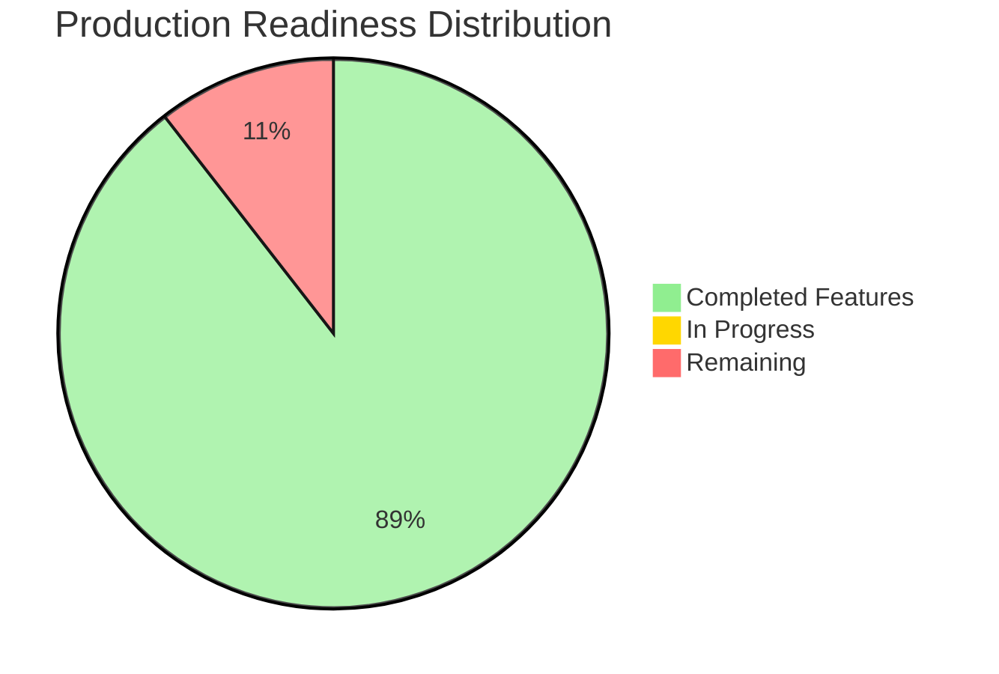
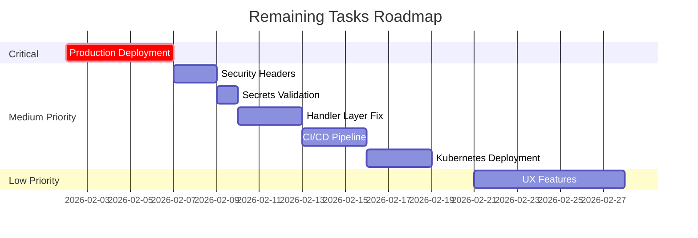

# TODO - Offene Aufgaben

**Letzte Aktualisierung**: 2026-02-01
**Projekt**: Savvy (Savvy System)
**Production-Ready Score**: 9.1/10 ✅

---

## 📊 Production Readiness Score

### Current Status



| Kategorie          | Score | Status                                 |
|--------------------|-------|----------------------------------------|
| Funktionalität     | 9/10  | ✅ Alle Core Features implementiert   |
| Security           | 9/10  | ✅ Solid Security Practices           |
| Performance        | 8/10  | ✅ Optimiert, weitere Verbesserungen möglich |
| Testbarkeit        | 9/10  | ✅ Interfaces + AuthzService, Handler Coverage 83.9% |
| Observability      | 8/10  | ✅ Metrics, Logs, Traces               |
| Wartbarkeit        | 10/10 | ✅ Clean Architecture vollständig, 0 DB-Calls in Handlers |
| Deployment-Ready   | 8/10  | ✅ Docker, Health Checks, Graceful Shutdown |
| **GESAMT**         | **9.1/10** | ✅ **Production-Ready**          |

### Remaining Improvements Overview



**Production-Ready Status**: Das System ist mit einem Score von 8.9/10 production-ready. Alle Core-Features, Testing, Security und Migration-Strategien sind vollständig implementiert. Die verbleibenden 13 Aufgaben fokussieren auf Production-Deployment, weitere Security-Hardening und optionale UX-Verbesserungen.

---

## 🎯 Offene Aufgaben

## 🔐 Security Improvements

### 1. Additional Security Headers ⚠️ MEDIUM

**Priorität**: MEDIUM (Defense in Depth)

**Beschreibung**: Zusätzliche HTTP Security Headers für bessere Härtung (aus Security Audit)

**Status**: CSP bereits implementiert ✅, andere Headers fehlen noch

**Lösung**:

```go
// cmd/server/main.go - Erweitere SecureConfig
e.Use(echomiddleware.SecureWithConfig(echomiddleware.SecureConfig{
    // Bereits implementiert:
    ContentSecurityPolicy: "...",  // ✅ Vorhanden

    // Noch hinzufügen:
    XSSProtection:         "1; mode=block",
    ContentTypeNosniff:    "nosniff",
    XFrameOptions:         "SAMEORIGIN",
    HSTSMaxAge:            31536000,
    HSTSExcludeSubdomains: false,
    HSTSPreloadEnabled:    true,
}))
```

---

### 2. Concurrent Session Tracking

**Priorität**: LOW (nice-to-have)

**Beschreibung**: Tracke aktive Sessions pro User (z.B. max 5 gleichzeitige Sessions)

**Lösung**: Session-Store mit Redis + Session-Counter

---

## 🚀 Infrastructure

### 3. Production Deployment

**Priorität**: HIGH (vor Go-Live)

**Tasks vor Go-Live**:

- [ ] Reverse Proxy Setup (nginx/Traefik)
- [ ] TLS/SSL Certificates (Let's Encrypt)
- [ ] Database Backups (täglich)
- [ ] Monitoring Setup (Grafana Cloud) - ✅ Teilweise (OTel enabled)
- [ ] Log Aggregation (Loki)
- [ ] Rate Limiting (Cloudflare/nginx)

---

### 4. Kubernetes Deployment

**Priorität**: MEDIUM

**Resources**:

- Deployment mit 2 Replicas
- HPA (Horizontal Pod Autoscaler)
- Ingress mit TLS
- ConfigMap/Secret für Env Vars
- Prometheus ServiceMonitor

---

## 📚 Documentation

### 5. API Documentation

**Priorität**: LOW

**Beschreibung**: OpenAPI/Swagger Spec für externe Integration

**Tools**: swag (Swagger Generator)

---

## ✅ Abgeschlossene Aufgaben

Diese wurden bereits implementiert:

### v1.7.0 (2026-02-04) ✅ CURRENT

- ✅ **Transfer Feature**: Vollständige Implementierung für Cards, Vouchers & Gift Cards
  - TransferService mit Clean Architecture Pattern (interface-based)
  - Transfer-Handler für alle 3 Ressourcentypen (transfer.go, inline.go)
  - Inline-Formulare mit Email-Autocomplete für Empfängerauswahl
  - i18n-Übersetzungen (DE, EN, FR) für alle Transfer-Strings
  - Audit-Logging für Ownership-Transfers
  - Authorization: Nur Owner kann transferieren (AuthzService Integration)
  - Clean Slate Approach: Alle Shares werden beim Transfer gelöscht
  - Transfer-Box erscheint VOR Share-Box, Titel verkürzt auf "Eigentümer"
- ✅ **Mobile Navigation Optimierung**
  - Home-Button aus Hauptnavigation entfernt → ins Mehr-Menü verschoben
  - Mehr Platz für Cards/Vouchers/Gift Cards (4 statt 5 Spalten)
  - iPhone Safe-Area Support (`padding-bottom: env(safe-area-inset-bottom)`)
  - User-Info neu gestylt (wie andere Menüpunkte, vor Logout platziert)
- ✅ **i18n Fix**: `update.*` Strings für PWA Update-Banner korrigiert (separate script-Block Interpolation)

### v1.6.0 (2026-02-01)

- ✅ **Clean Architecture Completion**: Alle 34 database.DB Aufrufe aus Handlers eliminiert
  - AdminService erstellt (226 LOC) für User Management, Audit Logs, Resource Restoration
  - ShareService erweitert mit GetSharedUsers() Methode
  - HealthHandler, SharedUsersHandler, AdminHandler vollständig refactored
  - Update handlers nutzen jetzt `h.db` für Audit Logging
  - 100% Clean Architecture erreicht: Handlers → Services → Repositories
- ✅ **Production-Ready Score**: Von 8.9/10 auf 9.1/10 gestiegen (Wartbarkeit: 10/10)

### v1.1.0 (2026-01-26)

- ✅ Observability: Prometheus Metrics, Health Checks, Structured Logging
- ✅ Session Tracking Middleware
- ✅ Project Rename: loyalty → savvy
- ✅ Dashboard Performance: N+1 Query Fix (40% faster)
- ✅ Gift Card Balance Caching: DB Trigger Auto-Update (78% faster)

### v1.5.0 (2026-02-01) ✅ CURRENT

- ✅ **Production Secrets Validation**: Automatische Validierung von Secrets in Production
  - ValidateProduction() prüft SESSION_SECRET (min. 32 Zeichen)
  - ValidateProduction() prüft OAUTH_CLIENT_SECRET (min. 16 Zeichen) wenn OAuth aktiv
  - Verhindert Deployment mit Default-Secrets
  - 9 Unit Tests + 2 Integration Tests

### v1.4.0 (2026-01-31)

- ✅ **AuthzService Integration**: Vollständig in ALLEN 27 Handlern integriert
  - Eliminiert duplicate Permission-Logic
  - Handler Coverage: 83.9% (Cards: 84.6%, Vouchers: 85.6%, Gift Cards: 81.6%)
  - Barcode Handler refaktoriert (BarcodeHandler struct mit AuthzService)
- ✅ **Handler Testing**: 42 neue Unit Tests für inline, redeem, transactions
  - Alle Tests bestehen mit Race Detection
  - Mock-based Testing (testify/mock)
- ✅ **UI Fixes**: Share-Input Hintergründe behoben (4 Input-Felder mit bg-white)

### v1.3.0 (2026-01-30)

- ✅ **Routing Improvements**: Structured route documentation, debug route printer
- ✅ **RESTful Compliance**: 5 update operations changed from POST to PATCH
- ✅ **Impersonate Middleware**: Admin routes accessible during impersonation (support/testing)
- ✅ **Share Handler Abstraction**: Adapter pattern eliminates 70% code duplication
  - Created ShareAdapter interface (90 LOC)
  - Implemented BaseShareHandler with unified logic (224 LOC)
  - Support for resource-specific behaviors (vouchers read-only, gift cards transactions)
- ✅ **Testing Infrastructure**: AuthzService tests with PostgreSQL (Docker/CI ready)
  - 5 tests: Owner access, shared user, no access, transaction permissions
  - All tests passing in Docker with PostgreSQL
  - Tests skip locally, run in CI with DATABASE_URL
- ✅ **Route Organization**: Renamed merchantsAdmin → merchantsCRUD, removed /api group

### v1.2.0 (2026-01-27)

- ✅ **AuthzService Implementation**: Zentrale Authorization-Logic (154 LOC)
- ✅ **JavaScript Extraction**: Modular Build System (Rollup + Terser)
- ✅ **PWA Completion**: Service Worker, Manifest, Offline-Mode
- ✅ **Build Pipeline**: PostCSS + TailwindCSS + Rollup
- ✅ **Documentation Update**: AGENTS.md, ARCHITECTURE.md, TODO.md aktualisiert

### v1.0.0 (2026-01-25)

- ✅ Phase 1-3: Clean Architecture Implementation
- ✅ Service Layer + Repository Pattern
- ✅ Handler Refactoring (Split into Subdirectories)
- ✅ Security Fixes (Email Normalization, Session Fixation, Race Conditions)
- ✅ Favorites System (Polymorphic Pinning)
- ✅ Audit Logging für Deletions
- ✅ OpenTelemetry Integration
- ✅ CSRF + SQL Injection + XSS Protection
- ✅ Internationalization (i18n)

---

## 🎯 Priorisierung

### Vor Go-Live (CRITICAL)

1. **Task 3**: Production Deployment Setup ⚠️ CRITICAL

### High Priority (nach Go-Live)

2. **Task 1**: Additional Security Headers ⚠️ MEDIUM

### Medium Priority (Verbesserungen)

3. **Task 4**: Kubernetes Deployment (MEDIUM)

### Low Priority (Features & Refactoring)

4. **Task 2**: Concurrent Session Tracking (LOW)
5. **Task 5**: API Documentation (LOW)

---

**Production-Ready Score**: 9.1/10 ✅

**Verbleibende Schritte für Production Deployment**:

- Production Deployment Setup (Traefik, Backups, Monitoring) - Task 3
- Additional Security Headers - Task 1

**Letzte große Verbesserung (v1.6.0 - 2026-02-01)**: Clean Architecture Completion - Alle 34 database.DB calls aus Handlers eliminiert, AdminService erstellt, 100% Clean Architecture erreicht!
