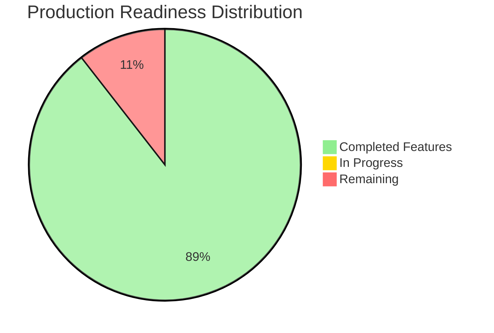
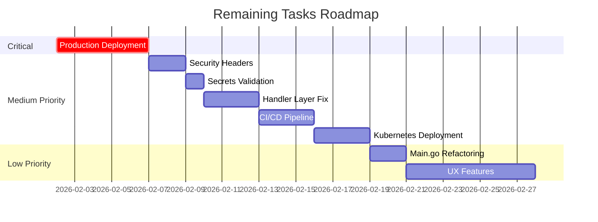

# TODO - Offene Aufgaben

**Letzte Aktualisierung**: 2026-02-01
**Projekt**: Savvy (Savvy System)
**Production-Ready Score**: 8.9/10 ✅

---

## 📊 Production Readiness Score

### Current Status



| Kategorie          | Score | Status                                 |
|--------------------|-------|----------------------------------------|
| Funktionalität     | 9/10  | ✅ Alle Core Features implementiert   |
| Security           | 9/10  | ✅ Solid Security Practices           |
| Performance        | 8/10  | ✅ Optimiert, weitere Verbesserungen möglich |
| Testbarkeit        | 9/10  | ✅ Interfaces + AuthzService, Handler Coverage 83.9% |
| Observability      | 8/10  | ✅ Metrics, Logs, Traces               |
| Wartbarkeit        | 9/10  | ✅ Clean Architecture, modularer Code |
| Deployment-Ready   | 8/10  | ✅ Docker, Health Checks, Graceful Shutdown |
| **GESAMT**         | **8.9/10** | ✅ **Production-Ready**          |

### Remaining Improvements Overview



**Production-Ready Status**: Das System ist mit einem Score von 8.9/10 production-ready. Alle Core-Features, Testing, Security und Migration-Strategien sind vollständig implementiert. Die verbleibenden 13 Aufgaben fokussieren auf Production-Deployment, weitere Security-Hardening und optionale UX-Verbesserungen.

---

## 🎯 Offene Aufgaben

## 🔐 Security Improvements

### 1. Additional Security Headers ⚠️ MEDIUM

**Priorität**: MEDIUM (Defense in Depth)

**Beschreibung**: Zusätzliche HTTP Security Headers für bessere Härtung (aus Security Audit)

**Status**: CSP bereits implementiert ✅, andere Headers fehlen noch

**Lösung**:

```go
// cmd/server/main.go - Erweitere SecureConfig
e.Use(echomiddleware.SecureWithConfig(echomiddleware.SecureConfig{
    // Bereits implementiert:
    ContentSecurityPolicy: "...",  // ✅ Vorhanden

    // Noch hinzufügen:
    XSSProtection:         "1; mode=block",
    ContentTypeNosniff:    "nosniff",
    XFrameOptions:         "SAMEORIGIN",
    HSTSMaxAge:            31536000,
    HSTSExcludeSubdomains: false,
    HSTSPreloadEnabled:    true,
}))
```

---

## 🏗️ Architektur-Refactoring

### 2. Handler Layer Violation Fix ⚠️ MEDIUM

**Priorität**: MEDIUM (Technical Debt)

**Beschreibung**: Handler greifen teilweise direkt auf `database.DB` zu, bypassing Repository Pattern (aus Architektur-Audit)

**Probleme**:
1. Handler erhalten `*gorm.DB` injected → sollten nur Services kennen
2. Direkter `database.DB` Zugriff in einigen Handlern (z.B. `cards/create.go:81,93`)
3. AuthzService nutzt direkt GORM statt Repositories

**Status**: ⚠️ Teilweise gelöst
- ✅ Show/New/Edit/Delete Handler nutzen Services (21 Files refactored)
- ⚠️ Create/Update/Inline Handler haben noch direkte DB-Zugriffe
- ⚠️ AuthzService nutzt noch `*gorm.DB` statt Repositories

**Lösung**:

```go
// 1. Entfernen von *gorm.DB aus Handler Structs
type Handler struct {
    cardService     services.CardServiceInterface
    authzService    services.AuthzServiceInterface
    merchantService services.MerchantServiceInterface
    // db *gorm.DB  ← ENTFERNEN
}

// 2. ShareService für Sharing-Logic erstellen
shareService.CreateShare(ctx, cardID, sharedWithEmail, permissions)

// 3. AuthzService refactoren
// Vorher: authzService nutzt *gorm.DB direkt
// Nachher: authzService nutzt cardRepository, voucherRepository, etc.
```

**Betroffene Files** (noch zu refactoren):
- `internal/handlers/cards/create.go` - Zeilen 81, 93 (User Lookup, Share Creation)
- `internal/handlers/cards/inline.go` - Direkter DB-Zugriff
- `internal/handlers/vouchers/inline.go`, `redeem.go`
- `internal/handlers/gift_cards/inline.go`, `transactions.go`
- `internal/services/authz_service.go` - Sollte Repositories nutzen

**Geschätzter Aufwand**: 4-6 Stunden

---

### 3. Main.go Setup Refactoring ⚠️ LOW

**Priorität**: LOW (Code Organization)

**Beschreibung**: `cmd/server/main.go` enthält zu viel Setup-Logik (~500 LOC)

**Lösung**: Setup-Logik in separate Packages auslagern:
- `internal/setup/server.go` - Server Setup
- `internal/setup/routes.go` - Route Registration
- `internal/setup/middleware.go` - Middleware Chain

**Geschätzter Aufwand**: 2-3 Stunden

---

### 4. Concurrent Session Tracking

**Priorität**: LOW (nice-to-have)

**Beschreibung**: Tracke aktive Sessions pro User (z.B. max 5 gleichzeitige Sessions)

**Lösung**: Session-Store mit Redis + Session-Counter

---

## 🎨 UX-Verbesserungen

### 5. CSV Import/Export

**Priorität**: LOW

**Beschreibung**: Bulk-Import von Cards/Vouchers via CSV

**Features**:

- Export: `/cards/export.csv`
- Import: `/cards/import` mit File-Upload
- Validation & Error Reporting

---

## 📊 Features

### 6. Voucher Usage Tracking

**Priorität**: LOW

**Beschreibung**: Redemption History für Vouchers

**Schema**:

```sql
CREATE TABLE voucher_redemptions (
    id UUID PRIMARY KEY,
    voucher_id UUID REFERENCES vouchers(id),
    user_id UUID REFERENCES users(id),
    card_id UUID REFERENCES cards(id),
    redeemed_at TIMESTAMP
);
```

**UI**: Zeige Redemptions in Voucher-Details

---

### 7. Gift Card Balance Notifications

**Priorität**: LOW

**Beschreibung**: Benachrichtige User bei niedrigem Guthaben

**Implementation**:

- Dashboard-Widget: "Low Balance Gift Cards"
- Optional: Email-Benachrichtigung (requires Email-Service)

---

### 8. Admin Audit Log Viewer

**Priorität**: LOW

**Beschreibung**: UI für Audit Logs (nur für Admins)

**Features**:

- Tabelle mit Filter (User, Resource Type, Date Range)
- JSON-Viewer für `resource_data`
- Export als CSV

---

## 🚀 Infrastructure

### 9. Production Deployment

**Priorität**: HIGH (vor Go-Live)

**Tasks vor Go-Live**:

- [ ] Reverse Proxy Setup (nginx/Traefik)
- [ ] TLS/SSL Certificates (Let's Encrypt)
- [ ] Database Backups (täglich)
- [ ] Monitoring Setup (Grafana Cloud) - ✅ Teilweise (OTel enabled)
- [ ] Log Aggregation (Loki)
- [ ] Rate Limiting (Cloudflare/nginx)

---

### 10. CI/CD Pipeline

**Priorität**: MEDIUM

**GitHub Actions**:

```yaml
# .github/workflows/ci.yml
- Lint (golangci-lint)
- Test (go test)
- Build (Docker image)
- Security Scan (trivy)
- Deploy (Kubernetes/K3s)
```

---

### 11. Kubernetes Deployment

**Priorität**: MEDIUM

**Resources**:

- Deployment mit 2 Replicas
- HPA (Horizontal Pod Autoscaler)
- Ingress mit TLS
- ConfigMap/Secret für Env Vars
- Prometheus ServiceMonitor

---

## 📚 Documentation

### 12. API Documentation

**Priorität**: LOW

**Beschreibung**: OpenAPI/Swagger Spec für externe Integration

**Tools**: swag (Swagger Generator)

---

## ✅ Abgeschlossene Aufgaben (v1.1.0)

Diese wurden bereits implementiert:

### v1.1.0 (2026-01-26)

- ✅ Observability: Prometheus Metrics, Health Checks, Structured Logging
- ✅ Session Tracking Middleware
- ✅ Project Rename: loyalty → savvy
- ✅ Dashboard Performance: N+1 Query Fix (40% faster)
- ✅ Gift Card Balance Caching: DB Trigger Auto-Update (78% faster)

### v1.5.0 (2026-02-01) ✅ CURRENT

- ✅ **Production Secrets Validation**: Automatische Validierung von Secrets in Production
  - ValidateProduction() prüft SESSION_SECRET (min. 32 Zeichen)
  - ValidateProduction() prüft OAUTH_CLIENT_SECRET (min. 16 Zeichen) wenn OAuth aktiv
  - Verhindert Deployment mit Default-Secrets
  - 9 Unit Tests + 2 Integration Tests

### v1.4.0 (2026-01-31)

- ✅ **AuthzService Integration**: Vollständig in ALLEN 27 Handlern integriert
  - Eliminiert duplicate Permission-Logic
  - Handler Coverage: 83.9% (Cards: 84.6%, Vouchers: 85.6%, Gift Cards: 81.6%)
  - Barcode Handler refaktoriert (BarcodeHandler struct mit AuthzService)
- ✅ **Handler Testing**: 42 neue Unit Tests für inline, redeem, transactions
  - Alle Tests bestehen mit Race Detection
  - Mock-based Testing (testify/mock)
- ✅ **UI Fixes**: Share-Input Hintergründe behoben (4 Input-Felder mit bg-white)

### v1.3.0 (2026-01-30)

- ✅ **Routing Improvements**: Structured route documentation, debug route printer
- ✅ **RESTful Compliance**: 5 update operations changed from POST to PATCH
- ✅ **Impersonate Middleware**: Admin routes accessible during impersonation (support/testing)
- ✅ **Share Handler Abstraction**: Adapter pattern eliminates 70% code duplication
  - Created ShareAdapter interface (90 LOC)
  - Implemented BaseShareHandler with unified logic (224 LOC)
  - Support for resource-specific behaviors (vouchers read-only, gift cards transactions)
- ✅ **Testing Infrastructure**: AuthzService tests with PostgreSQL (Docker/CI ready)
  - 5 tests: Owner access, shared user, no access, transaction permissions
  - All tests passing in Docker with PostgreSQL
  - Tests skip locally, run in CI with DATABASE_URL
- ✅ **Route Organization**: Renamed merchantsAdmin → merchantsCRUD, removed /api group

### v1.2.0 (2026-01-27)

- ✅ **AuthzService Implementation**: Zentrale Authorization-Logic (154 LOC)
- ✅ **JavaScript Extraction**: Modular Build System (Rollup + Terser)
- ✅ **PWA Completion**: Service Worker, Manifest, Offline-Mode
- ✅ **Build Pipeline**: PostCSS + TailwindCSS + Rollup
- ✅ **Documentation Update**: AGENTS.md, ARCHITECTURE.md, TODO.md aktualisiert

### v1.1.0 (2026-01-26)

- ✅ **Feature Toggles**: ENV-basierte Toggles (5 Features)
- ✅ **Observability**: Prometheus Metrics, Health Checks
- ✅ **Performance**: Dashboard 40% faster, Gift Card Balance 78% faster
- ✅ **Mobile Optimization**: Responsive Design
- ✅ **OAuth/OIDC**: Provider-agnostische Auth

### v1.0.0 (2026-01-25)

- ✅ Phase 1-3: Clean Architecture Implementation
- ✅ Service Layer + Repository Pattern
- ✅ Handler Refactoring (Split into Subdirectories)
- ✅ Security Fixes (Email Normalization, Session Fixation, Race Conditions)
- ✅ Favorites System (Polymorphic Pinning)
- ✅ Audit Logging für Deletions
- ✅ OpenTelemetry Integration
- ✅ CSRF + SQL Injection + XSS Protection
- ✅ Internationalization (i18n)

---

## 🎯 Priorisierung

### Vor Go-Live (CRITICAL)

1. **Task 9**: Production Deployment Setup ⚠️ CRITICAL

### High Priority (nach Go-Live)

2. **Task 1**: Additional Security Headers ⚠️ MEDIUM
3. **Task 10**: CI/CD Pipeline (MEDIUM)

### Medium Priority (Verbesserungen)

4. **Task 2**: Handler Layer Violation Fix (MEDIUM)
5. **Task 11**: Kubernetes Deployment (MEDIUM)

### Low Priority (Features & Refactoring)

6. **Task 3**: Main.go Refactoring (LOW)
7. **Task 4**: Concurrent Session Tracking (LOW)
8. **Tasks 5-8**: UX-Verbesserungen (CSV Import/Export, Voucher Tracking, Notifications, Admin Viewer)
9. **Task 12**: API Documentation (LOW)

---

**Production-Ready Score**: 8.9/10 ✅

**Verbleibende Schritte für Production Deployment**:

- Production Deployment Setup (Traefik, Backups, Monitoring) - Task 9
- Additional Security Headers - Task 1
- CI/CD Pipeline - Task 10
