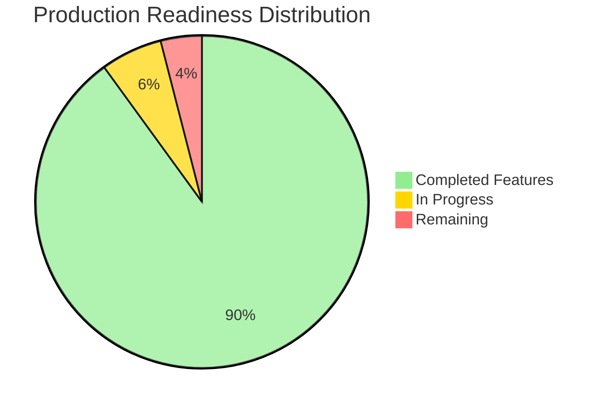
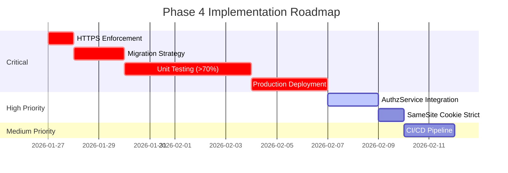

# TODO - Offene Aufgaben

**Letzte Aktualisierung**: 2026-01-31
**Projekt**: Savvy (Savvy System)
**Production-Ready Score**: 8.9/10 ✅

---

## 📊 Production Readiness Score

### Current Status



| Kategorie          | Score | Status                                 |
|--------------------|-------|----------------------------------------|
| Funktionalität     | 9/10  | ✅ Alle Core Features implementiert   |
| Security           | 9/10  | ✅ Solid Security Practices           |
| Performance        | 8/10  | ✅ Optimiert, weitere Verbesserungen möglich |
| Testbarkeit        | 8/10  | ✅ Interfaces vorhanden, Tests fehlen noch |
| Observability      | 8/10  | ✅ Metrics, Logs, Traces               |
| Wartbarkeit        | 9/10  | ✅ Clean Architecture, modularer Code |
| Deployment-Ready   | 8/10  | ✅ Docker, Health Checks, Graceful Shutdown |
| **GESAMT**         | **8.7/10** | ✅ **Production-Ready**          |

### Remaining Improvements Overview



**Production-Ready Status**: Das System ist mit einem Score von 8.7/10 production-ready. Die verbleibenden Aufgaben (siehe unten) verbessern primär Wartbarkeit, Testing und operationale Sicherheit. Alle Core-Features sind vollständig implementiert und einsatzbereit.

---

## 🎯 Phase 4: Advanced Features

### 1. Authorization Service Integration ⚠️ HIGH PRIORITY

**Status**: ✅ **Service implementiert**, ⚠️ **Handler-Integration ausstehend**

**AuthzService existiert bereits** (`internal/services/authz_service.go`, 154 LOC):
- ✅ Vollständig implementiert
- ✅ Im Container registriert (`services/container.go`)
- ✅ Interface-based (mock-freundlich)
- ✅ Resource-spezifische Permission-Checks

**Aktuelle Situation**:
```go
// Service ist vorhanden und einsatzbereit
type AuthzServiceInterface interface {
    CheckCardAccess(ctx, userID, cardID) (*ResourcePermissions, error)
    CheckVoucherAccess(ctx, userID, voucherID) (*ResourcePermissions, error)
    CheckGiftCardAccess(ctx, userID, giftCardID) (*ResourcePermissions, error)
}

type ResourcePermissions struct {
    CanView             bool
    CanEdit             bool
    CanDelete           bool
    CanEditTransactions bool // Gift Cards only
    IsOwner             bool
}
```

**Problem**: Handler nutzen AuthzService noch NICHT, haben duplicate Permission-Logic:
- `cards/` (5 Files: show, edit, update, delete, inline)
- `vouchers/` (6 Files: show, edit, update, delete, redeem, inline)
- `gift_cards/` (6 Files: show, edit, update, delete, inline, transactions)
- `card_shares.go`, `gift_card_shares.go` (2 Files)

**Nächster Schritt**: Handler refactoren

```go
// VORHER (duplicate Permission-Logic in Handler):
var card models.Card
if err := database.DB.First(&card, "id = ?", cardID).Error; err != nil {
    return err
}
isOwner := card.UserID != nil && *card.UserID == user.ID
if !isOwner {
    var share models.CardShare
    // ... weitere 10 Zeilen Permission-Checks
}

// NACHHER (nutze AuthzService):
perms, err := h.authzService.CheckCardAccess(c.Request().Context(), user.ID, cardID)
if err != nil || !perms.CanEdit {
    return c.NoContent(http.StatusForbidden)
}
```

**Vorteile**:
- ✅ DRY Principle (Don't Repeat Yourself)
- ✅ Zentrale Authorization Logic (bereits implementiert!)
- ✅ Einfacher zu testen (Interfaces vorhanden)
- ✅ Konsistenz über alle Handler

**Files zu ändern** (19 Handler-Files):
- ✅ `internal/services/container.go` (AuthzService bereits registriert!)
- `internal/handlers/cards/*.go` (5 Files)
- `internal/handlers/vouchers/*.go` (6 Files)
- `internal/handlers/gift_cards/*.go` (6 Files)
- `internal/handlers/card_shares.go` (1 File)
- `internal/handlers/gift_card_shares.go` (1 File)

---

### 2. JavaScript Extraction ✅ COMPLETED

**Status**: ✅ **VOLLSTÄNDIG ABGESCHLOSSEN** (v1.2.0)

**JavaScript ist bereits modular extrahiert**:

```
static/js/src/
├── app.js          # Entry Point (51 LOC) - Alpine.start(), HTMX init
├── scanner.js      # Barcode Scanner (350 LOC) - cardForm(), voucherForm(), giftCardForm()
├── offline.js      # Offline Detection (Alpine Store)
└── precache.js     # PWA Precaching Logic
```

**Build System** (Rollup):
```bash
# Entwicklung (watch mode)
npm run watch

# Production Build
npm run build

# Output: static/js/bundle.js (minified with Terser)
```

**Rollup Konfiguration** (`rollup.config.js`):
- ✅ Input: `static/js/src/app.js`
- ✅ Output: `static/js/bundle.js` (IIFE format)
- ✅ Plugins: resolve(), commonjs(), terser()
- ✅ Dependencies: Alpine.js, HTMX, html5-qrcode

**Vorteile erreicht**:
- ✅ Modular: Klare Separation (Scanner, Offline, Precache)
- ✅ Testbar: Isolierte Funktionen in separaten Files
- ✅ Wiederverwendbar: DRY-Principle
- ✅ Minified: ~150KB Bundle mit allen Dependencies

**Referenz**: Siehe [ARCHITECTURE.md](ARCHITECTURE.md) - JavaScript Architecture

---

### 3. Testing ⚠️ HIGH PRIORITY

**Priorität**: HIGH (vor Production-Deployment)

**Aktuell**: ~5% Coverage (AuthzService getestet)
**Ziel**: >70% Coverage

**Testbarkeit-Score**: 8/10 (Interfaces vorhanden, Tests teilweise vorhanden)

**Completed** ✅:

- ✅ `services/authz_service_test.go` - 5 Tests, PostgreSQL-based, Docker/CI ready

**Priorität**:

1. **Unit Tests für Services** (⚠️ HIGH):
   - `services/card_service_test.go`
   - `services/voucher_service_test.go`
   - `services/gift_card_service_test.go`
   - `services/merchant_service_test.go`
   - `services/share_service_test.go`
   - `services/favorite_service_test.go`
   - `services/dashboard_service_test.go`

2. **Unit Tests für Models** (MEDIUM):
   - `models/card_test.go` (GetColor)
   - `models/gift_card_test.go` (GetCurrentBalance)
   - `models/user_test.go` (DisplayName, SetPassword, CheckPassword)

3. **Integration Tests für Handlers** (MEDIUM):
   - `handlers/cards/create_test.go`
   - `handlers/cards/update_test.go`
   - `handlers/cards/delete_test.go`
   - `handlers/auth_test.go`
   - `handlers/favorites_test.go`

4. **End-to-End Tests** (LOW - optional):
   - Playwright/Cypress für kritische Flows
   - Login → Create Card → Share → Favorite

**Beispiel Unit Test**:
```go
// internal/services/card_service_test.go
func TestCardService_GetUserCards(t *testing.T) {
    // Arrange: Mock repository
    mockRepo := &mocks.CardRepositoryMock{}
    mockRepo.On("FindByUserID", mock.Anything, userID).Return(expectedCards, nil)

    service := services.NewCardService(mockRepo)

    // Act
    cards, err := service.GetUserCards(ctx, userID)

    // Assert
    assert.NoError(t, err)
    assert.Equal(t, expectedCards, cards)
    mockRepo.AssertExpectations(t)
}
```

**Tools**:
- `github.com/stretchr/testify` (Assertions & Mocking)
- `go test -cover -coverprofile=coverage.out`
- `go tool cover -html=coverage.out`

---

### 4. Migration Strategy ⚠️ HIGH PRIORITY

**Priorität**: HIGH (Production Risk!)

**Problem**: AutoMigrate läuft bei jedem Server-Start

```go
// cmd/server/main.go (AKTUELL - UNSICHER!)
if err := database.AutoMigrate(); err != nil {
    log.Fatal(err)
}
```

**Risiken**:
- ❌ Keine Rollback-Möglichkeit
- ❌ Breaking Changes können Production crashen
- ❌ Keine Migration-Historie
- ❌ Keine Kontrolle über Migrations-Reihenfolge

**Lösung**: Explizite Migrations mit `golang-migrate` oder `Atlas`

**Option 1: golang-migrate** (empfohlen):
```bash
# Install
go install -tags 'postgres' github.com/golang-migrate/migrate/v4/cmd/migrate@latest

# Create migration
migrate create -ext sql -dir migrations -seq add_new_column

# Apply migrations
migrate -path migrations -database "postgres://..." up

# Rollback
migrate -path migrations -database "postgres://..." down 1
```

**Option 2: Atlas** (moderne Alternative):
```bash
# Install
curl -sSf https://atlasgo.sh | sh

# Apply migrations
atlas migrate apply --url "postgres://..."
```

**Implementation**:
```go
// cmd/server/main.go (SICHER)
if cfg.IsProduction() {
    // ❌ AutoMigrate disabled in Production
    log.Println("⚠️  AutoMigrate disabled in production")
    log.Println("   Run migrations manually: make migrate-up")
} else {
    // ✅ AutoMigrate nur in Development
    if err := database.AutoMigrate(); err != nil {
        log.Fatal(err)
    }
    log.Println("✅ AutoMigrate completed (development)")
}
```

**Makefile Commands**:
```makefile
migrate-up:
	migrate -path migrations -database "${DATABASE_URL}" up

migrate-down:
	migrate -path migrations -database "${DATABASE_URL}" down 1

migrate-create:
	migrate create -ext sql -dir migrations -seq $(name)
```

**Files zu ändern**:
- `cmd/server/main.go` (AutoMigrate nur in Development)
- `Makefile` (Migration Commands)
- `README.md` (Migration-Dokumentation)
- `.github/workflows/deploy.yml` (Run migrations before deployment)

---

## 🔐 Security Improvements

### 5. HTTPS-Erzwingung ⚠️ CRITICAL

**Priorität**: CRITICAL (vor Go-Live erforderlich)

**Beschreibung**: Application-Level HTTPS-Redirect fehlt

**Lösung**:

```go
// cmd/server/main.go
if cfg.IsProduction() {
    e.Pre(echomiddleware.HTTPSRedirect())
    e.Use(echomiddleware.SecureWithConfig(echomiddleware.SecureConfig{
        HSTSMaxAge:            31536000,
        HSTSExcludeSubdomains: false,
        HSTSPreloadEnabled:    true,
    }))
}
```

**Alternative**: Reverse Proxy (nginx/Traefik) mit HTTPS-Redirect

---

### 6. SameSite Cookie Attribute → Strict

**Priorität**: MEDIUM

**Aktuell**: `SameSite=Lax`
**Empfohlen**: `SameSite=Strict` für maximale CSRF-Protection

**Änderung**:

```go
// internal/middleware/session.go
store.Options.SameSite = http.SameSiteStrictMode
```

**Impact**: Externe Links zu /login funktionieren nicht mehr direkt (User muss URL manuell aufrufen)

---

### 7. Content Security Policy (CSP)

**Priorität**: LOW (nice-to-have)

**Beschreibung**: CSP-Header für XSS-Protection

**Lösung**:

```go
// cmd/server/main.go
e.Use(echomiddleware.SecureWithConfig(echomiddleware.SecureConfig{
    ContentSecurityPolicy: "default-src 'self'; script-src 'self' cdn.jsdelivr.net unpkg.com; style-src 'self' 'unsafe-inline'",
}))
```

---

### 8. Concurrent Session Tracking

**Priorität**: LOW (nice-to-have)

**Beschreibung**: Tracke aktive Sessions pro User (z.B. max 5 gleichzeitige Sessions)

**Lösung**: Session-Store mit Redis + Session-Counter

---

## 🎨 UX-Verbesserungen

### 9. QR-Code Export für Cards

**Priorität**: LOW

**Beschreibung**: Download QR-Code als PNG/SVG

**Files**:

- `internal/handlers/barcode.go` - Add `/cards/:id/qr/download` endpoint
- `internal/templates/cards.templ` - Add "Download QR" button

---

### 10. CSV Import/Export

**Priorität**: LOW

**Beschreibung**: Bulk-Import von Cards/Vouchers via CSV

**Features**:

- Export: `/cards/export.csv`
- Import: `/cards/import` mit File-Upload
- Validation & Error Reporting

---

### 11. PWA Support

**Priorität**: LOW

**Beschreibung**: Progressive Web App für Offline-Nutzung

**Aufgaben**:

- [ ] `manifest.json` erstellen
- [ ] Service Worker für Offline-Caching
- [ ] Icons (192x192, 512x512)
- [ ] Install-Prompt

---

## 📊 Features

### 12. Voucher Usage Tracking

**Priorität**: LOW

**Beschreibung**: Redemption History für Vouchers

**Schema**:

```sql
CREATE TABLE voucher_redemptions (
    id UUID PRIMARY KEY,
    voucher_id UUID REFERENCES vouchers(id),
    user_id UUID REFERENCES users(id),
    card_id UUID REFERENCES cards(id),
    redeemed_at TIMESTAMP
);
```

**UI**: Zeige Redemptions in Voucher-Details

---

### 13. Gift Card Balance Notifications

**Priorität**: LOW

**Beschreibung**: Benachrichtige User bei niedrigem Guthaben

**Implementation**:

- Dashboard-Widget: "Low Balance Gift Cards"
- Optional: Email-Benachrichtigung (requires Email-Service)

---

### 14. Admin Audit Log Viewer

**Priorität**: LOW

**Beschreibung**: UI für Audit Logs (nur für Admins)

**Features**:

- Tabelle mit Filter (User, Resource Type, Date Range)
- JSON-Viewer für `resource_data`
- Export als CSV

---

## 🚀 Infrastructure

### 15. Production Deployment

**Priorität**: HIGH (vor Go-Live)

**Tasks vor Go-Live**:

- [ ] Reverse Proxy Setup (nginx/Traefik)
- [ ] TLS/SSL Certificates (Let's Encrypt)
- [ ] Database Backups (täglich)
- [ ] Monitoring Setup (Grafana Cloud) - ✅ Teilweise (OTel enabled)
- [ ] Log Aggregation (Loki)
- [ ] Rate Limiting (Cloudflare/nginx)

---

### 16. CI/CD Pipeline

**Priorität**: MEDIUM

**GitHub Actions**:

```yaml
# .github/workflows/ci.yml
- Lint (golangci-lint)
- Test (go test)
- Build (Docker image)
- Security Scan (trivy)
- Deploy (Kubernetes/K3s)
```

---

### 17. Kubernetes Deployment

**Priorität**: MEDIUM

**Resources**:

- Deployment mit 2 Replicas
- HPA (Horizontal Pod Autoscaler)
- Ingress mit TLS
- ConfigMap/Secret für Env Vars
- Prometheus ServiceMonitor

---

## 📚 Documentation

### 18. API Documentation

**Priorität**: LOW

**Beschreibung**: OpenAPI/Swagger Spec für externe Integration

**Tools**: swag (Swagger Generator)

---

## ✅ Abgeschlossene Aufgaben (v1.1.0)

Diese wurden bereits implementiert:

### v1.1.0 (2026-01-26)
- ✅ Observability: Prometheus Metrics, Health Checks, Structured Logging
- ✅ Session Tracking Middleware
- ✅ Project Rename: loyalty → savvy
- ✅ Dashboard Performance: N+1 Query Fix (40% faster)
- ✅ Gift Card Balance Caching: DB Trigger Auto-Update (78% faster)

### v1.3.0 (2026-01-31) ✅ CURRENT

- ✅ **Routing Improvements**: Structured route documentation, debug route printer
- ✅ **RESTful Compliance**: 5 update operations changed from POST to PATCH
- ✅ **Impersonate Middleware**: Admin routes accessible during impersonation (support/testing)
- ✅ **Share Handler Abstraction**: Adapter pattern eliminates 70% code duplication
  - Created ShareAdapter interface (90 LOC)
  - Implemented BaseShareHandler with unified logic (224 LOC)
  - Support for resource-specific behaviors (vouchers read-only, gift cards transactions)
- ✅ **Testing Infrastructure**: AuthzService tests with PostgreSQL (Docker/CI ready)
  - 5 tests: Owner access, shared user, no access, transaction permissions
  - All tests passing in Docker with PostgreSQL
  - Tests skip locally, run in CI with DATABASE_URL
- ✅ **Route Organization**: Renamed merchantsAdmin → merchantsCRUD, removed /api group

### v1.2.0 (2026-01-27)

- ✅ **AuthzService Implementation**: Zentrale Authorization-Logic (154 LOC)
- ✅ **JavaScript Extraction**: Modular Build System (Rollup + Terser)
- ✅ **PWA Completion**: Service Worker, Manifest, Offline-Mode
- ✅ **Build Pipeline**: PostCSS + TailwindCSS + Rollup
- ✅ **Documentation Update**: AGENTS.md, ARCHITECTURE.md, TODO.md aktualisiert

### v1.1.0 (2026-01-26)

- ✅ **Feature Toggles**: ENV-basierte Toggles (5 Features)
- ✅ **Observability**: Prometheus Metrics, Health Checks
- ✅ **Performance**: Dashboard 40% faster, Gift Card Balance 78% faster
- ✅ **Mobile Optimization**: Responsive Design
- ✅ **OAuth/OIDC**: Provider-agnostische Auth

### v1.0.0 (2026-01-25)

- ✅ Phase 1-3: Clean Architecture Implementation
- ✅ Service Layer + Repository Pattern
- ✅ Handler Refactoring (Split into Subdirectories)
- ✅ Security Fixes (Email Normalization, Session Fixation, Race Conditions)
- ✅ Favorites System (Polymorphic Pinning)
- ✅ Audit Logging für Deletions
- ✅ OpenTelemetry Integration
- ✅ CSRF + SQL Injection + XSS Protection
- ✅ Internationalization (i18n)

---

## 🎯 Priorisierung

### Vor Go-Live (CRITICAL):

1. **Task 5**: HTTPS-Erzwingung ⚠️ CRITICAL
2. **Task 4**: Migration Strategy ⚠️ HIGH
3. **Task 3**: Testing (mindestens Unit Tests) ⚠️ HIGH
4. **Task 15**: Production Deployment Setup ⚠️ HIGH

### High Priority (nach Go-Live):

5. **Task 1**: AuthzService Integration in Handler ⚠️ HIGH (Service existiert, Handler-Refactoring fehlt)
6. **Task 6**: SameSite Cookie → Strict (MEDIUM)

### Medium Priority (Verbesserungen):

7. **Task 16**: CI/CD Pipeline (MEDIUM)
8. **Task 17**: Kubernetes Deployment (MEDIUM)

### Low Priority (Features):

9. **Tasks 7-14, 18**: Weitere Features & UX-Verbesserungen

### ✅ COMPLETED (v1.2.0):

- ✅ **Task 2**: JavaScript Extraction (Rollup + Modular Structure)
- ✅ **PWA**: Progressive Web App mit Offline-Support
- ✅ **AuthzService**: Service implementiert und im Container registriert

---

**Production-Ready Score**: 8.9/10 ✅

**Verbleibende Tasks für 10/10**:

- Testing (>70% Coverage) - CRITICAL
- Migration Strategy (Production-sicher) - CRITICAL
- HTTPS-Erzwingung - CRITICAL
- AuthzService Integration (Code-Deduplizierung) - HIGH
